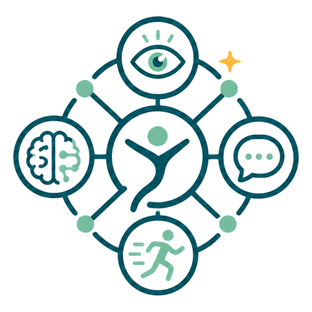

# 居家訓練網 Rehab Trainer Hub

<p align="center">
  
</p>

## 中文

居家訓練網是居家練習工具與衛教資訊的整合入口，同時提供 Steam 式遊戲平台，供經審核的開發者上傳 HTML/ZIP 居家練習遊戲：

- 動作練習：上肢、下肢與動作協調活動
- 視覺練習：視標、眼動、閱讀與視覺注意力活動
- 認知練習：注意、記憶與思考活動
- 口腔練習：口說、理解與口腔動作活動
- 遊戲平台：開發者可上傳 jsPsych 8 HTML/ZIP 居家練習遊戲，經人工審核後在隔離域名安全執行，並支援單一遊戲 PWA 安裝

## English

Rehab Trainer Hub brings together home-practice tools, educational information, and a Steam-like game platform where approved developers can upload jsPsych 8 HTML/ZIP practice games:

- Movement Practice: upper-limb, lower-limb, and movement-coordination activities
- Visual Practice: visual-target, eye-movement, reading, and attention activities
- Cognitive Practice: attention, memory, and thinking activities
- Oral Practice: speech, comprehension, and oral-movement activities
- Game Platform: developers upload jsPsych 8 HTML/ZIP games; after human review, games run in an isolated domain with per-game PWA install support

## 資料夾結構 / Folder Structure

```text
.
|-- apps/
|   |-- rehabtrainerhub/   # 入口網站、遊戲平台與內建練習 runtime / Hub, Game Platform, and built-in practice runtimes
|   |   `-- training-runtimes/
|   |       |-- motor/     # 動作練習 / Movement Practice
|   |       |-- vision/    # 視覺練習 / Visual Practice
|   |       |-- brain/     # 認知練習 / Cognitive Practice
|   |       `-- mouth/     # 口腔練習 / Oral Practice
|   `-- usergamerunner/    # 隔離遊戲執行環境 / Isolated game runner (trainerhub-user-games.pages.dev)
|-- packages/
|   |-- ui/                # 共用介面、auth、gamePlatform 型別 / Shared UI, auth, gamePlatform types
|   |-- game-sdk/          # 開發者遊戲 SDK (@rehab-trainer/game-sdk) / Developer game SDK
|   |-- config-eslint/     # 共用 ESLint 設定 / Shared ESLint config
|   `-- config-tailwind/   # 共用 Tailwind 設定 / Shared Tailwind config
|-- docs/                  # 文件 / Documentation
|-- scripts/               # 腳本 / Scripts
|-- package-lock.json
|-- package.json
`-- turbo.json
```

## 使用方式

1. 進入居家訓練網主畫面。
2. 選擇內建練習模組（動作練習、視覺練習、認知練習、口腔練習）或「遊戲庫」中經核准的開發者遊戲。
3. 依需求調整網頁設定，例如語言、字體大小、色彩模式與音效。
4. 選擇訓練分類與訓練模組或遊戲。
5. 在訓練前設定畫面確認參數後開始，或於遊戲平台直接以沙盒執行。
6. 完成訓練後，可在成績結算畫面下載 CSV、重新開始或返回主畫面；開發者遊戲亦可透過 PWA 單獨安裝於裝置。

## How To Use

1. Open the Rehab Trainer Hub home screen.
2. Choose a built-in practice module (Movement, Visual, Cognitive, or Oral Practice) or an approved developer game from the Game Library.
3. Adjust page settings as needed, such as language, font size, color mode, and sound.
4. Select a training category and module or game.
5. Confirm pre-training settings and start, or run in sandbox mode via the game platform.
6. After training, view results, download CSV, restart, or return to the home screen; individual developer games can also be installed as standalone PWAs.

## 遊戲平台與安全機制 / Game Platform & Security Architecture

居家訓練網提供 Steam 式的自主居家練習遊戲平台，開放開發者投稿 HTML 或包含資源的 ZIP 檔案，並實施五重安全防護：

1. **物理隔離（Separate Domain）**：遊戲檔案完全部署在獨立網域（`trainerhub-user-games.pages.dev`），與主平台（`trainerhub.cc`）徹底分開，受同源政策（SOP）強制隔離，無法存取主平台的 Cookie 或登入憑證。
2. **沙盒機制（Strict Iframe Sandbox）**：主平台以 `<iframe sandbox="allow-scripts">` 嵌入遊戲，禁止 `allow-same-origin` 與 `allow-top-navigation`。
3. **阻斷外連（Restrictive CSP）**：執行環境施加 `connect-src 'none'`、`worker-src 'none'`、`form-action 'none'`，禁止遊戲向外連線竊取資料。
4. **安全通訊橋樑（postMessage & MessageChannel）**：遊戲透過 `@rehab-trainer/game-sdk` 的 MessageChannel 與外層通訊，使用 session nonce 與 sequence 防止重放攻擊，僅回傳非敏感的彙總指標。
5. **自動掃描與人工審核**：上傳時自動阻擋 18 種危險 API 模式（fetch、XHR、WebSocket、cookie、location 等）與混淆程式碼；管理員於隔離環境試玩並查核原始碼，經 3 項查核勾選後始可核准上架。

## 注意事項 / Notice

本專案提供一般資訊與自主練習工具，非醫療機構或職能治療所；不提供個別評估、診斷、醫囑或治療。所有結果只反映當次操作，不是醫療評估、診斷或療效指標。

This project provides general information and self-practice tools. It is not a medical facility or occupational therapy clinic and does not provide individualized assessment, diagnosis, medical orders, or treatment. Results reflect only the current activity.

## 部署文件 / Deployment

- [Auth and D1 setup](docs/auth-d1-setup.md)
- [管理後台與 Cloudflare 擴充設定](docs/admin-cloudflare-setup.md)
- [遊戲平台部署指引 / Game Platform Deployment](docs/game-platform-deployment.md)
- [開發者遊戲套件規格與指引 / Developer Game Packages](docs/developer-game-packages.md)

### Cloudflare 資源清單 / Cloudflare Resources

| 資源類別 | 名稱 / Binding | 用途 |
| --- | --- | --- |
| Pages | `rehabtrainerhub` (`trainerhub.cc`) | Hub 主平台與 API Functions |
| Pages | `trainerhub-user-games` (`trainerhub-user-games.pages.dev`) | 隔離遊戲執行環境與靜態 Runtime |
| D1 Database | `rehab_db` (`REHAB_DB`) | 使用者、紀錄、審核與遊戲發布資料庫 |
| R2 Bucket | `rehab-storage` (`ASSET_BUCKET`) | 一般後台靜態資產 |
| R2 Bucket | `rehab-game-quarantine` (`GAME_QUARANTINE_BUCKET`) | 開發者上傳待審遊戲隔離暫存區 |
| R2 Bucket | `rehab-game-releases` (`GAME_RELEASE_BUCKET`) | 已核准遊戲不可變發布版本 |
| KV Namespace | `ARTICLE_CACHE` | 衛教文章快取 |

## 授權 / License

本 repository 的原始碼以 GNU Affero General Public License v3.0 授權，SPDX identifier 為 `AGPL-3.0-only`。完整條款請見 [LICENSE.md](LICENSE.md)。

The original source code in this repository is licensed under the GNU Affero General Public License v3.0, SPDX identifier `AGPL-3.0-only`. See [LICENSE.md](LICENSE.md) for the full license text.

GitHub 會依 repository 根目錄的 license 檔案偵測授權。若公開 repository 尚未顯示 AGPL-3.0，請先確認本次新增的 `LICENSE.md` 已推送到預設分支。

GitHub detects repository licenses from the license file in the repository root. If the public repository does not yet show AGPL-3.0, confirm that this `LICENSE.md` file has been pushed to the default branch.

## 第三方參考 / Third-Party References

下列項目是頁面中列名的參考專案或使用的第三方程式庫；它們各自保留原授權。本 repository 的 AGPL-3.0 授權不會重新授權第三方專案本身。

The following projects are referenced by the app pages or used as third-party libraries. They keep their own licenses. This repository's AGPL-3.0 license does not relicense those third-party projects.

| Project | Current license check | Notes |
| --- | --- | --- |
| brownhci/WebGazer | `GPL-3.0-or-later` in package metadata; GitHub license API did not classify the custom license file | Compatible with AGPL-3.0 for this web app use; preserve upstream notices. |
| michaelbach/FrACT10 | `GPL-3.0` | Compatible with AGPL-3.0. |
| styts/eye-training | No GitHub-detected license and no package license found | Reference only. Do not copy or adapt code/assets unless permission is clarified. |
| Jesper-N/foveaflow | `MIT` | Permissive; compatible with AGPL-3.0. |
| Fordi/eyegame | `CC-BY-SA-4.0` | Reference only. If code/assets are copied or adapted, preserve CC BY-SA obligations for that material. |
| visiontherapy/visiontherapy.github.io | `AGPL-3.0` | Compatible with AGPL-3.0. |
| muthuspark/javascript-games | `MIT` | Permissive; compatible with AGPL-3.0. |
| antfu/vue-minesweeper | `MIT` | Permissive; compatible with AGPL-3.0. |
| rbcavanaugh/mainConcept | `AGPL-3.0` | Compatible with AGPL-3.0. |
| jspsych/jsPsych 8.2.x | `MIT` | Pinned at 8.2.3 in platform runtime; see `apps/usergamerunner/THIRD_PARTY_NOTICES.txt`. |

Last checked: 2026-08-17.
