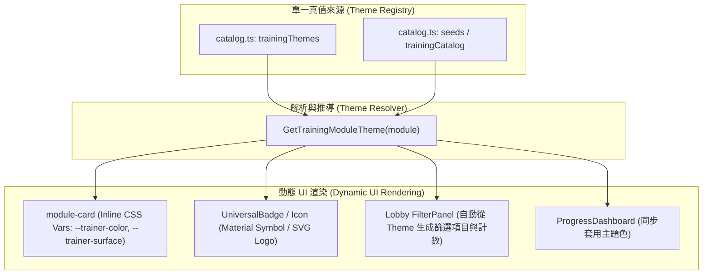

# 訓練模組視覺標籤與主題自動化重構方案 (Technical Design Document)

## 1. 背景與目標 (Background & Objectives)

### 1.1 現狀問題
目前在「居家訓練網」（`rehabtrainerhub`）新增訓練模組或調整分類時，模組的顯示樣式（文字標籤、Icon 圖示、主題色調、側邊欄篩選器）分散在多個檔案中：
1. **顏色樣式**：硬編碼於 `apps/rehabtrainerhub/app/globals.css` 的 `.trainer-motor`、`.trainer-vision`、`.trainer-brain`、`.trainer-mouth` 等 class。
2. **圖示與名稱**：硬編碼於 `apps/rehabtrainerhub/app/TrainingLobby.tsx` 的私有 `trainerVisuals` 物件中。
3. **文字標籤與分類**：硬編碼於 `apps/rehabtrainerhub/training-modules/catalog.ts` 的 `trainingPurposes` 陣列與嚴格 TypeScript Union。
4. **進度儀表板**：`apps/rehabtrainerhub/app/progress/ProgressDashboard.tsx` 同樣依賴 `.trainer-*` 的 CSS 類別。

當未來需要新增全新類別（例如「平衡訓練 Balance」、「呼吸控制 Breath」）或為模組指定特定視覺標籤時，開發者必須修改 4 個以上的檔案，且容易產生遺漏或樣式不一致。

### 1.2 重構目標
- **單一真值來源（Single Source of Truth）**：所有視覺標籤、色彩、圖示定義統一收攏於設定檔中。
- **隨插即用（Plug-and-Play）**：只要在模組 Metadata 指定標籤（Label / Theme ID），訓練大廳與進度頁面即自動套用文字標籤、Icon 與主題色彩。
- **動態樣式（Dynamic CSS Variables）**：以 CSS Custom Properties（CSS 變數）取代寫死的 CSS 類別名稱。
- **防呆與降級（Graceful Fallback）**：未指定或找不到主題時自動套用預設主題，確保畫面不破版。

---

## 2. 系統架構設計 (System Architecture)



---

## 3. 詳細規格與介面定義 (Specification & Interfaces)

### 3.1 視覺主題註冊表介面 (`catalog.ts`)

```typescript
export type ThemeIconType = 'material-symbol' | 'svg';

export interface ThemeIconConfig {
  type: ThemeIconType;
  value: string; // Material Symbol 名稱 (例如 'directions_walk') 或 SVG 路徑 (例如 '/assets/motor-logo.svg')
  alt?: string;
}

export interface TrainingVisualTheme {
  id: string;
  label: {
    'zh-TW': string;
    en: string;
  };
  icon: ThemeIconConfig;
  colors: {
    primary: string;     // 主色，例如 '#005eb8'
    dark?: string;       // 深色/Focus色，例如 '#00478d'
    surfaceMixRatio?: number; // 表面底色混合比 (預設 8%)
  };
  badge?: {
    text: {
      'zh-TW': string;
      en: string;
    };
  };
}
```

### 3.2 內建與擴充主題註冊表範例

```typescript
export const trainingThemes: Readonly<Record<string, TrainingVisualTheme>> = {
  'upper-limb': {
    id: 'upper-limb',
    label: { 'zh-TW': '上肢動作', en: 'Upper-limb movement' },
    icon: { type: 'svg', value: '/assets/motor-logo.svg', alt: 'MotorTrainer' },
    colors: { primary: '#005eb8', dark: '#00478d' },
  },
  'vision': {
    id: 'vision',
    label: { 'zh-TW': '視覺訓練', en: 'Vision training' },
    icon: { type: 'svg', value: '/assets/vision-logo.svg', alt: 'VisionTrainer' },
    colors: { primary: '#006c47', dark: '#005235' },
  },
  'attention': {
    id: 'attention',
    label: { 'zh-TW': '注意力訓練', en: 'Attention training' },
    icon: { type: 'svg', value: '/assets/brain-logo.svg', alt: 'BrainTrainer' },
    colors: { primary: '#7a4a24', dark: '#5a3519', surfaceMixRatio: 10 },
  },
  'oral': {
    id: 'oral',
    label: { 'zh-TW': '口腔訓練', en: 'Oral training' },
    icon: { type: 'svg', value: '/assets/mouth-logo.svg', alt: 'MouthTrainer' },
    colors: { primary: '#6750a4', dark: '#4f378b', surfaceMixRatio: 9 },
  },
  // 未來新增範例：平衡訓練
  'balance': {
    id: 'balance',
    label: { 'zh-TW': '平衡訓練', en: 'Balance training' },
    icon: { type: 'material-symbol', value: 'directions_walk' },
    colors: { primary: '#d97706', dark: '#b45309' },
  },
};

export const defaultTrainingTheme: TrainingVisualTheme = {
  id: 'default',
  label: { 'zh-TW': '一般訓練', en: 'General practice' },
  icon: { type: 'material-symbol', value: 'sports_esports' },
  colors: { primary: '#005eb8', dark: '#00478d', surfaceMixRatio: 8 },
};
```

---

## 4. 實作改造步驟 (Step-by-Step Implementation Plan)

### 步驟 1：改造 `apps/rehabtrainerhub/training-modules/catalog.ts`
1. 匯入或宣告 `trainingThemes` 與 `TrainingVisualTheme`。
2. 建立輔助函式 `GetTrainingModuleTheme(moduleOrPurposeId)`，當查無主題時自動返回 `defaultTrainingTheme`。
3. `trainingPurposes` 改為由 `trainingThemes` 的 key 動態推導，避免重複維護多份陣列。

### 步驟 2：改造 `apps/rehabtrainerhub/app/globals.css`
1. 移除寫死的 `.module-card.trainer-motor`、`.module-card.trainer-vision`、`.module-card.trainer-brain`、`.module-card.trainer-mouth`。
2. 移除寫死的 `.recent-module-card.trainer-*`。
3. 在 `.module-card` 與 `.recent-module-card` 的基礎規則中，全面使用 CSS 變數：
   ```css
   .module-card {
     /* 預設變數，可在 inline style 中被動態覆蓋 */
     --trainer-color: #005eb8;
     --trainer-color-dark: #00478d;
     --trainer-surface: color-mix(in srgb, var(--trainer-color) 8%, var(--surface));
     background: var(--trainer-surface);
     border-color: color-mix(in srgb, var(--trainer-color) 20%, transparent);
   }
   .module-card:focus-visible {
     outline: 3px solid var(--trainer-color);
     outline-offset: 4px;
   }
   ```

### 步驟 3：改造 `apps/rehabtrainerhub/app/TrainingLobby.tsx`
1. 移除 Lobby 內寫死的私有 `trainerVisuals` 物件。
2. 在渲染卡片時，呼叫 `GetTrainingModuleTheme(module.purpose)` 取得主題物件。
3. 將主題變數注入到 `<article>` 的 `style`：
   ```tsx
   const theme = GetTrainingModuleTheme(module.purpose);
   const surfaceMix = theme.colors.surfaceMixRatio ?? 8;

   return (
     <article
       aria-label={`${copy.start}: ${moduleCopy.title}`}
       className="module-card official-game-card"
       key={module.catalogId}
       style={{
         '--trainer-color': theme.colors.primary,
         '--trainer-color-dark': theme.colors.dark ?? theme.colors.primary,
         '--trainer-surface': `color-mix(in srgb, ${theme.colors.primary} ${surfaceMix}%, var(--surface))`,
       } as React.CSSProperties}
     >
       {/* Meta 區域 */}
       <div className="module-card-meta">
         <span>{language === 'en' ? theme.label.en : theme.label['zh-TW']}</span>
         {theme.icon.type === 'svg' ? (
           <Image
             src={theme.icon.value}
             alt={theme.icon.alt ?? theme.label['zh-TW']}
             width={52}
             height={36}
           />
         ) : (
           <span className="material-symbols-outlined" aria-hidden="true">
             {theme.icon.value}
           </span>
         )}
       </div>
       {/* ... 其餘內容維持不變 ... */}
     </article>
   );
   ```
4. 側邊欄篩選器使用 `trainingThemes` 動態產生，自動支援多國語系切換與模組數量統計。

### 步驟 4：改造 `apps/rehabtrainerhub/app/progress/ProgressDashboard.tsx`
將儀表板中的近期訓練卡片同步調整為以 inline style 注入 `--trainer-color`，徹底移除靜態 class 依賴。

---

## 5. 未來新增模組之開發者流程 (Developer Workflow)

完成重構後，未來若要新增一個訓練模組，開發者只需進行以下操作：

### 情境 A：使用現有分類（例如上肢動作）
在 `catalog.ts` 的 `seeds` 加入：
```typescript
{
  id: 'new-upper-game',
  trainer: 'motor',
  purpose: 'upper-limb',
  kind: 'motor-upper',
  path: '/upper-limb-training?game=new-upper-game',
  zh: ['新上肢練習', '練習肩部活動度。'],
  en: ['New Upper Practice', 'Practise shoulder range of motion.'],
}
```
➡️ **大廳會全自動**帶入「上肢動作」標籤、`MotorTrainer` Logo、藍色主題色與篩選計數。

### 情境 B：新增全新類別與全新視覺風格（例如平衡訓練）
在 `catalog.ts` 的 `trainingThemes` 新增一行定義：
```typescript
'balance': {
  id: 'balance',
  label: { 'zh-TW': '平衡訓練', en: 'Balance training' },
  icon: { type: 'material-symbol', value: 'directions_walk' },
  colors: { primary: '#d97706', dark: '#b45309' },
}
```
並在模組的 `seed` 設定 `purpose: 'balance'`。

➡️ **大廳與進度頁面將 100% 自動生效**：
- 自動呈現「平衡訓練」文字標籤
- 自動呈現 `directions_walk` 圖示
- 自動套用琥珀橙色（`#d97706`）卡片主題與焦點效果
- 側邊欄自動出現「平衡訓練」核取方塊並統計數量
- **無需修改任何 CSS 或 JSX 元件**

---

## 6. 合規性與架構規範檢驗 (Compliance & Architecture Checklist)

依據專案規範（`AGENTS.md`）：
- [x] **台灣法規文案**：預設文字標籤維持「練習 / 訓練」，不使用「評估 / 治療 / 處方」字眼。
- [x] **SEO 與預渲染一致性**：主題設定檔支援繁體中文（`zh-TW`）與英文雙語系，不破壞 SSR 繁中預渲染。
- [x] **運行隔離原則**：視覺主題僅影響 Hub React Shell（大廳與儀表板），完全不干涉訓練模組各自獨立的 jsPsych / Pixi / Three.js 引擎與 runtime。
- [x] **單一來源原則**：主題色碼與圖示直接定義在資料層，禁止在元件與樣式表間重複宣告相同色碼。
