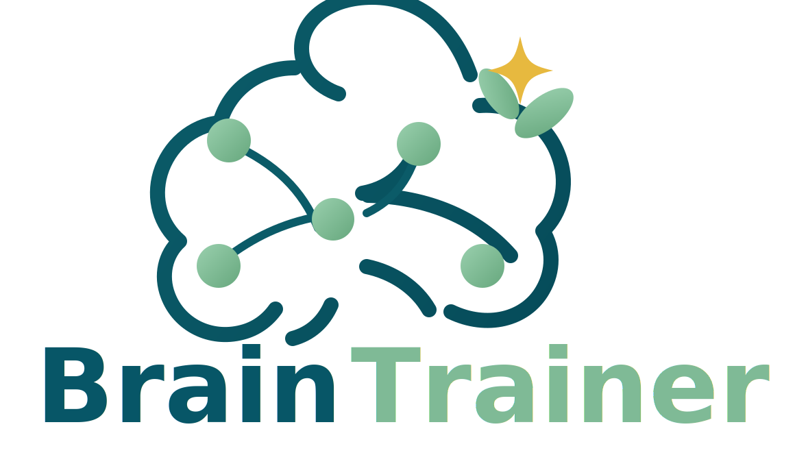

# BrainTrainer

BrainTrainer is the cognitive training app for attention, memory, and thinking
practice. Thinking Training includes Main Concept Training plus Minesweeper,
Memory Match, Lights Out, Reaction Time, Target Click, Sliding Puzzle, Sudoku,
Bulls and Cows, Simon Says, Tic Tac Toe, Connect 4, Dots and Boxes, Hex, Set,
Sokoban, and Maze.
