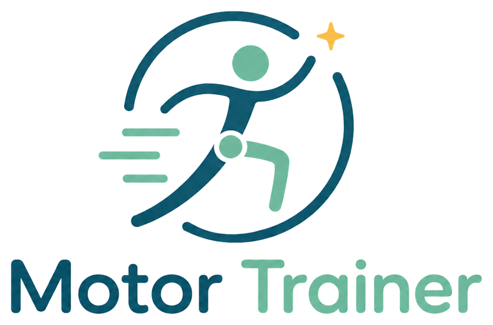

# MotorTrainer

MotorTrainer is a React rehabilitation training web app for upper- and lower-limb motor practice. It
combines game-like upper-limb training modules with local settings, user
selection, calibration, and training record helpers. Cognitive games now live
under BrainTrainer Thinking Training, while speech and oral exercises live under
MouthTrainer.

> **Disclaimer:** This application is for programming practice and experimental
> purposes. It is not medical diagnosis, treatment, or rehabilitation advice. If
> you have medical needs, seek professional medical assistance.

## Tech Stack

- **React 19** + **TypeScript**: UI and typed app code
- **React Router v7**: client-side routing
- **PixiJS v8**: 2D rendering for drawing and game screens
- **jsPsych 8** + **WebGazer.js**: calibration and training data flow
- **MediaPipe Tasks Vision** + **TensorFlow.js**: gesture and vision helpers
- **Three.js**: 3D/visual training support
- **Vite**: development and production builds

## Training Modules

### Motor Training

- **Drawing Tower Defense**: draw circles, crosses, squares, triangles, and
  straight lines with mouse or touch.
- **Gesture Battler**: camera-based hand gesture practice.

## Project Structure

```text
src/
|-- main.tsx                         # App entry point
|-- App.tsx                          # Routes
|-- index.css                        # Global styles
|-- theme.ts                         # Design tokens
|-- components/                      # Shared UI components
|-- i18n/                            # Language resources
|-- pages/
|   |-- HomePage.tsx                 # Home / module menu
|   |-- home/                        # Home page cards and module metadata
|   |-- training/                    # Training pages and games
|   |   |-- MotorTraining.tsx
|   |   |-- DrawingTowerDefenseGame.tsx
|   |   |-- GestureBattlerGame.tsx
|   |   |-- AsteroidShieldGame.tsx
|   |   `-- MotorCortexRehabGame.tsx
|   |-- settings/                    # Settings and calibration
|   |-- credits/                     # Credits page
|   `-- links/                       # Related links page
`-- utils/                           # Storage, records, settings, downloads
```

## Development

```bash
npm install
npm run dev
npm run build
npm run preview
```

Useful build commands:

```bash
npm run build:full        # Keep bundled assets
npm run build:cloudflare  # Force Cloudflare Pages pruning
```

## Discord Image Upload

Drawing Tower Defense outputs missed recognition samples as 256x256 transparent
PNG files and sends them to `/api/drawing-samples` as `multipart/form-data`.
Upload progress and counts are intentionally not shown in the game UI. The
frontend does not store the Discord webhook; the webhook must be provided by
backend environment variables.

Set in Cloudflare Pages environment variables:

```text
DISCORD_DRAWING_WEBHOOK_URL=your Discord webhook URL
```

If the frontend and API are on different domains, also set:

```text
VITE_DRAWING_SAMPLE_UPLOAD_URL=https://your-api.example.com/api/drawing-samples
DRAWING_UPLOAD_ALLOWED_ORIGINS=https://your-frontend.example.com
```

GitHub Pages only supports static files and cannot execute
`functions/api/drawing-samples.js`. If deploying to GitHub Pages, point
`VITE_DRAWING_SAMPLE_UPLOAD_URL` to another service capable of executing this
API.
