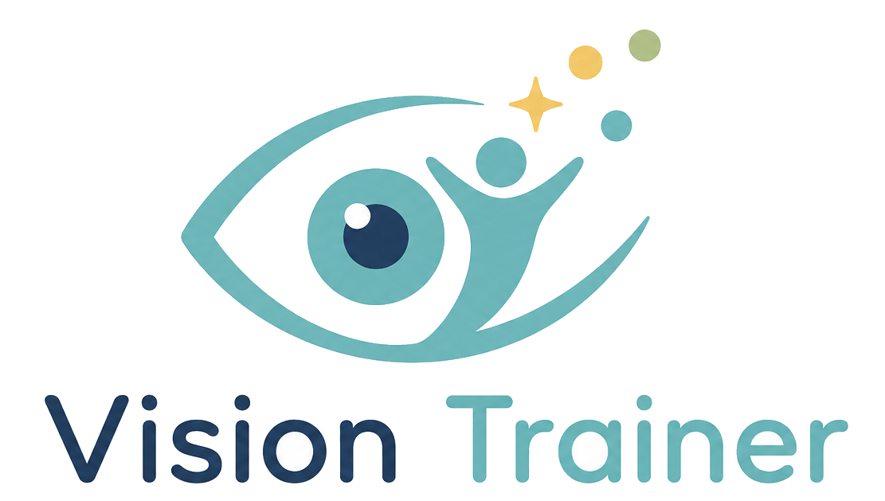

# Vision Trainer



Vision Trainer is a browser-based visual-practice and session-record app built with React, TypeScript, Vite, jsPsych, PixiJS, Three.js, and WebGazer.

It includes visual-target activities, screen calibration tools, user profiles, and CSV result export. It is a non-medical practice tool; results do not represent visual acuity, diagnosis, or treatment advice.

## Features

- Visual practice modules: Moving Card, Oculomotor Training, Gabor Patching, Reading Training (RSVP), Driving Attention Simulation Practice, and Hart Chart Training.
- Visual-target activities: Landolt C, Tumbling E, Sloan Letters, Shapes, Grating Location Practice, and Contrast Recognition Practice.
- Calibration: screen size, viewing distance, gamma, crowding, and WebGazer webcam calibration.
- Results: local browser records and CSV export.
- UI languages: English and Traditional Chinese.

## Tech Stack

- React 19
- TypeScript
- Vite
- React Router 7
- jsPsych 8
- PixiJS 8
- Three.js
- WebGazer.js

## Project Structure

```text
src/
  App.tsx                         App routes and layout
  main.tsx                        React entry point
  components/                     Shared UI components
  experiment/                     jsPsych timelines and plugins
  i18n/                           Translation provider and strings
  pages/
    assessment/                   Visual-target activity pages and logic
    credits/                      Credit page
    home/                         Home page module definitions
    links/                        Related links page
    settings/                     Calibration and app settings
    training/                     Training pages, data, and results
  utils/                          Settings, storage, math, CSV, Pixi helpers
public/
  assets/                         Images and logos
  webgazer.js                     Local WebGazer runtime
```

## Development

```bash
npm install
npm run dev
npm run build
npm run preview
```

## Deployment

The Vite build writes static files to `dist/`.

```bash
npm run build
```

Deploy the `dist/` directory to any static host, including GitHub Pages.

## Credits

- [FrACT10](https://github.com/michaelbach/FrACT10) for visual-target presentation and calibration references.
- [styts/eye-training](https://github.com/styts/eye-training) for moving-card training references.
- [Jesper-N/foveaflow](https://github.com/Jesper-N/foveaflow) for oculomotor training references.
- [Fordi/eyegame](https://github.com/Fordi/eyegame.git) for Gabor patching references.
- [visiontherapy.github.io](https://github.com/visiontherapy/visiontherapy.github.io) for Hart Chart activity references.
