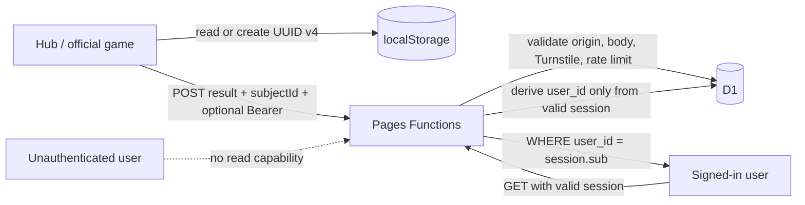

# 匿名 Subject ID 與全測驗 D1 紀錄：PRD + TRD

文件狀態：已實作；production 啟用核准
建立日期：2026-09-22
適用範圍：`trainerhub.cc` Hub、40 個內建遊戲，以及由 Hub 啟動的第三方沙盒遊戲
主要資料庫：Cloudflare D1 `rehab_db`

## 1. 摘要與核心決策

每個瀏覽器 origin 第一次進入網站時，前端以原生 `crypto.randomUUID()` 建立一組 UUID v4，儲存在 `localStorage` 的 `rehabtrainerhub.subject-id.v1`。之後每次進站先讀取並驗證既有值；有效就沿用，缺少或格式無效才換發新值。

每筆可提交的測驗結果都寫入 D1：

- 未登入：保存 guest `subject_id`，`user_id = NULL`。
- 已登入：保存另一套帳號範圍的 `subject_id` 與由後端 session 判定的 `user_id`；guest Subject ID 永遠不寫入登入紀錄。
- 登入帳號不得由 request body 指定，前端傳入的任何帳號欄位都不具權威性。
- Subject ID 不在畫面、URL、下載檔、一般 API response 或應用程式 log 中顯示。
- Subject ID 只用於資料列關聯，**不是密碼、token、session 或讀取授權依據**。

匿名使用者不會取得 D1 紀錄的讀取能力，也不會在進度追蹤看到資料。`GET /api/records` 與 `GET /api/progress` 繼續要求有效登入 session，並只以 session 中的 `user_id` 查詢；系統不得新增 `GET ...?subjectId=`、`/subjects/{id}/records` 或任何可由 UUID 查資料的 API。

guest 紀錄使用同一瀏覽器內的穩定假名 ID；登入紀錄則使用另一個帳號範圍 ID，兩個 namespace 不在伺服器端互用。隱私權政策必須揭露這項處理；不得以「使用者看不到 ID」取代告知或必要的法規審查。

## 2. 背景與現況

目前流程有兩個阻擋匿名 D1 紀錄的條件：

1. `packages/ui/src/auth/authClient.ts` 的 `SaveRemoteTrainingRecord` 在沒有 auth token 時直接回傳 `false`。
2. D1 `training_records.user_id` 是 `NOT NULL`，且外鍵指向 `app_users`。

其他既有行為：

- Hub 內建遊戲由 `TrainingOverlay` 接收已驗證的 score，再呼叫 `/api/records`。
- 單一內建遊戲 PWA 使用共用 `SaveTrainingRecord`；未登入時目前只留本機紀錄。
- `/api/records` 的 GET 與 `/api/progress` 已依登入 session 的 `user_id` 查詢。
- 管理端紀錄查詢以 `INNER JOIN app_users`、patient role 與 therapist assignment 限制，因此目前只會顯示帳號紀錄。
- 第三方遊戲使用獨立網域、`sandbox="allow-scripts"`、一次性 `game_run_sessions` token 與 `game_runs`，不應取得 auth、Subject ID 或 D1 能力。
- 現有文案仍表示「未登入不會上傳」或「紀錄只存在瀏覽器」，上線前必須同步修正。

## 3. 產品需求（PRD）

### 3.1 目標

1. 同一瀏覽器在 localStorage 未被清除時，跨頁面、跨測驗與跨登入狀態沿用同一 Subject ID。
2. 所有由 runtime 正常產生且通過既有 schema 驗證的完成／中止結果，無論使用者是否登入，都能寫入 D1。
3. 已登入結果另關聯後端驗證的帳號；未登入結果不建立假帳號。
4. 未登入者不能查看 D1 紀錄、進度或 Subject ID。
5. 不讓 Subject ID 形成 IDOR、UUID 枚舉或匿名資料讀取路徑。
6. 維持既有 payload 大小、score schema、眼動資料、第三方沙盒及一次性 token 安全邊界。

### 3.2 名詞

- **guest Subject ID**：未登入時由瀏覽器以 CSPRNG 產生的 UUID v4，作為同一個網站 origin 內的假名化關聯值。
- **authenticated Subject ID**：登入時依帳號範圍在瀏覽器產生並沿用的另一組 UUID v4；不得與 guest Subject ID 交叉使用。
- **帳號 ID / `user_id`**：由後端驗證登入 session 後取得的 `app_users.id`。
- **匿名紀錄**：`subject_id` 有值、`user_id` 為 `NULL` 的資料列。
- **登入紀錄**：`subject_id` 與 `user_id` 都有值的資料列。
- **可提交測驗結果**：runtime 已依現行契約送出的完成或中止結果；僅開啟頁面、開始後關閉且 runtime 沒有產生結果，不憑空建立測驗資料。

### 3.3 使用者故事

- 身為首次訪客，我不需操作任何 UI，就能直接開始活動，網站會在背景建立本機 Subject ID。
- 身為回訪者，只要沒有清除該 origin 的網站資料，我的後續紀錄會沿用同一 Subject ID。
- 身為未登入訪客，我的結果可寫入 D1，但我無法透過進度頁、API 或 Subject ID 讀回紀錄。
- 身為登入使用者，我的當次結果同時關聯 Subject ID 與帳號，並依既有規則出現在自己的進度中。
- 身為管理者或維運人員，我不會在一般 UI 或 log 看到 Subject ID；需要分析匿名資料時只能經過受控的 D1 存取流程。

### 3.4 功能需求

#### FR-1：Subject ID 建立與沿用

- localStorage key 固定為 `rehabtrainerhub.subject-id.v1`。
- 值必須符合小寫 UUID v4 格式。
- 初次進站即初始化，不等待第一場測驗結束。
- Hub shell 與單一內建遊戲 PWA 都要走相同的共用 helper。
- 不引入 jsPsych 只為建立 ID；`crypto.randomUUID()` 已由 Web Crypto 提供安全亂數 UUID，且不會把 jsPsych 帶入非測驗 entry bundle。
- localStorage 不可用時，以記憶體內 UUID 完成當次頁面生命週期；此例外不能保證跨造訪沿用，但不得阻擋測驗或造成資料遺失。

#### FR-2：每筆結果寫入

- Hub 內建遊戲：由父層 `TrainingOverlay` 在 score 驗證完成後寫入 `/api/records`。
- 單一內建遊戲 PWA：由共用 `SaveTrainingRecord` 寫入同一 API。
- Hub 內第三方沙盒遊戲：建立 `game_run_session` 時由 Hub 父層附上 Subject ID；Subject ID 不傳入 iframe。結果仍以一次性、雜湊保存的 run token 寫入 `game_runs`。
- 已登入與未登入使用相同 payload schema、大小上限與 server-side validation。
- 未登入 payload 在寫入前由後端遞迴移除 `userName`、`Participant_ID`、email、token 等可識別或憑證類欄位；不能只依賴各遊戲自行清理。
- API 成功回應只回傳 `{ ok, recordId }` 或等價最小資訊，不回顯 payload、Subject ID、帳號 ID 或既有資料。

#### FR-3：帳號關聯

- Request body 不包含可被信任的 `userId`、email、display name 或 role。
- Authorization header 缺少時，以匿名紀錄處理。
- Authorization header 存在但無效或過期時回傳 `401`，不能靜默降級成匿名寫入，以免把原應屬於帳號的資料錯誤脫鉤。
- 前端收到 `401` 後可清除失效 token，並以相同 record ID、guest Subject ID、明確不帶 Authorization 的匿名請求重試一次；此行為要有測試且不得把其他帳號附到舊結果。
- 使用者在 guest 測驗完成後才登入，不回填過去紀錄的 `user_id`；登入後改用 authenticated Subject ID，兩套 ID 不可互相寫入。
- D1 紀錄只保存 `user_id` 外鍵，不重複複製 email 或其他帳號資訊。

#### FR-4：讀取與進度

- 未登入呼叫 `GET /api/records`、`GET /api/progress` 一律為 `401`。
- Subject ID 不得出現在任何讀取 API 的 path、query、header 授權規則或 response DTO。
- 登入讀取只接受伺服器驗證的 session，查詢固定加上 `WHERE user_id = session.sub`。
- 登入 A 即使知道登入 B 或匿名訪客的 Subject ID、record ID，也不能取得對方資料。
- 管理端維持角色、patient assignment、audit log 與帳號資料 join。匿名列不進入既有治療師／個案 UI。
- 匿名資料分析使用獨立的 `GET /api/admin/anonymous-analysis`；只允許 admin，預設回集合統計，可選受控的集合 CSV 匯出，所有使用寫入 audit log，且不接受 Subject ID 查詢參數。

#### FR-5：背景重試與重複提交

- 上線目標為 at-least-once delivery；record ID 與 run-session token 提供冪等性，D1 最終只留一筆。
- 首次 POST 失敗或離線時，把最小待送 envelope 暫存於 IndexedDB，不把 auth token 放進 outbox。
- 在本次頁面、`online` event 與下次進站時靜默重試，成功後立即刪除 outbox 項目。
- guest 完成的 envelope 即使稍後登入，也必須以 guest 模式補送；登入完成的 envelope 使用 authenticated Subject ID，帳號切換時改以新的 guest Subject ID 補送。
- 登入完成的 envelope 只有在目前驗證 session 為同一帳號時才能補上帳號；若帳號已更換，優先以匿名資料送出，不能誤掛到另一帳號。
- 瀏覽器永久離線、清除網站資料或不再回訪時，任何純 Web 方案都無法保證最終到達 D1；這是明確限制，不得在 UI 或文件宣稱絕對零遺失。

#### FR-6：UI 與文案

- 不新增 Subject ID 顯示、複製按鈕、URL 參數、帳號欄位或匿名進度頁。
- 結果頁可沿用一般「儲存中／已儲存／失敗重試」狀態，但訊息不得再宣稱未登入不會上傳，且不得顯示 ID。
- 登入功能的價值改為「跨裝置查看與進度追蹤」，不能再說登入才會把結果送到伺服器。
- 隱私權政策需揭露穩定的本機假名識別碼、未登入結果上傳、使用目的、保存期間、利用對象、跨境／雲端處理、資料權利與聯絡方式。

### 3.5 非目標與限制

- 不提供未登入者跨裝置同步或紀錄查詢。
- 不把 Subject ID 當作帳號，不建立匿名 `app_users` 假資料。
- 不用指紋辨識、IP、裝置資訊或其他資料嘗試重建被清除的 Subject ID。
- localStorage 不是秘密儲存區；使用者可在瀏覽器開發者工具查看，同源 JavaScript 也能讀取。因此產品 UI 不顯示 Subject ID，但安全設計不得假設它永遠不可見。
- 不在不同 origin 間同步 localStorage；Pages preview domain 與正式 domain 會有不同 ID。
- 不回填歷史資料的假 Subject ID。上線前資料保留 `subject_id = NULL`，因為無法真實還原當時瀏覽器身分。
- 不改變結果的醫療／效度定位；資料仍是當次操作紀錄，不因加入 Subject ID 成為臨床量測。
- 直接從隔離域名啟動的第三方獨立 PWA 不在本階段寫入 D1。依既有安全規範，`usergamerunner` 沒有 D1/auth binding，CSP `connect-src 'none'` 也禁止外連；不能為了紀錄而放寬。由 Hub 啟動的第三方遊戲則納入。

### 3.6 成功指標

- 正常連線且 server validation 通過的測驗結果，D1 寫入成功率至少 99.9%。
- 匿名與登入資料的 `subject_id` 缺漏率為 0%；歷史 legacy rows 另計。
- 同一瀏覽器重載後 Subject ID 一致率為 100%。
- 重試造成的重複資料列為 0。
- 匿名讀取成功事件為 0；任何未登入讀取皆為 401。
- 一般 response、前端畫面與 application log 的 Subject ID 洩漏事件為 0。

## 4. 技術設計（TRD）

### 4.1 架構與資料流



安全重點不是 UUID 難猜，而是讀取路徑完全不接受 UUID 作為授權。即使攻擊者任意產生或猜中 Subject ID，後端也沒有以該值查回資料的程式碼。

### 4.2 前端 Subject ID helper

新增共用模組，例如：

`packages/ui/src/storage/subjectId.ts`

介面：

```ts
export function GetOrCreateSubjectId(): string;
export function IsSubjectId(value: unknown): value is string;
```

行為：

1. 僅在 browser environment 存取 `window.localStorage`。
2. 讀取 `rehabtrainerhub.subject-id.v1`。
3. 若符合 UUID v4 regex，直接回傳。
4. 否則呼叫 `crypto.randomUUID()`、寫入、再回傳。
5. localStorage read/write 例外時，回傳 module-level memory fallback。
6. 不輸出 console log，不送 analytics，不把 ID 放入 URL。

初始化位置：

- `apps/rehabtrainerhub/app/HubNavigation.tsx` 的 Hub client shell `useEffect`。
- `packages/ui/src/components/TrainerAppLayout.tsx` 或所有正式遊戲確定共用的更上層 client entry。
- `SaveRemoteTrainingRecord` 與第三方 session 建立函式仍要再次呼叫 helper，作為初始化遺漏時的最後防線。

### 4.3 API 契約：內建遊戲紀錄

`POST /api/records`

```json
{
  "subjectId": "f32bdc20-3d46-4e30-b82a-8eeb8d89ce5b",
  "appId": "rehabtrainerhub",
  "runtimeId": "hub",
  "record": {},
  "turnstileToken": "optional"
}
```

伺服器處理順序：

1. `RejectDisallowedOrigin`。
2. 有 Authorization header 時必須成功驗證；無 header 才是 guest。
3. 依既有上限讀取 JSON，驗證 record、score、eye-tracking 與敏感欄位。
4. 以嚴格 UUID v4 regex 驗證 `subjectId`；不接受空字串、其他 UUID 版本或超長值。
5. 驗證 Turnstile（若 production 設為 required）。
6. Rate limit：登入者以 `user_id`；匿名者以「IP + Subject ID」雜湊鍵雙重限流，不能只依可任意輪替的 Subject ID。
7. 由 server time 覆寫 `savedAt`／`trainingDate`。
8. 匿名 payload 移除姓名、participant、email、token 等可識別欄位。
9. `user_id = session?.sub ?? null`，寫入 D1。
10. 回傳最小 response；不回顯 record 或 Subject ID。

建議 response：

```json
{
  "ok": true,
  "recordId": "server-accepted-record-id"
}
```

`GET /api/records`

- 契約不新增 Subject ID 參數。
- 未登入保持 401。
- 所有 SQL 仍以 `user_id = session.sub` 為第一層資料範圍。
- 即使 request 帶未知的 `subjectId` query，也不得將它帶入 SQL；可直接回 400，讓契約更明確。
- Response DTO 不含 `subject_id`。

### 4.4 API 契約：第三方沙盒遊戲

`POST /api/game-run-sessions`：

- 允許 guest。
- Hub 父層傳入 `{ releaseId, clientRunId, subjectId }`。
- 有效登入 session 才附 `user_id`；無 session 時為 `NULL`。
- production 要求紀錄 Turnstile 時，建立 session 也必須通過同一個 `records` action 驗證。
- 回傳既有的 256-bit opaque run token；D1 只保存 token hash。
- Subject ID、帳號與 run token都不傳入第三方 iframe。

`POST /api/game-runs`：

- 以一次性 run token、release、clientRunId、expiry、active release 與未消耗狀態做原子驗證。
- 從 `game_run_sessions` 複製 `subject_id` 與 `user_id` 到 `game_runs`。
- 不從 result payload 接受 Subject ID 或帳號欄位。
- 重試只回傳同一 run 的最小成功狀態，不回傳 result 或身分欄位。

這條路徑的授權憑證是短效、一次性、伺服器驗證且僅由 Hub 持有的 run token，不是 Subject ID。

### 4.5 D1 資料模型

新增 migrations：

`apps/rehabtrainerhub/migrations/0011_anonymous_subject_records.sql`

`apps/rehabtrainerhub/migrations/0012_separate_authenticated_subjects.sql`

#### `training_records`

```sql
subject_id TEXT,
user_id TEXT,
FOREIGN KEY (user_id) REFERENCES app_users(id) ON DELETE CASCADE
```

- `subject_id` schema 層允許 `NULL`，只為保留上線前 legacy rows 與 migration/code cutover 相容性。
- 新版前端對每筆寫入都送出有效 Subject ID；後端只為已登入的舊快取 client 暫時容許缺值並存為 `NULL`，guest 一律強制要求 UUID v4。
- `user_id` 改為 nullable；guest 不再需要假 `app_users` row。
- 既有 `user_id`、app、runtime、日期索引保留；未出現實際 Subject ID 查詢需求前不新增 subject index。
- `ON CONFLICT(id)` 的 scope 比對必須用能正確處理 `NULL` 的 `IS`，並同時核對 `subject_id`、app、runtime、module，避免 guest retry 因 `NULL = NULL` 為 false 而失敗，也避免跨 scope 覆寫。

#### `game_run_sessions`

```sql
subject_id TEXT,
user_id TEXT
```

- `user_id` 由 NOT NULL 改為 nullable。
- 既有 token hash unique、expiry 與 release FK 全數保留。

#### `game_runs`

```sql
subject_id TEXT
```

- `user_id` 原本已 nullable，維持不變。
- Subject ID 只從已驗證的 run session 複製。

#### Migration 原則

- SQLite 不能直接把既有 `NOT NULL` 欄位改成 nullable，因此要以 `*_new` table 重建並複製資料。
- 重建 `training_records` 時必須完整重建 0009 的 canonicalization trigger 與所有現有 index。
- 重建 `game_run_sessions` 時保留 `game_runs.run_session_id` 外鍵與唯一索引語意。
- 歷史資料的 `subject_id` 保持 `NULL`，不得用 account ID 或隨機值假裝成舊瀏覽器 Subject ID。
- Migration 先於 Pages code 部署，schema 必須允許舊 Worker 在 cutover window 繼續寫入已登入紀錄。
- 新增 node:sqlite migration test，從 0001 依序套用至 0012，驗證資料列數、payload、trigger、index、FK、nullable 行為與 guest／authenticated Subject ID 分離。

### 4.6 寫入可靠性與冪等

- 內建遊戲沿用 client record UUID 作為 D1 primary key。
- 同一 Subject ID、同一 account scope、同一 app/runtime/module 的相同 record ID 可安全重試。
- 不同 Subject ID 或不同 scope 使用已存在的 record ID 時回固定的 `409`，錯誤訊息不得透露原 row 的 Subject ID、帳號或是否存在其他醫療資料。
- 第三方結果沿用 `game_runs.run_session_id` unique index，確保 token 只消耗一次。
- Outbox 使用 IndexedDB 而不是 localStorage，避免 450 KiB score 或眼動資料迅速耗盡同步 storage quota。
- Outbox 使用 IndexedDB，最多保留 25 筆，建立後最多保存 30 天；成功上傳立即刪除，清除網站資料時由瀏覽器自然刪除。滿載時優先保留較新的未送紀錄，且 operational error metric 不含 payload／Subject ID。

### 4.7 安全設計：禁止 UUID 暴力讀取

#### 安全不變量

1. **Subject ID 永不授權讀取。** 後端沒有任何以 Subject ID 取得 records、progress、profile 或 account 的 route。
2. **匿名 API 只有受限 POST。** 未登入者可送出經驗證的結果，但沒有 GET、LIST、COUNT、EXPORT、PATCH 或 DELETE 能力。
3. **登入讀取只信任 server session。** 帳號 ID 不從 body、query、localStorage 或 JWT 的未驗證 client decode 取得。
4. **管理讀取另有 RBAC/assignment。** Subject ID 不會繞過 staff role、patient assignment 或 audit。
5. **UUID 不回顯、不判斷存在性。** 不提供「Subject exists」「幾筆資料」等 response；有效與不存在的 UUID 沒有可供枚舉的讀取差異。
6. **無效登入不降級。** 攻擊者不能用壞 token 觸發 guest 分支繞過原本應有的帳號驗證。
7. **資料庫不直接暴露。** 瀏覽器只接觸 Pages Functions；D1 binding、Wrangler/API token 不進前端 bundle。

#### 威脅與控制

| 威脅 | 必要控制 |
|---|---|
| 暴力猜 UUID 後嘗試讀資料 | 完全不實作 Subject ID read route；所有 account GET 以 session `sub` 篩選；負面安全測試覆蓋所有 records/progress/admin route |
| IDOR：修改 query/path 讀他人紀錄 | Deny by default；每次 request 都驗證 session 與資源範圍；不以難猜 ID 取代授權 |
| 偽造 `user_id`／email | Request schema 不接受；一律由 server session 派生 |
| 輪替 UUID 大量灌資料 | Turnstile、origin validation、IP + Subject ID rate limit、payload 上限、D1/WAF 告警；不能只限 subject |
| 猜中 UUID 後污染該 subject | UUID v4 高熵、寫入 schema 限制、rate limit；Subject ID 不影響任何個人 UI 或醫療決策，統計與品質分析不接受 Subject ID 查詢 |
| 利用 record ID conflict 探測既有資料 | 固定 409 body、不得回原 row；record ID 與 Subject ID 都用 CSPRNG；監測高 conflict 率 |
| Response、log、URL 洩漏 | Subject ID 只放 HTTPS JSON body；response 最小化；no-store；應用程式 log 禁止記錄 request body、Subject ID、result payload |
| 同源 XSS 讀取 localStorage | Subject ID 本身不具讀取或授權能力；維持 CSP、輸入輸出編碼與 dependency review。XSS 仍屬高風險事件，因既有 auth token 也在瀏覽器儲存 |
| 快取洩漏醫療資訊 | records、progress、admin 與 write response 設 `Cache-Control: private, no-store`；確認 CDN 不快取 API JSON |
| 第三方 iframe 竊取身分 | 不把 Subject ID、auth token、run token 傳入 iframe；維持 separate domain、`sandbox="allow-scripts"` 與限制 CSP |
| D1 資料外洩 | 最小 Cloudflare 權限、production binding 僅 Hub、管理操作 MFA、審計、備份與事件應變；禁止在 CI artifact 或 debug dump 輸出資料 |

`crypto.randomUUID()` 的高熵只降低碰撞與猜中機率，**不是主要存取控制**。OWASP 明確建議不可僅依不可預測 identifier 防止 IDOR；本設計以「沒有匿名讀取介面 + 每次 server-side authorization」作為真正控制。

### 4.8 隱私、醫療資訊與資料治理

- 本計畫把測驗結果、眼動樣本、穩定 Subject ID 與其帳號關聯視為高敏感資料處理，不以「沒有顯示姓名」視為已匿名。
- guest Subject ID 與 authenticated Subject ID 使用不同 namespace；伺服器不以 guest ID 連結登入紀錄，隱私文件必須如實揭露兩種識別碼的用途。
- 上線前由台灣個資／醫療法規專業人士確認蒐集依據、告知或同意方式、目的、保存期間、利用範圍、跨境處理、當事人權利與事件通報流程。程式碼審查不能保證主管機關認定合法。
- 隱私權政策說明 guest D1 紀錄永久保存，僅用於網站品質改善與集合統計；瀏覽器 outbox 最多保存 30 天，成功上傳立即刪除。
- guest 紀錄的 `user_id` 永遠為 `NULL`，不屬於任何帳號；帳號刪除只依現有 FK 規則處理帶 `user_id` 的登入紀錄。
- 未登入者沒有紀錄讀取或進度查詢能力；匿名分析僅由 admin-only 端點提供集合統計或受控集合匯出，且寫入 audit log。
- 維運 log 只保留 status、runtime、authenticated boolean、payload size、rate-limit outcome 與 request trace ID；不保留 Subject ID、email 或結果內容。
- Cloudflare 文件表示 D1 資料在靜態與傳輸中加密；這是基礎設施保護，不能取代應用層授權與最小化。

### 4.9 功能旗標與事故處理

- 新增 server-side `ANONYMOUS_RECORDS_ENABLED=1` kill switch；預設關閉，完成 migration、隱私審查與安全測試後才開啟。
- 關閉時：登入寫入照常；guest POST 回固定 `503`，前端留在 outbox 等候，不能假裝成功。
- 監控匿名／登入寫入量、400/401/409/413/429/5xx 比率、Turnstile failure 與 outbox retry；指標不得含 Subject ID 或 payload。
- 異常時先關閉 guest ingestion、保全 audit、評估受影響範圍，再依核准的事件應變與通知流程處理。

## 5. API 存取矩陣

| 呼叫者 | 動作 | 授權依據 | Subject ID 用途 | 結果 |
|---|---|---|---|---|
| Guest | POST `/api/records` | Origin + validation + Turnstile/rate limit | 僅寫入關聯 | 允許 |
| Guest | GET `/api/records` | 無有效 session | 不接受 | 401 |
| Guest | GET `/api/progress` | 無有效 session | 不接受 | 401 |
| Signed-in user | POST `/api/records` | 有效 session | 使用 authenticated Subject ID；帳號由 session 取得 | 允許 |
| Signed-in user | GET records/progress | 有效 session `sub` | 完全不參與查詢 | 只回該帳號資料 |
| Staff | GET `/api/admin/records` | Staff role + assignment + audit | 不作為授權條件 | 既有帳號個案資料；匿名列排除 |
| Admin | GET `/api/admin/anonymous-analysis` | Admin role + audit | 不接受 query Subject ID；只回集合資料 | JSON 集合統計或集合 CSV |
| Hub parent | POST game-run session/result | Origin + optional session + one-time run token | session 建立時寫入；不送 iframe | 允許 |
| Third-party iframe | 任何 D1/auth API | 無權限、CSP 阻擋 | 不可取得 | 拒絕／無路徑 |

## 6. 預計修改範圍

### 6.1 共用前端

- 新增 `packages/ui/src/storage/subjectId.ts`，分離 guest 與 authenticated Subject ID namespace。
- 從 `packages/ui/src/index.ts` 匯出必要 helper。
- `packages/ui/src/auth/authClient.ts`：guest 也送 POST、登入使用另一套 Subject ID、處理無效 token 與最小 response。
- `packages/ui/src/storage/trainingRecords.ts`：移除只有登入才遠端保存的 guard；保留本機結果需求並接上 outbox。
- `packages/ui/src/components/TrainerAppLayout.tsx`：初次 mount 初始化 Subject ID。
- `packages/ui/src/components/TrainingScore.tsx`：移除「未登入不會上傳」錯誤文案，Subject ID 不顯示。
- `packages/ui/src/components/AuthPanel.tsx`、`TrainingLoginReminder.tsx`：把登入價值改為跨裝置查看與進度，不再宣稱登入才上傳。

### 6.2 Hub

- `apps/rehabtrainerhub/app/HubNavigation.tsx`：Hub 初次 mount 初始化。
- `apps/rehabtrainerhub/app/train/TrainingOverlay.tsx`：移除 guest short-circuit，所有有效 score 都保存。
- `apps/rehabtrainerhub/app/train/PackageGameOverlay.tsx`：guest 也建立 run session；Subject ID 只送 Hub API。
- `apps/rehabtrainerhub/app/privacy/PrivacyContent.tsx`：揭露保存期限、用途與 admin-only 集合分析限制。
- `apps/rehabtrainerhub/app/i18n/{zh-TW,en}.ts` 與 privacy page metadata：更新資料蒐集與登入文案。
- `docs/game-score-contract.md`：把「Guests do not upload」改為新契約。

### 6.3 後端與 D1

- `apps/rehabtrainerhub/migrations/0011_anonymous_subject_records.sql`。
- `apps/rehabtrainerhub/migrations/0012_separate_authenticated_subjects.sql`：清除歷史登入列可能沿用的 guest Subject ID。
- `apps/rehabtrainerhub/functions/api/records.js`：optional auth write、Subject ID validation、guest rate limit、nullable user、最小 response；GET auth 邊界不放寬。
- `apps/rehabtrainerhub/functions/api/game-run-sessions.js`：optional auth、Subject ID、guest rate limit。
- `apps/rehabtrainerhub/functions/api/game-runs.js`：以一次性 session token 消耗 guest 或 signed-in run，從 session 複製身分欄位。
- `apps/rehabtrainerhub/functions/api/admin/anonymous-analysis.js`：僅 admin 可用的集合統計／受控集合 CSV 匯出，所有使用寫入 audit log，不接受 Subject ID 查詢。
- 如共用 helper 不足，於 `_lib` 新增小型 UUID validation／optional-session helper；不要建立一套新的 auth abstraction。

## 7. 驗收標準

### 7.1 Subject ID

- [ ] 清空 localStorage 後首次進站會建立一個有效 UUID v4。
- [ ] 未登入 reload、切換頁面與進入不同內建遊戲後 guest Subject ID 不變。
- [ ] guest 測驗只使用 guest Subject ID；登入後使用另一套 authenticated Subject ID。
- [ ] 同一帳號在同一瀏覽器重載後 authenticated Subject ID 一致；登入／登出不互相重用兩套 ID。
- [ ] 清除網站資料或換裝置後產生新值，系統不嘗試復原。
- [ ] localStorage 被禁用時測驗仍可執行並以當頁 memory ID 寫入。
- [ ] DOM、URL、畫面、下載檔、console 與一般 response 均無 Subject ID。

### 7.2 D1 寫入

- [ ] Guest 內建測驗建立 `subject_id != NULL`、`user_id = NULL` 的 `training_records` row。
- [ ] Signed-in 內建測驗建立 subject 與 session user 都有值的 row。
- [ ] Guest 與 signed-in 第三方 Hub 測驗均建立具有正確 subject/account 的 `game_runs` row。
- [ ] Server 忽略 client 時間並使用既有 verified date 規則。
- [ ] 相同 record ID 或 run token 的網路重試不產生第二筆。
- [ ] 歷史 row 維持完整且 `subject_id = NULL`。

### 7.3 禁止匿名讀取／UUID 枚舉

- [ ] Guest 帶任意有效、無效、存在或不存在 Subject ID 呼叫 records/progress GET，結果一律 401，response 大小與內容不揭露存在性。
- [ ] 系統不存在依 Subject ID 回傳 LIST、COUNT、record、profile 或 progress 的 route。
- [ ] 登入 A 在 path/query/body 放入 B 的 Subject ID 或 record ID，仍只能取得 A 的 session-scoped 資料。
- [ ] 無效 Authorization header 不會被當成 guest read 或 guest write。
- [ ] Admin endpoint 未經 staff role 為 403；治療師仍受 assignment 限制；匿名 rows 不會因 LEFT JOIN 改動而出現在個案 UI。
- [ ] API response 使用 `private, no-store`，且 Cloudflare/CDN 不快取 records/progress/admin JSON。
- [ ] Source map、client bundle、CI log 與 deployment config 不含 D1 credential。

### 7.4 文案與隱私

- [x] 中英文隱私權政策說明未登入結果會上傳、穩定 Subject ID 的用途及限制。
- [x] 不再出現「未登入，本次紀錄不會上傳」或「只存在此瀏覽器」等失實文字。
- [x] Subject ID 不在 UI 顯示。
- [x] 資料控制者已核准保存期限、用途、存取限制與事件回復設定，並保留由適任專業人士定期複核法規適用性的要求。

## 8. 測試計畫

### 8.1 自動化測試

1. Subject helper unit test：首次建立、沿用、非法值替換、storage throw、UUID regex。
2. `records.security.test.mjs`：
   - guest POST success；
   - signed POST attaches server session user；
   - malformed UUID rejected；
   - invalid bearer rejected without guest downgrade；
   - GET remains auth-only；
   - Subject ID injection cannot alter read scope；
   - conflict response cannot enumerate existing scope；
   - IP + Subject rate limits and Turnstile；
   - response omits payload、subject、user。
3. Migration test：0001 → 0012、legacy preservation、清除歷史登入列的 guest ID、nullable user、trigger/index/FK、cutover old write。
4. Game run tests：guest session、signed session、one-time consume、forged/expired/mismatched token、subject 不進 iframe/result input、retry idempotency。
5. Browser smoke：guest 完成內建遊戲後 POST body 有 guest Subject ID、無 Authorization；登入後使用不同 Subject ID 且 header 有 token；reload 各自穩定。
6. Progress test：匿名 row 不影響任一帳號的 daily tasks、achievement、recent modules。
7. Admin security test：匿名 row 不出現在 patient list/export；analysis endpoint 僅 admin、拒絕 Subject ID 查詢、只回集合資料並寫入 audit log。

### 8.2 必跑指令

```bash
npm run test:hub-functions
npm run test:embedded-training
npm run test:game-platform
npm run test:game-architecture
npm run test:game-architecture:browser
npm run test:entrypoints
npm run test:seo
npm run build:hub
```

### 8.3 手動安全驗證

- 以 curl／代理工具對 records、progress、admin routes 注入大量 UUID，確認沒有任何可讀資料或存在性 oracle。
- 驗證 GET/POST/OPTIONS 以外方法不會繞過 authorization。
- 驗證 response headers、Cloudflare cache status、CORS/origin、Turnstile 與 WAF/rate-limit。
- 搜尋 production bundle、HTML、logs、CSV/JSON export，確認無 Subject ID。
- 以兩個帳號、guest、兩個瀏覽器 profile 測試資料隔離。
- 對 32 KiB、450 KiB、512 KiB 邊界與 outbox quota 做測試。
- 上線前安排獨立 access-control review；自動化測試不能取代人工滲透測試。

## 9. 上線順序與回復

1. 完成隱私／法規風險／保存期限決策，更新中英文政策與文案。
2. 實作並審查 migration；以 production schema 副本跑 0001 → 0012 與 rollback rehearsal。
3. 先套用向後相容 migration；確認舊 Worker 仍可寫已登入紀錄。
4. 部署後端與前端；migration 成功後才同步 `TURNSTILE_RECORDS_REQUIRED=1` 與 `ANONYMOUS_RECORDS_ENABLED=1`。
5. 執行完整自動化、瀏覽器、API 枚舉與 cache 驗證。
6. 小流量開啟 guest ingestion，監測 24–48 小時的寫入率、錯誤、429、Turnstile 與 D1 用量。
7. 全量開啟；不在 log 或 dashboard 加入 raw Subject ID。

回復策略：

- 發生資料安全或寫入異常時，先關閉 `ANONYMOUS_RECORDS_ENABLED`；登入寫入與讀取維持既有流程。
- Schema 新欄位可保留，不需要破壞性 rollback。
- 前端退版後，舊 code 仍能向 nullable-compatible schema 寫入登入紀錄。
- 不以刪除 production rows 當作一般 rollback；涉及錯誤蒐集時依事件應變與核准的資料處置程序執行。

## 10. 已核准的資料治理與持續控管

production 匿名寫入依下列決策運作：

1. 隱私權政策明確告知未登入紀錄、guest 假名識別碼、用途、保存期限及存取限制。
2. guest 紀錄不連結帳號，`user_id` 永遠為 `NULL`，不提供依 Subject ID 查詢、停止利用或刪除特定 guest 紀錄的遠端功能；安全事件仍依影響範圍評估與處理。
3. guest D1 紀錄永久保存；瀏覽器 outbox 最多保存 30 天，上傳成功立即刪除，清除網站資料時自然消失。
4. guest 紀錄僅限網站品質改善與集合統計，不得擴張用途。
5. 只有 admin 可使用具稽核紀錄的匿名分析端點；端點不接受 Subject ID，預設只提供集合統計或受控集合匯出。production D1 不提供一般使用者或前端直接存取。
6. `TURNSTILE_RECORDS_REQUIRED=1` 與 `ANONYMOUS_RECORDS_ENABLED=1` 必須一起啟用；事故時先關閉後者。Cloudflare 管理權限、MFA、稽核、定期複查與離職撤權屬持續維運控制。

這些是資料控制者採用的產品與維運決策，不構成主管機關或法律專業人士對個案合法性的保證；用途、資料欄位或法規改變時必須重新複核。

## 11. 設計依據

- [W3C Web Cryptography Level 2：`crypto.randomUUID()`](https://www.w3.org/TR/WebCryptoAPI/#Crypto-method-randomUUID)
- [OWASP Authorization Cheat Sheet：deny by default、每次 request 驗證權限、不可只靠難猜 identifier 防止 IDOR](https://cheatsheetseries.owasp.org/cheatsheets/Authorization_Cheat_Sheet.html)
- [OWASP Business Logic Security Cheat Sheet：身分與權限須由後端重新驗證](https://cheatsheetseries.owasp.org/cheatsheets/Business_Logic_Security_Cheat_Sheet.html)
- [Cloudflare D1 Data security：靜態與傳輸中加密](https://developers.cloudflare.com/d1/reference/data-security/)
- [法務部全國法規資料庫：個人資料保護法](https://law.moj.gov.tw/LawClass/LawAll.aspx?pcode=I0050021)

以上法規連結只作保守風險辨識。法律版本與施行日期可能不同，且本網站資料是否落入特定法定類別須由專業人士依實際蒐集內容、目的與流程判斷。
