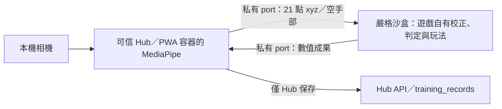

# 手勢指令對戰 R2 候選審查

更新日期：2026-10-09。狀態：擁有者以「核准並推送」核准以下精確版本及摘要；R2 已發布，Hub／runner 已部署，正式驗收進行中。尚未建立完整正式收據或標記遷移完成。

## 精確候選

- 遊戲：`gesture-battler@2.0.0`。
- `contentSha256`：`07559f7b08707675ea8e6faa343959bc859ce2fa60e133cb1737027855717bf1`。
- 遊戲包：5 個檔案、893,134 bytes。包含自有設定／教學／引擎／雙語結果、`game.json` 與原始預覽圖；沒有設定／成績 JSON、MediaPipe 模型或平台 UI。
- 第一方輸入：`hand-tracking-1.0.0`，MediaPipe `0.10.35`。10 個檔案合計 41,723,126 bytes；實際輸入檔案清單摘要為 `0f141b5a013b6a14a6ce71f58c8e7ab32a1ac15f1ce547fdd1a28d6be3bd94c4`。包含 SIMD／非 SIMD／module WASM、固定模型、第一方輸入程式與授權文件；PWA 預快取實際使用的 SIMD／非 SIMD 路徑。
- 完整清單：[候選資料](migrations/gesture-battler-2.0.0-candidate.json)。`ownerApproval` 記錄使用者的精確候選核准；發布前的 dry-run 不作為公開證據，發布後以 R2 實際回讀與正式部署／瀏覽器驗收為準。

發布前重新執行 `node scripts/publish-official-game.mjs gesture-battler --dry-run` 核對上述摘要。任何遊戲 bytes 改動都須重新審查；已公開的遊戲與輸入版本不得覆寫。未建立 `docs/releases/gesture-battler-2.0.0.json`，正式收據須等發布與正式驗收完成後才建立。

發布前輸入目錄檢查失敗：Vite 預設另複製 runner 的 `_headers`、`_routes.json`、`index.html`、`robots.txt`，因此核准時的完整建置快照實際為 14 個檔案、41,726,607 bytes，摘要 `3f334a5da81ca05fd712325f6b14b755fa4af19c5084fc3f882b0c3e05dc2f37`。`buildHandTracking.mjs` 設定 `publicDir: false` 後，重新 build 與輸入目錄檢查通過。候選 `input.approvedBuildSnapshot` 保留完整核准快照；交付的 10 個輸入檔案逐一核對，與已核准 bytes 相同，遊戲摘要也未變更。此修正只移除重複容器檔，不變動 MediaPipe／模型／WASM／输入程式。

## 原功能與分類

原 workspace 為 `1.0.0`／`catalog-v1`，依賴共用 shell、設定與成績 JSON。原 JSON 留在 [舊設定](migrations/gesture-battler-legacy/settings.json)及[舊成績](migrations/gesture-battler-legacy/score.json)供範圍與成果欄位核對，不隨新遊戲發布。

| 原行為 | 候選保留情形 |
| --- | --- |
| HP 10；1–100、整數 | 自有表單與 validation，邊界、無效值及往返保留值已驗證 |
| 維持 2 秒；0.5–10 秒、每階 0.5 秒 | 原預設／範圍及實際 0.5 秒對戰與入庫已驗證 |
| 相似度 70%；50–90%、每階 5% | 保留原特徵／權重／門檻與 ROM 正規化，不換算成關節角度 |
| 自由／指定模式 | 自由接受已校正手勢；指定模式只接受當前要求，逐次成果保留目標值 |
| 握拳、張手、1–5，共七步校正 | 原 2.2 秒擷取、穩定樣本檢查、追蹤中斷與重試保留 |
| 五招、每次攻擊扣 1 HP、動畫與聲音 | 原 Pixi 場景、手勢判定、持續／中斷、攻擊及 jsPsych lifecycle 保留 |
| 桌機全螢幕、手機方向限制與返回 | 第一個校正按鈕取得原生全螢幕；手機橫向對戰，返回退出全螢幕與停止相機 |
| 完整當次紀錄 | 五種手勢統計、逐次施放、相似度、指定值、時長、HP、保存失敗重試；不送身份資料給遊戲 |

分類沿用遊戲原 catalog：`motor`／`upper-limb`，中英文標題／描述與作者由遊戲 `public/game.json` 擁有。原圖 SHA-256 為 `e9a94f96668975638581ad4cf467bb9d8b38f26ce82512a9a54185a1f2d22a9b`；已核對原 Hub bytes 相同後移到遊戲 `public/preview.webp`，Hub 只產生相容預覽。

直接讀正式 `/api/games` 確認有歷史 `official-gesture-battler`／`rel-gesture-battler-1.0.0`，摘要 `e1df952cc2fd88ea8c75d71db9373bd25d0b81430ef0810c8ec1d1a0be816c0a`，舊發布分類為 `motor`／`general`。新格式使用原遊戲上肢分類；歷史發布不能覆蓋新的官方入口。Hub 合併測試與 Brave 大廳 fixture 都加入此 slug 的舊版碰撞，驗證只保留一張正確分類／原圖卡片，開始前固定 session 版本。

## 已核准的輸入代理

使用者已明確接受「輸入代理，維持嚴格沙盒」。規範例外已寫入 [AGENTS.md](../AGENTS.md)與[搬遷計畫](r2-game-migration-plan.md#手勢指令對戰的相機輸入例外)。



只有可信官方版本的 `hand-tracking` capability 能要求容器開啟確認視窗。Hub 經固定版本 session；獨立 launcher 額外核對官方歷史與 release 摘要。遊戲保持 `sandbox="allow-scripts"`，package 相機權限為 `camera=()`、`connect-src 'none'`，不加入 same-origin、相機委派、外連、Worker 或 unsafe-eval。只有可信容器取得相機與 WASM 編譯能力。

MediaPipe 模型與 WASM 來自 runner `/input/hand-tracking-1.0.0/`，建置依既有 `r2-ai-assets.manifest.json` 核對大小／SHA-256；瀏覽器不讀 CDN。代理只傳有限數值 xyz、timestamp、ready／錯誤狀態，私有 port 核對 nonce、遞增 sequence、欄位與數量。影像留在裝置，不交給遊戲、不上傳；座標不存入成果。遊戲自行畫骨架預覽，擁有全部校正與手勢判定程式碼。

取消同意、退出、結算、卸載、撤回、重載、相機斷線、推論失敗及晚到初始化皆停止 track／video／模型／排程。測試包含重複要求不重開權限視窗、晚到相機／模型不能重新啟動、拒絕與斷線可回到設定。

## 使用者畫面

前景設定確認後才開始聚光燈，背景已呈現遊戲場景。四步依序定位相機、校正、招式及對手；亮區／遮罩／焦點會隨 resize 更新，Tab／Escape、返回設定、略過與完成清理都有可執行測試。開始練習後，可信容器才詢問相機同意。

- [桌機設定](migrations/gesture-battler-2.0.0/desktop-settings.png)、[相機聚光燈](migrations/gesture-battler-2.0.0/desktop-spotlight-camera.png)、[招式聚光燈](migrations/gesture-battler-2.0.0/desktop-spotlight-moves.png)。
- [手機校正教學聚光燈](migrations/gesture-battler-2.0.0/mobile-spotlight-calibration.png)、[橫向對戰](migrations/gesture-battler-2.0.0/mobile-combat.png)。
- [英文指定模式結果](migrations/gesture-battler-2.0.0/desktop-english-results.png)、[獨立手機 PWA 英文結果](migrations/gesture-battler-2.0.0/pwa-mobile-english-results.png)。

Hub 結果保留 iframe，由遊戲顯示成功／失敗與重試；只有返回大廳按鈕。獨立 PWA 顯示返回入口，不寫帳號／訪客紀錄。兩者結算都關閉相機。

## TDD 與本機驗證

| 先失敗情境 | 原因與修正 | 修正後驗證 |
| --- | --- | --- |
| 聚光燈教學 | 缺少目標定位／遮罩／清理 | tutorial 4 項、四個真實 browser 目標與手機截圖 |
| 自包含遊戲／私有輸入 | 共用 shell、JSON、直接相機及缺少本地設定／協定 | migration 4 項、全部遊戲 TypeScript 與架構 gate |
| 嚴格沙盒下相機 | opaque origin 不能取得相機 | 官方容器代理；browser 真實拒絕遊戲相機要求與真實 WASM 推論 |
| 官方輸入 launcher | 原路由沒有可信相機能力 | capability／官方歷史核對；非官方 404，package CSP 維持 |
| 載入與返回入口 | 等待權限只有空白 loader；返回仍全螢幕 | 可見載入文字；等待退出全螢幕後返回 |
| 英文私有 init | init 先於 React effect，語言事件遺失 | 訂閱後讀目前已驗證語言；英文設定／教學／校正／成果通過 |
| 英文 PWA／離線入口 | lang 被舊 query 安全檢查拒絕；SW 忽略 query | 僅官方手部入口允許單一 zh／en；canonical cache 離線回歸 |

本機 gate 通過：`test:naming`、`test:pwa`（18 項）、`test:game-architecture`（42 項）、`test:hub-functions`（105 項）、`test:gamerunner`（初始 30 項）、`test:entrypoints`、`test:cloudflare-deploy`（4 項）。遊戲、Hub、runner build 與 Functions `node --check` 通過。既有 `test:game-architecture:browser` 5 項及畫畫塔防 R2 大廳完整流程通過。[初次 CI／部署](https://github.com/ian030590/RehabTrainerHub/actions/runs/37891101687)七項 matrix 與兩站部署成功；兩份 workflow 保持既有七項 matrix／相同命令，沒有加入需要 Brave 的 Linux gate。

手勢專用 Brave 命令（全部成果只寫本機 SQLite）：

```sh
node scripts/check-r2-game-browser.mjs --game gesture-battler --lobby
node scripts/check-r2-game-browser.mjs --game gesture-battler --lobby --mobile
node scripts/check-r2-game-browser.mjs --game gesture-battler --lobby --english --signed-in --session-failure --directed
node scripts/check-r2-game-browser.mjs --game gesture-battler --lobby --camera-disconnect
node scripts/check-r2-game-browser.mjs --game gesture-battler --lobby --revoke
node scripts/check-r2-game-browser.mjs --game gesture-battler --standalone
node scripts/check-r2-game-browser.mjs --game gesture-battler --standalone --mobile --english
```

覆蓋：大廳碰撞／分類／原圖、無效設定、設定往返、四步聚光燈、同意取消與重試、真實模型七步校正、自由／指定對戰、完整數值成果、失敗重試及單筆 SQL、帳號／訪客 Subject ID 隔離、session 失敗重試與開始中 current 切換、撤回、相機斷線／資源清理、原生全螢幕與來源一致的返回。獨立 PWA 實際預快取手部模型／WASM，scope 限該遊戲版本與第一方 runtime／input。

瀏覽器先以 Brave fake device 呼叫原生 getUserMedia，驗證可信容器的相機權限政策並停止該 track，再替換影像來源，使用 Google 官方且核對 SHA-256 的手部圖片形成 video stream；MediaPipe、模型、WASM、校正、判定、Pixi、私有通訊與保存都實際執行。來源與摘要見 `scripts/gesture-camera-fixtures.mjs`，首次執行自動下載到忽略的 `.tmp/`。不同參考姿勢代表五個校正標籤，並不表示已驗證真人數字 1–5。張手圖片取單一手，避免雙手切換；CPU 忙碌導致資料不足時沿用遊戲原安全檢查重新校正，不放寬門檻。

Hub output 曾被同步工具改名為 conflicted 檔，重建後測試採 `.tmp/gesture-hub-output` 固定副本／`HUB_OUTPUT_ROOT`。此問題不是產品白畫面；最終 Hub build 已通過，候選排除三款 R2 bundle、保留 37 款舊遊戲。

## 發布、回退與待驗收項目

[唯讀 preflight](migrations/gesture-battler-2.0.0/preflight.json)確認正式 deployment 都成功，手勢官方 current 與 `2.0.0` release 均為 404，沒有提前發布或版本衝突。Wrangler 身份查詢後核對成功；文件與候選沒有憑證。正式舊 Hub「大廳 → 手勢設定」Brave smoke 通過，未啟動相機或寫正式成果。

| 回退對象 | 此次核對值 |
| --- | --- |
| Hub 舊流程 | [65a47245.rehabtrainerhub.pages.dev](https://65a47245.rehabtrainerhub.pages.dev)，deployment `65a47245-0c33-4afc-a8eb-5c7407daaa10` |
| runner 原支援 | [64f9a248.trainerhub-user-games.pages.dev](https://64f9a248.trainerhub-user-games.pages.dev)，deployment `64f9a248-3932-4310-b041-d3936c541c62` |
| 兩者來源 commit | `f49ff709e9bbe2156be5b30591d336fec90de4c4` |

此遊戲首次新格式沒有可供 `--activate-version` 的舊新格式回退版。切換失敗先恢復已核對 Hub 舊部署及 gesture registry／workspace 依賴／原遊戲 source 與兩份 JSON；不把 R2 舊 `1.0.0` JSON 版本加入新格式歷史。恢復舊入口不等於撤回新 R2 版本；官方 CLI 尚無撤回命令，需按計畫第 8 節制定並驗證擁有者操作，不刪歷史物件或紀錄。

核准後順序依[計畫第 7 節步驟 E–F](r2-game-migration-plan.md)：先部署相容 runner 支援，核對候選摘要後發布 R2／current，再部署 Hub registry／bundle 排除，等待 CI／部署成功，最後直接驗證真實 API 分類／同版圖片／摘要、穩定入口、固定版本 session、逐檔 CSP／bytes，以及 `--remote --lobby`、`--remote --standalone`、`--production-hub --lobby` 與手機正式站流程。正式驗收與收據完成後才標記遷移完成。

2026-10-09 rollout：先部署 runner `78ba8f66`、回讀全部十個輸入資產，再發布 R2／current（遊戲摘要一致），推送 `e8cedc4` 後 CI／兩站部署成功。正式 `/api/games` 的唯一官方手勢入口、上肢分類、原圖、穩定 302／no-store、嚴格 iframe／相機 launcher、版本化 PWA、舊 Hub 子資產 410 與無指定版本的 session 回傳皆通過。Session API 只簽發記憶體 HMAC／UUID，僅更新一般 rate_limits 計數，不建立 session／訓練紀錄，不儲存或輸出 token；所有 browser 保存仍只寫本機 SQLite。

正式 browser 發現兩項並先重現失敗：錄製手部圖片被 Hub SW 導航 fallback 攔截，改由已核對的圖片 bytes 形成 data URL；Wrangler 保留函式名稱時，序列化的 broker 遺漏 `__name` 輔助碼，獨立 PWA 無法啟動。新增真實 esbuild `keepNames` 編譯後的 launcher 開頁測試，先因 `__name` 失敗，再改用已發布輸入 IIFE 的 `CreateBroker` 讓測試通過；設定載入仍不開相機。R2 遊戲與十個輸入資產 bytes 均不變。修正後重跑 runner／命名 gate、部署與完整正式瀏覽器流程，再補正式收據。

擁有者已核准上述精確版本／摘要。感測器驗收限制：未使用實體相機、真人 1–5 手勢、Safari／iOS、原生安裝操作或長時間離線。人工驗收依序開啟遊戲、略過／完成教學、確認相機、握拳／張手／1–5 各自校正、分別完成自由／指定模式、遮住手確認中斷、退出確認攝影機指示燈熄滅；再檢查拒絕權限重試、斷線與手機旋轉。這些項目不能以錄製影像測試冒充完成。
