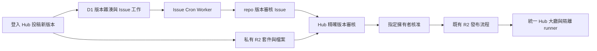

# Hub 統一遊戲目錄與版本審核：第一階段

日期：2026-10-08。程式已完成本機驗證；尚未套用正式 migration、部署或建立真實 GitHub Issue。

## 完成範圍

- 大廳以 `gameCatalog.ts` 合併原有 40 項遊戲與已核准的 R2 投稿。一套卡片、分類、搜尋、數量與 `GameOverlay` 啟動入口；同一 slug 不重複顯示。既有 catalog 項目保留自己的啟動與安裝契約，包含 39 個未遷移遊戲及畫畫塔防；歷史投稿不覆蓋這些入口。畫畫塔防在啟動前由 R2 工作階段 API 選擇核准的 current 版本。
- 39 個舊遊戲保留 workspace、設定、runtime、PWA、成績與建置依賴。畫畫塔防仍使用既有官方 R2 工作階段與入口。
- `/api/game-submissions` 提供中性的投稿入口；舊 `/api/developer/games` 保留相容。投稿套件存私有 quarantine R2，與版本摘要、檔案清單、掃描結果一起建立不可變的審核雜湊。
- 投稿的 D1 transaction 同時建立 Issue 工作。Cron Worker 每分鐘取工作，以 GitHub App 為每個版本建立本 repo 的 Issue；新版本不切換現有公開版本。
- Issue 只放公開作者、活動描述、變更說明、能力、版本／審核雜湊與受保護的 Hub 審核連結。原始套件、詳細掃描、帳號識別及下載權杖保持私有。
- 管理後台支援 `/admin/?release={releaseId}` 精確版本連結。其他管理員可以查核，只有指定擁有者能核准、退回與撤回。
- 核准必須完成既有三項人工查核，且前端提交的雜湊、重新計算的版本摘要、Issue 綁定及實際檔案清單全部相符。沿用現有 Lease、R2 不可變檔案與 manifest 發布流程，核准／退回／撤回後持久化同步 Issue。
- 已開始的投稿遊戲固定原版本；current 切換後仍可保存原本核准版本的結果與冪等重試。已撤回／停用、失效或偽造 token 仍遭拒絕；新版開始僅允許 current。



## 尚未納入本階段

完整目標見 [統一 R2 架構](unified-r2-game-platform-architecture.md)。本次沒有移動任何舊遊戲，也未改 runner、官方發布 CLI、官方 registry 或既有兩套成果資料表。內部仍以 `catalog-v1`／`package-v1` 版本契約轉接既有 overlay；使用者的大廳已整併，所有遊戲的儲存與協定尚未整併。

新投稿仍遵循 [現行 HTML／ZIP 契約](developer-game-packages.md)：原生套件的 `settings.json`／`score.json` 與舊 jsPsych bridge 皆保留。未實作新 v2 自有設定／結果 UI 套件、獨立 Publisher Worker、每遊戲原子公開索引、統一成果儲存或官方 CLI 改走投稿審核。既有官方 slug 保護繼續生效。

已核准的投稿會公開可執行的 HTML／JS／CSS／素材，讓隔離 runner 提供遊玩。原始上傳封存包仍只有授權下載；本階段沒有新增公開原始封存包下載功能。

## 正式啟用

先完成下列設定再部署。這些是啟用步驟，本次沒有對正式環境執行。

1. 確認擁有者在 `app_users` 的 `id`，且角色為 `admin`。設定 GitHub repository variable `GAME_RELEASE_OWNER_USER_ID`；Pages 部署腳本只把它同步至 Hub server environment，不產生任何 `NEXT_PUBLIC_`／`VITE_` 對應值。若自行部署，設定同名 Hub 環境變數。
2. 建立／安裝只選取 `ian030590/RehabTrainerHub`、具 Issues write 權限的 GitHub App。不要給程式碼寫入或發布權限；本 Worker 不讀 repository 原始碼、不執行投稿、不收 R2 或 Hub auth bindings。
3. 把 App 私鑰以 PKCS#8 PEM 格式放入 Worker secret；GitHub 下載的 RSA 私鑰若是 `BEGIN RSA PRIVATE KEY`，先在 repo 外轉換為 `BEGIN PRIVATE KEY`。私鑰與轉換檔不可提交。Worker 必需 secrets：

   | 名稱 | 內容 |
   | --- | --- |
   | `GITHUB_APP_ID` | App 的數字 ID |
   | `GITHUB_APP_INSTALLATION_ID` | 此 repo 所屬 installation 的數字 ID |
   | `GITHUB_REVIEW_REPOSITORY_ID` | 此 repo 的數字 ID |
   | `GITHUB_APP_PRIVATE_KEY` | PKCS#8 PEM 私鑰 |

4. 先套用 D1 `0014_game_review_issues.sql`。既有 Pages 部署腳本會在部署 Hub 前套用 migrations；若先部署 Worker，先明確執行：

   ```sh
   npx --yes wrangler@4 d1 migrations apply REHAB_DB --remote --config apps/rehabtrainerhub/wrangler.toml
   ```

5. 部署 Hub；獨立部署 Worker：`npm run deploy:game-review-worker`。新 Worker 設定在 `workers/game-review-issues/wrangler.toml`，使用現有 D1、每分鐘 Cron、`workers_dev = false`。可透過 Cloudflare dashboard 設定上述 secrets；CLI 設定時使用同一份 `--config`。Pages workflow 不會自動部署此 Worker。
6. 用新版本投稿確認 Issue 連回正確版本，私有下載需登入，未核准版本不出現在公開 API／runner；再由擁有者確認公開。此項需正式帳號、App 與 R2，因此本次只驗證本機替身流程。

未設定擁有者時，審核 mutation 回覆 503。未部署 Worker／App 不通時，投稿仍成功存入私有 R2，審核單顯示建立中，核准遭拒絕；既有核准遊戲與 39 個舊遊戲繼續提供。

## 工作恢復與限制

- 每次最多處理 10 筆；D1 原子領取與 180 秒 Lease 防止重複處理，同一版本的工作依序處理。每筆用當下時間取得 Lease，GitHub 寫入前重新核對並續租；失敗依序延後 60 秒至最多 1 小時重試。重新領取逾期工作會換 Lease ID，已失去 Lease 的工作不再發起新的 GitHub 寫入，也不能綁定 Issue 或完成新 Lease。
- Issue 建立成功但回覆遺失時，先找回由同一 App 建立且具有相同版本／雜湊標記的 Issue；一般使用者貼相同標記不會被認作系統審核單。
- 查找最多翻閱最近 1,000 張 Issue／PR；超過上限會停止該筆建立、保留待重試並記錄需要人工對帳，不會冒險再建立一張。維護者需核對 release ID、review digest、App identity 及 Issue ID，再恢復工作；目前沒有自助對帳後台。
- Migration 為既有待審／阻擋／發布中版本補工作；Worker 也補回 migration 與 Hub 部署之間由舊程式產生的待審投稿。歷史已發布版本不重新開審核單。
- Issue 是審核工作入口。標籤、勾選或關閉不授權公開；不接任何 GitHub Issue webhook 作為核准指令。
- 發布仍使用原有同步 API 與每版本 Lease；沒有實作目標架構的每遊戲 Publisher／原子索引。大型發布仍受 Pages Function 時間限制，失敗後沿用既有發布重試。

## TDD 與本機驗證

先確認失敗，再修改程式：

| 需求 | 修改前失敗 | 修正後驗證 |
| --- | --- | --- |
| 統一大廳 | 缺少合併 helper；仍有兩個結果 grid／啟動 state | 合併去重、保留舊清單與安裝入口；Brave 桌機／手機顯示同一 grid 的 41 項測試遊戲 |
| 保留 39 個舊遊戲 | 已核准投稿的 slug 碰撞會替換舊 runtime | 未遷移 ID 保留原入口與安裝連結；R2 資格登記仍是單一來源 |
| 固定版本成果 | current 切換後原 session 保存回覆 409 | 保存 201、重試 200、僅一筆結果；實際 SQLite 也覆蓋版本切換 |
| 擁有者核准 | 其他 admin 走到版本檢查，回覆 409 而非 403 | 非擁有者 403；缺設定 503；均不接觸 R2 |
| 審完後換檔案 | 改變 file inventory 仍回覆 200 | 雜湊／檔案不符回覆 409，沒有核准 manifest |
| 部署補單 | migration 後舊程式投稿沒有工作，建立 0 張 Issue | 建立 1 張；歷史核准版本不補單 |
| 私有設定隔離 | owner 未同步；runner build 收到 owner ID | Hub 同步 server-only owner；runner 與部署 subprocess 移除它 |
| 過期工作／同步順序 | 慢查詢恢復後重複建立第 2 張 Issue；舊核准同步可蓋掉撤回 | GitHub 寫入前核對續租；同版本工作序列化，Issue 最終維持撤回狀態 |

最終驗證全部通過：

| 驗證 | 結果 |
| --- | --- |
| `npm run build:hub` | 40 個 workspace 成功，39 個舊遊戲保留，畫畫塔防未加入 Hub bundle；包含 TypeScript、產物架構與 SEO 檢查 |
| `npm run test:hub-functions` | 94 項通過，包含 SQLite 實際投稿／核准／成果流程、Worker entry 與核准遊戲自有目錄 |
| `npm run test:entrypoints` | 通過，包含 8 項統一目錄測試、導航、設定、訓練、成果、i18n 與既有安全契約 |
| `npm run test:game-architecture` | 全部遊戲 TypeScript 與 23 項架構／發布／遊戲自有目錄測試通過 |
| `npm run test:game-architecture:browser` | Brave 5 項通過；桌機／手機統一清單、slug 碰撞、舊遊戲設定／開始／完成、guest／登入保存，以及 320／390／768／1024 px 導覽 |
| `test:gamerunner`／`test:pwa` | 24／18 項通過，隔離與既有 PWA 契約保留 |
| `test:naming`／`test:cloudflare-deploy`／`test:seo` | 通過；直接檢查首頁 title、H1、description、canonical、robots、JSON-LD、繁體中文及 104 排除 |
| Functions／Worker syntax、Worker Wrangler dry-run | 8 個模組語法通過，Worker 打包成功且僅有 D1 binding；client bundles 沒有 server-only 審核設定 |

GitHub 故障、回覆遺失、並行領取、偽造 Issue、每版重新送審、owner 核准→R2→D1→Issue 同步皆以可執行測試覆蓋，未對正式服務寫入。瀏覽器重跑時曾遇到本機 `out/index.html` 缺失；重新 build 後，以 `HUB_OUTPUT_ROOT` 指向 `.tmp/` 的完整輸出副本，最終 5／5 通過。重現一般流程：先 build，再跑 browser gate；需要固定輸出時先複製 `out/` 並設定 `HUB_OUTPUT_ROOT`。

## 畫畫塔防啟動、分類與預覽圖修復

2026-10-08 的正式站只讀確認：`/api/games` 仍列出歷史 `drawing-defense@1.0.0`，而 runner 的穩定入口已導向 `2.0.2`。大廳合併原先只保護未遷移 ID，造成舊投稿蓋掉 R2 入口、上肢分類與原預覽圖，並改走不相容的通用設定 shell。

- `MergeHubGames` 保留既有啟動契約；`/api/games` 以可信 R2 current 取代同 slug 的歷史資料列。核准的新目錄資訊可更新卡片、篩選與安裝連結，啟動仍由官方工作階段 API 固定版本。
- 畫畫塔防以自己的 `public/game.json` 宣告 `motor`／`upper-limb`、雙語文案、作者及 `preview.webp`。原預覽圖移入同一 workspace，bytes 未變；Hub 不另維護一份分類或圖片原始檔。
- Publisher 將宣告與圖片一起納入不可變版本的逐檔雜湊。公開目錄必須先驗證 current／approved manifest，再回讀宣告 bytes 核對 SHA-256、分類配對及圖片是否在發布清單；撤回、錯誤雜湊、缺圖或分類不相容時不公開該筆 R2 目錄。前端只接受指定 runner 與同遊戲／同版本的圖片 URL。
- 已發布 `2.0.2` 沒有此宣告，採遊戲 source 宣告與由原圖產生的 Hub 相容資產；39 個未遷移遊戲仍使用既有來源。本機修復驗證時 `2.0.3` 為待核准套件，當時尚未上傳或修改正式 current。

TDD：啟動測試先出現 `package-v1` 取代 `catalog-v1`，Brave 從大廳啟動未建立官方 session 而失敗；分類測試先讀到 `higher-cognition`，自有圖片／宣告不存在，新格式又因缺少 `settingsUrl` 被濾掉。修正後 8 項目錄測試、3 項 API 測試及 2 項宣告驗證全部通過。

Brave 的 `--lobby`／`--lobby --mobile` 現在使用實際本機 `/api/games`、R2 bytes 與 SQLite，另加入舊版 slug 碰撞。兩種尺寸均確認原圖載入、標籤為「上肢動作」，並通過設定→教學→繪圖→結果→保存失敗→重試→單筆成果→返回大廳。`--revoke`／`--session-failure`、5 項既有瀏覽器回歸，以及上表 build／後端／架構／entrypoints／PWA／runner／命名／部署範圍／SEO gate 均通過。

發布 dry-run 驗證 `2.0.3` 共 6 個檔案，內容摘要為 `0eabb5457c9ada94b3ef5bd4da413f6182c4ce95b1fb78aaa18b88130a7e1e24`。本機生成的 `dist/index.html` 曾出現改名為 `index [conflicted].html` 的情況；還原生成檔後完成 dry-run，瀏覽器使用固定 Hub 輸出副本。該次 dry-run 收據僅在 `.tmp/official-game-releases/`，不當作已發布證據；當時 Hub 尚未部署，須擁有者確認公開後才可發布。

使用者在後續明確指示「部屬、公開」，核准上述 `2.0.3` 摘要及 Hub 修正。2026-10-08 已完成 R2 發布、逐檔回讀、current／四個新格式歷史版本的 bytes／雜湊核對，以及 [Hub／runner CI/CD 部署](https://github.com/ian030590/RehabTrainerHub/actions/runs/37774613740)；七項驗證與部署全部成功。正式 `/api/games` 僅有一筆 `2.0.3`，分類為上肢動作，preview URL 指向同版本 R2，原圖與 Hub 相容圖均核對原始 SHA-256。

正式 Hub 桌機／390×844 手機、真實 R2 大廳流程與獨立 PWA 的 Brave 驗收全部通過。直接讀正式 API 確認 current／分類／圖片，並核對不指定版本的 session 選到 `2.0.3`；瀏覽器的保存 API 僅導向本機 SQLite，沒有建立正式成果。完整公開收據見 [drawing-defense-2.0.3.json](releases/drawing-defense-2.0.3.json)，39 個舊遊戲未搬遷。

後續遷移門檻已更新於 [R2 遷移計畫](r2-game-migration-plan.md)第 7／11 節：逐遊戲鎖定舊功能、自有目錄與原圖、歷史 slug 碰撞、真實大廳啟動、正式 sandbox／CSP、每版精確摘要核准、發布順序及正式站驗收；不得用畫畫塔防專用測試宣稱其他遊戲已完成。
