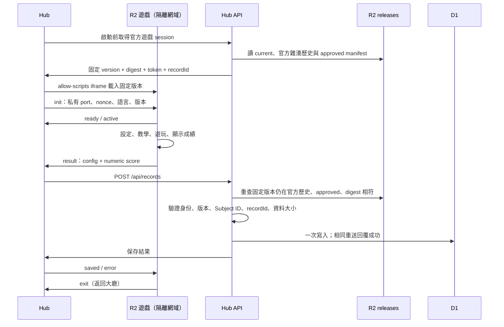

# 內建遊戲逐步遷移至 R2：畫畫塔防試點

更新日期：2026-10-08。首個試點目前採用 `drawing-defense@2.0.2`。

本次先發布新格式 `2.0.0`，最後的設定驗收發現自訂秒數與下拉選單顯示不同，補上失敗測試後修正並另發 `2.0.1`；沒有覆寫已發布內容。舊版 `1.0.0` 與初次試點 `2.0.0` 均保留。

`2.0.2` 修正遊戲教學忽略目標與聚光燈選項的問題。亮區與框線依敵人、繪圖區、防線步驟移動，說明框依可用空間定位；視窗縮放會重新對齊，返回設定、完成或略過教學皆會清除聚光燈。`2.0.1` 保留作為新格式回退版本。

## 1. 本次完成範圍與發布狀態

- 畫畫塔防的設定、教學、Pixi 玩法、音效與完整成績表均由遊戲本身呈現；已移除它的 `settings.json`、`score.json` 與 `packages/ui` 依賴。
- 遊戲已發布至 `rehab-game-releases` R2，經隔離執行器提供服務。版本解耦部署的 runner URL 為 <https://13ff21e2.trainerhub-user-games.pages.dev>。
- 遊戲入口：<https://trainerhub-user-games.pages.dev/games/drawing-defense/2.0.2/package/index.html>。獨立 PWA 入口：<https://trainerhub-user-games.pages.dev/games/drawing-defense/2.0.2/>。
- Hub／runner 已透過 [GitHub CI/CD](https://github.com/ian030590/RehabTrainerHub/actions/runs/37741967141) 完成版本解耦的平台部署；Hub URL 為 <https://1b9362a3.rehabtrainerhub.pages.dev>。正式版本 API、穩定 PWA 入口及 Brave 的開始前固定版本、遊戲、保存失敗重試流程均已確認。遊戲 `2.0.2` 的[原發布紀錄](https://github.com/ian030590/RehabTrainerHub/actions/runs/37730958922)另行保留；平台架構更新沒有重新發布遊戲內容。
- 資料庫沿用 `training_records`，沒有新增 migration。資料庫寫入整合測試使用現有全部 migrations 建立的本機 SQLite，沒有製造正式使用者紀錄。
- 其餘 39 個遊戲維持原流程，逐個遷移；不一次改動全部遊戲。

本次 R2 發布收據見 [drawing-defense-2.0.2.json](releases/drawing-defense-2.0.2.json)。四個檔案合計 5,566,639 bytes，發布後逐檔回讀核對 SHA-256，並從正式 runner 核對 bytes、Content-Type 與 CSP。真實 R2 的 Hub 流程、獨立 PWA 與本機手機流程均通過 Brave 驗證，沒有建立正式使用者紀錄。

版本解耦的架構檢視見 [r2-release-architecture-review.md](r2-release-architecture-review.md)，R2 current／歷史及正式站驗證收據見 [drawing-defense-catalog-2026-10-08.json](releases/drawing-defense-catalog-2026-10-08.json)。仍保留 `1.0.0`、`2.0.0`、`2.0.1` 與 `2.0.2`；只有後三個新格式版本進入官方 current 歷史。

## 2. 架構檢視與責任劃分

原本遊戲雖然各有 Vite workspace，Hub 仍依賴所有遊戲 workspace；Hub build 會複製其 `dist` 到 `/games/{id}/`。獨立 workspace 提供快取隔離，尚未提供部署隔離。R2 已有舊版遊戲封存，但它們仍帶設定／成績 JSON 與原 Hub shell，不能直接視為這次的新格式。

舊遷移方案留下的本機 `.dist-releases/` 已從倉庫移除並加入 `.gitignore`。現行發布直接讀取各遊戲 workspace 的 `dist/`，暫存收據寫入 `.tmp/official-game-releases/`，正式發布收據保留於 `docs/releases/`。清理本機產物不會刪除 R2 上的已發布版本；後續遷移不再建立或提交此舊目錄。

| 責任 | 未遷移遊戲 | R2 試點 |
| --- | --- | --- |
| 設定與教學 | Hub／遊戲既有 JSON shell | 遊戲自己的 React UI |
| 成績畫面 | Hub 解讀 `score.json` | 遊戲自己的摘要與逐敵人表格 |
| 遊戲程式與圖片 | Hub output `/games/{id}/` | R2 不可變版本 |
| Hub build | 建置／複製遊戲 bundle | 只有 registry 與相容入口連結 |
| 登入、Subject ID、成果保存 | Hub | Hub；不交給遊戲 |
| 通訊 | 同源既有嵌入協定 | opaque iframe + 私有 MessageChannel |



## 3. 本次實作的檔案入口

| 檔案 | 用途 |
| --- | --- |
| `games/drawing-defense/main.tsx`、`DrawingTowerDefenseGame.tsx` | 遊戲自己的入口、設定、玩法、結果 |
| `games/drawing-defense/runtime/hubBridge.ts` | 遊戲端 port、序號、成果與保存回覆 |
| `games/drawing-defense/vite.config.ts`、`package.json` | 自有依賴、相對資產路徑、IIFE bundle |
| `packages/ui/src/officialGameReleases.json` | 遷移資格、名稱與可信隔離 origin；不含版本 |
| `apps/usergamerunner/functions/_lib/officialCatalog.js` | 官方 current／雜湊歷史與核准版本驗證；Hub API 與 runner 共用 |
| `packages/ui/src/selfContainedGame.js` | Hub 訊息及成果邊界驗證 |
| `app/train/R2GameOverlay.tsx` | iframe container、session、保存、重試、撤回 |
| `functions/api/official-game-sessions.js` | 簽署與身份／版本綁定的成果保存 token |
| `functions/api/records.js` | 驗證 token、沿用紀錄表、不可變且冪等保存 |
| `scripts/publish-official-game.mjs` | 遊戲 package.json 版本、不可變發布、回讀雜湊、最後切換 current 與回退 |
| `scripts/pages-deployment-scope.mjs` | R2 遊戲內容變更只驗證，平台／未遷移遊戲變更才部署 Pages |
| `scripts/sync-games.mjs`、Hub game shell/PWA scripts | 從 Hub 依賴與 output 排除已遷移遊戲 |
| `apps/usergamerunner/functions/[[path]].js` | 依 release allowlist 核對實際 R2 檔案雜湊 |

除明確列出的完整路徑外，`games/`、`app/`、`functions/` 路徑以 `apps/rehabtrainerhub/` 為根。

## 4. 畫畫塔防保留的功能

- 初級／中級／高級生成規則；30、60、300 秒與無限模式，以及 1–3600 秒自訂時間。
- 生命值 1–20、速度 1–20 px/s、辨識嚴格度 10–90%、收筆等待 100–2000 ms。
- 星空、自訂顏色、自訂圖片背景；音效開關；繁體中文／英文。
- 原本的形狀辨識、滑鼠／觸控／筆輸入、全螢幕與退出流程、jsPsych lifecycle。
- 成績畫面顯示消滅／生成數、活動時間及逐敵人形狀、反應時間、消滅狀態；保存失敗時可重試。
- 設定與教學往返會保留值並清理教學遮罩。沙盒不允許原生 form submission，因此使用按鈕／Enter 觸發遊戲操作，保留欄位驗證，不加入 `allow-forms`。

自訂圖片是本機 Blob URL，不將圖片或檔名寫入成果設定。遊戲不接收姓名、帳號 token 或 Subject ID；成績中的 `Guest` 為本機中性標籤，真正紀錄身份由 Hub 綁定。

## 5. 新通訊契約：沒有設定／成績描述檔

新格式不下載 `settings.json`／`score.json`。設定 UI 與結果 UI 都是遊戲程式碼。傳輸成果仍使用可驗證的物件，沿用資料庫已有的 `rehab-trainer.game-score/v1` 數值結構；此 schema 名稱不是恢復 `score.json` 檔案。

每個 port 訊息包含：

```json
{
  "schema": "trainerhub.game/v1",
  "gameId": "drawing-defense",
  "version": "2.0.2",
  "sessionNonce": "由 Hub 產生的 64 位十六進位字串",
  "sequence": 1,
  "type": "result",
  "payload": {
    "config": { "difficulty": "Beginner", "durationSec": 30, "maxHp": 3 },
    "score": {
      "schema": "rehab-trainer.game-score/v1",
      "gameId": "drawing-defense",
      "summary": { "durationSeconds": 30, "spawned": 2, "defeated": 1, "hpRemaining": 3, "victory": 1 },
      "rounds": [{ "enemyNumber": 1, "shape": 0, "reactionSeconds": 1.2, "defeated": 1 }]
    }
  }
}
```

- `ready`、`active`、`exit`、`retry` 的 payload 為空物件。`retry` 只能出現在有效結算後；同一次載入僅接受一個 `result`。
- Hub 核對 gameId、version、nonce、嚴格遞增 sequence、精確欄位與資料大小。一般 `window.message` 不接受成果，只接受轉交給指定 iframe window 的私有 port。
- 遊戲核對 init 的 `event.source === parent`、由 referrer 推導的 parent origin，以及唯一 port。
- config 最多 64 個短的 primitive 欄位；summary／每回合最多 12 個有限數值或 null，最多 4000 回合，整體最多 450 KiB。敏感欄位名稱會被拒絕。
- 形狀數值依序為 circle=0、cross=1、square=2、triangle=3、vertical-line=4、horizontal-line=5。Boolean 成績用 0／1；無限時間的 `durationSec` 用 0。
- 保存 session token 在載入 iframe 前建立並留在 Hub，綁定 game/version/contentSha256/recordId/userId/Subject ID，24 小時有效。保存與重試沿用原 session；current 切換不改變它。`/api/records` 重查原版本的官方歷史、核准狀態與 digest，並保留既有 origin、驗證碼、rate limit 與身份隔離檢查。仍有效的舊 token 可相容，撤回後不得使用。
- 相同 recordId 與相同成果重送回覆成功；修改成果或跨身份重用回覆 409／400。SQL `ON CONFLICT DO NOTHING` 防止同時提交覆寫。
- 這是使用者端回報的活動紀錄，並非伺服器權威計分或防作弊證明；不可將簽章解讀為玩法或分數已由伺服器重算。

## 6. R2 套件與安全限制

```text
rehab-game-releases/
  official-games/drawing-defense/current.json
  releases/drawing-defense/2.0.2/
    release.json
    files/
      index.html
      assets/index-BYt4-x-R.js
      assets/style-DMY_l4Xs.css
      assets/StarSky-COfhhfcH.png
```

`release.json` 是發布清單，列出 entry、版本、大小、SHA-256 與 `presentation: "game"`。先上傳並核對 files，再寫 approved manifest 並回讀驗證，最後更新官方 current。上傳或核對失敗不切換入口。

官方 `current.json` 包含 `schemaVersion: 1`、`gameId`、`currentVersion` 與 `releases`；歷史項目以版本為 key，保存 `contentSha256`。第三方審核 API 不寫入此 prefix，Hub／runner 不能只憑共用 releases prefix 的 approved 檔案認定它是官方遊戲。首次建立歷史使用倉庫已追蹤的發布收據，逐版核對 manifest 與實際檔案。

- 同版檔案或 release digest 不同時，publisher 拒絕覆寫。中斷後可用相同內容重跑；更動內容要升版本。本腳本假設每個遊戲只有一位發布者，發布與回退不得並行；尚未加入跨發布者 lease／CAS。
- 使用者看到的是執行器 URL，沒有開 R2 公開 bucket 網域。Hub 與執行器分開，執行器仍無 D1／auth binding。
- iframe 維持 `sandbox="allow-scripts"`；CSP 維持 `connect-src 'none'`、`worker-src 'none'`、`form-action 'none'` 等原限制。
- 新格式檔案驗證實際 bytes 的 SHA-256；舊投稿格式仍沿用 customMetadata sha256 驗證。上傳 API 不必依賴自訂 metadata 是否可設定。
- opaque origin 下 ES module 載入與多 chunk import 容易受限制；本次使用相對路徑、classic IIFE script、inlineDynamicImports，未開 `allow-same-origin`。
- Pixi 在嚴格 CSP 中先前會因 unsafe-eval 探測失敗；遊戲採用 `pixi.js/unsafe-eval` 的靜態相容入口，實際驗證不需要把 `'unsafe-eval'` 加入 CSP。
- 不依賴 CDN、外部星空圖片、Hub CSS 或遠端字型；所有必要資產皆在發布清單中。
- Hub 每 60 秒及恢復連線時做 HEAD 檢查，404／410 卸載遊戲。獨立 PWA 沿用 runner 的版本 scope、快取與撤回自毀流程；一般斷網不視為撤回。
- 獨立 PWA 容器只有在新格式遊戲宣告 `fullscreen` capability 時加上 fullscreen 委派；Hub 與獨立 PWA 都已驗證原生 fullscreen element 是遊戲 root。runner Service Worker revision 已更新為 `2026-10-08-self-contained-games-v4`，避免沿用舊容器快取。

## 7. 每個遊戲的遷移步驟

### 步驟 A：盤點並先鎖定行為

1. 列出設定欄位、預設值、規則、結果表、語言、背景／音效／模型／worker／感測器需求。
2. 寫可執行的使用者流程測試：設定 → 規則 → 開始 → 結算 → 返回；再加入設定往返、手機、保存失敗、重送、身份切換與撤回情境。
3. 先確認新需求測試失敗；不要刪除原功能或放寬安全檢查。

### 步驟 B：讓遊戲真正自給自足

1. 將設定與成績 UI 放進遊戲自己的 entry／runtime。移除 OfficialGameShell、Hub auth／storage／routing／CSS 引用。
2. 依賴寫在遊戲 package.json；保留自身已用的 renderer、jsPsych、i18n 與 assets。不能只因 root node_modules 恰好存在而省略依賴。
3. 把外部必要資產打包；改為相對路徑。將所有設定、結果與回合欄位對照原功能確認完整。
4. 將成果保存改為 port 傳遞；遊戲不自行呼叫 Hub database API，不帶 frontend secrets。
5. 保留獨立啟動模式。未接收到 Hub port 時只能本機遊玩與查看結果；退出回設定，不永久顯示「保存中」。
6. 在行為測試保護下，移除該遊戲的設定／成績 JSON 與不用的 shell 檔案。

### 步驟 C：註冊版本並排除 Hub bundle

1. 在 `officialGameReleases.json` 增加 gameId、隔離 origin 與名稱。版本只由遊戲 package.json 擁有，bridge 與 publisher 都讀取它；不要恢復 Hub 的靜態版本指標。
2. 執行 `npm run sync:games`，確認 Hub package.json 不再依賴已遷移的遊戲；執行 `npm install --package-lock-only --ignore-scripts` 更新 lockfile。
3. 確認 Hub build、PWA emitter、輸出檢查只為該遊戲留下相容入口連結，沒有恢復 bundle、設定／成績 JSON 或 `/runtimes/*`。
4. 為新遊戲加入 registry 驅動的分支測試；其他遊戲的 JSON 規則仍必須通過。

### 步驟 D：建置與測試

以本次為例：

```sh
npm run build --workspace=@rehab-trainer/game-drawing-defense
node scripts/publish-official-game.mjs drawing-defense --dry-run
npm run test:game-architecture
npm run test:hub-functions
npm run test:gamerunner
npm run test:entrypoints
npm run build:hub
npm run test:seo
npm run test:pwa
npm run test:game-architecture:browser
node scripts/check-r2-game-browser.mjs
node scripts/check-r2-game-browser.mjs --mobile
node scripts/check-r2-game-browser.mjs --revoke
```

新遊戲要擴充對應 browser fixture，不能只改上述 gameId 就宣稱所有玩法通過。完成遊戲與 Hub TypeScript 檢查及修改 Function 的 `node --check`。

### 步驟 E：上傳不可變 R2 發布

```sh
npm run publish:game -- drawing-defense
```

需有 Cloudflare API token 或有效 Wrangler OAuth，以及可選的 `CLOUDFLARE_ACCOUNT_ID`。多帳號必須指定帳號。憑證只在本機／CI secret，不寫入 repo、release manifest、遊戲或文件。

1. 先確認目標版本未存在；存在不同內容時升版，不能覆寫。
2. dry-run 確認所有本地資源存在、檔案數／單檔／總容量符合 runner 限制。
3. 上傳、回讀並核對所有檔案；發布 release.json 後再次驗證，再更新官方 current／歷史並回讀確認。回退也必須驗證原版本的實際檔案。
4. 收據放 `.tmp/official-game-releases/{id}/{version}/`；將不含憑證的發布摘要保存到 `docs/releases/`。

### 步驟 F：切換前驗收與部署

1. 若 runner 新增格式支援，先執行其測試與 build，再部署隔離 runner。只更新遊戲內容且格式已支援時不必部署 runner。
2. 從正式 runner 下載每個 R2 檔案，核對 status、Content-Type、CSP、sandbox、hash，再跑實際瀏覽器流程。
3. 本次可使用 `node scripts/check-r2-game-browser.mjs --remote` 及 `--remote --standalone`。remote 模式讀實際 R2／runner 資產；Brave 的 CDP 僅將 `https://trainerhub.cc/*` 導向本機 Hub 與測試 API，保留正式 CSP，不寫入正式 D1。
4. 新格式／平台架構需一次 Hub／runner CI/CD 部署；完成後，同一 R2 遊戲的內容更新與 current 回退由 publisher 完成。純 R2 遊戲變更仍跑 CI gate，但跳過 Pages；未遷移遊戲與平台變更仍部署。不要在 production 建立虛構帳號／成績作為測試。
5. 記錄 Hub／runner deployment、R2 digest、驗證結果與回退目標。

### 步驟 G：版本指標已移到 R2

版本指標改為每遊戲一份 R2 官方目錄，不新增 D1 migration、binding 或 secret。Hub API 選擇已登記官方遊戲的 current；舊 Hub 可明確要求仍核准的官方歷史版本。遊戲資產仍是不可變版本，開始中的 session 固定版本，撤回與 digest 不符時拒絕保存，R2 故障回覆 503 以便重試。

Hub 的相容 PWA 連結指向 runner `/games/{gameId}/`，由不可快取 302 選擇 current；版本化 PWA 的 manifest、scope 與快取維持原版本。新增遊戲資格或平台功能仍需部署。未加入管理者切換畫面、並行發布鎖或已安裝 PWA 自動升版。

## 8. 回退與版本相容

- 新格式修正版只升 game package 版本並更新 lockfile 的對應版本資料，重新建置、測試與發布；publisher 切換 current，不修改 Hub registry。
- 回退命令：`node scripts/publish-official-game.mjs drawing-defense --activate-version 2.0.1`。僅可選擇官方歷史中仍核准且 bytes 驗證通過的新格式版本，不部署 Hub、不刪除新版。
- 舊 `1.0.0` 使用原 JSON shell／嵌入協定，保留在 R2 但不加入新格式官方 current 歷史。若回退到舊流程，必須回退 Hub 的 overlay 分派、workspace 依賴與遊戲原始程式／JSON，重新跑 gates。
- 本次 runner 部署之前的 production deployment 為 `6dd705d9-8ac2-4145-9b9b-cb20eac9a025`。runner 回退會失去新格式的實際 bytes hash 支援；先撤回新入口或回退 Hub，再回退 runner。
- 無須 database migration／降版。歷史紀錄仍在原表；切換版本不應刪除它們。
- session 固定版本並於 24 小時到期；current 切換後仍可保存與重試該版，只要版本仍在可信官方歷史中、approved 且 digest 相符。撤回與逾期 token 不接受；舊版 PWA 保留版本，無須刪除 R2 資產。

## 9. 後續 39 個遊戲的順序與驗收門檻

1. 先選純點擊、無感測器、依賴較少的棋盤／益智遊戲，例如井字棋、四子棋、點格棋。
2. 接著遷移 Pixi 類遊戲，逐個驗證實際 canvas、音效與全螢幕；禁止假設畫畫塔防設定能套用到所有遊戲。
3. 再遷移 jsPsych 實驗，保留 lifecycle、雙語指導、刺激時序、逐 trial 資料與科學參考說明。
4. 最後處理相機、麥克風、MediaPipe／TensorFlow／Vosk／WebGazer 等大型模型與權限需求。現有 restrictive sandbox／CSP 不保證能支援它們；先針對實際能力設計受控第一方執行環境，不放寬第三方遊戲保護。

每一個遊戲都必須符合：自有依賴、設定／教學／結果完整；Hub output 無該遊戲 bundle；匿名／登入隔離與冪等保存；桌面／手機互動；獨立 PWA；不可變發布收據；回退步驟；未改變用途或引入新的醫療效能宣稱。

## 10. 本次 TDD／回歸紀錄與限制

| 先失敗的情境 | 原因與修正 | 修正後證據 |
| --- | --- | --- |
| 獨立入口／無 JSON／完整設定 | 仍引用共用 shell、JSON 和 Hub 依賴 | self-contained game + architecture tests |
| R2 檔案無 customMetadata | 原 runner 只核對 metadata | 新格式核對 bytes；正確 200、竄改 404，舊格式測試保留 |
| 沙盒 Pixi 啟動 | CSP 下 unsafe-eval 探測失敗 | 靜態相容入口；正式 CSP 下 Brave 無 runtime exception |
| 設定按鈕進教學 | sandbox 阻止 native submit | 按鈕／Enter + reportValidity；實際流程通過 |
| 教學返回設定 | 教學 overlay 未卸載 | effect dispose；設定往返測試通過 |
| 自訂時間顯示 | 不在 preset options 中，select 顯示 30 但活動採用自訂值 | 新增對應 option；選單、教學與入庫 duration 都為 5 秒；另發 2.0.1 |
| 獨立 PWA 原生全螢幕 | 舊 runner iframe 沒有委派 fullscreen | 新格式宣告能力後才委派；原生目標測試與完整結算通過，sandbox 不變 |
| 同時重送 | 競爭中的第二個 INSERT 回 409 | SQL barrier 模擬並行；201+200 且僅一筆，修改成果仍 409 |
| 已載入後撤回 | Hub 沒有版本健康檢查 | online/HEAD 檢查；iframe 移除、沒有保存成果 |

已通過：Hub build、遊戲／Hub TypeScript、Hub Functions 71 tests、runner 18 tests、entrypoints、game architecture 17 tests、SEO、PWA 18 tests，以及畫畫塔防 Brave 桌面／390×844 手機（含觸控）／正式 R2／獨立 PWA／撤回測試。既有 JSON 遊戲的 Brave 測試已改為明確選擇未遷移遊戲，避免依賴大廳第一張卡片的順序。

測試不是正式 D1 帳號操作、所有裝置／瀏覽器或完整離線長時間驗證。首個新格式單檔 JS 約 904 KB、星空 PNG 約 4.65 MB；壓縮圖片可另開經測試的版本，不覆寫此次發布。

原畫畫塔防有未命中筆畫 PNG 回報；倉庫沒有 `/api/drawing-samples` 的後端實作。本次保留去除身份資訊後的 port→Hub 轉送，移除遊戲直連與 frontend upload token，但不宣稱 PNG 已成功存放。此選配資料收集需另行配置 Hub 後端及儲存政策，不影響玩法或成果入庫。

## 參考文件

- [Cloudflare R2 object upload API](https://developers.cloudflare.com/api/resources/r2/subresources/buckets/subresources/objects/methods/upload/)
- [PixiJS v8 migration guide](https://pixijs.com/8.x/guides/migrations/v8)
- 倉庫 [game-score-contract.md](game-score-contract.md)：保留其歷史格式；新格式 UI 與通訊差異以本文為準。
