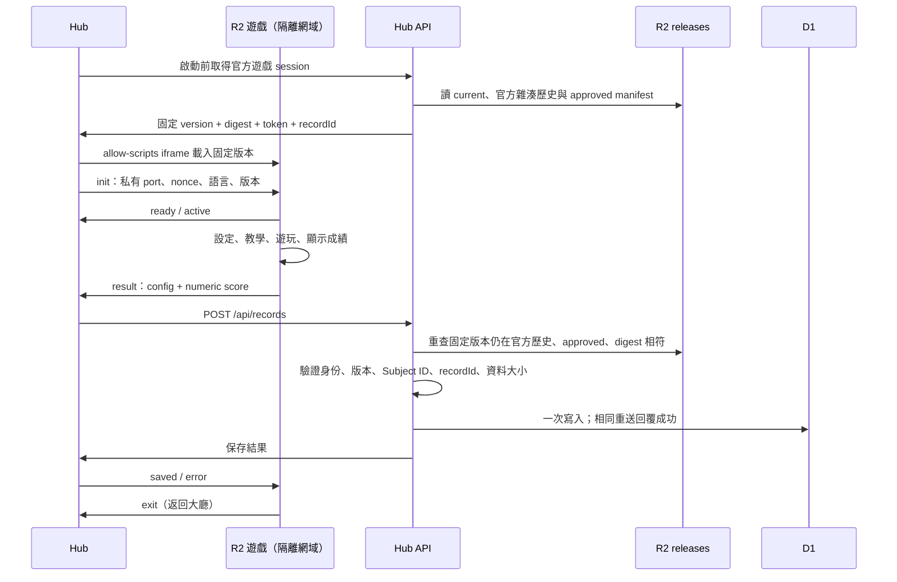

# 內建遊戲逐步遷移至 R2：畫畫塔防試點

更新日期：2026-10-09。目前 R2 current 為 `drawing-defense@2.0.4`、`asteroid-shield@2.0.3` 與 `gesture-battler@2.0.1`。第 7 節是後續每個遊戲必須完成的遷移流程；第 11 節是逐遊戲審查單，不得只確認直接遊戲網址能開啟。

三款成績頁新版經擁有者核准精確 version／contentSha256，已發布 R2，加入主要統計、可切換指標的圖表／描述統計與個別回合明細。成績 UI、計算與樣式仍各自由遊戲擁有，Hub 不增加結果頁或遊戲 bundle。後續遷移同樣必須符合第 7 節步驟 B 的成績呈現規範、第 D 步驟的驗證關卡與第 11 節的審查欄位；實作、正式驗收與回退證據見 [成績頁發布紀錄](r2-game-results-ui.md)及三份正式收據：[畫畫塔防](releases/drawing-defense-2.0.4.json)、[小行星護盾防衛](releases/asteroid-shield-2.0.3.json)、[手勢指令對戰](releases/gesture-battler-2.0.1.json)。

小行星護盾防衛的滑鼠／觸控 `asteroid-shield@2.0.0` 已完成擁有者精確版本核准、R2 發布與逐檔回讀、[CI／Hub／runner 部署](https://github.com/ian030590/RehabTrainerHub/actions/runs/37853571583)、正式 API／圖片／固定版本 session，以及真實 Hub 桌機／觸控與獨立 PWA 驗收。逐遊戲證據見 [審查單](asteroid-shield-r2-migration.md)與[正式收據](releases/asteroid-shield-2.0.0.json)。目前 3 款完成、37 款維持舊流程；第 1 節保留畫畫塔防首個試點的發布歷史與當時數量。

小行星護盾防衛 `2.0.1` 將設定改為前景視窗，遊戲說明場景先在背景呈現，確認後才啟動教學；擁有者已核准精確摘要，R2／正式 API／Hub 桌機與手機／獨立 PWA 驗收通過，[CI／部署](https://github.com/ian030590/RehabTrainerHub/actions/runs/37867035465)成功且部署後已重新驗收。見 [設定視窗審查](asteroid-shield-settings-dialog-2.0.1.md)與[正式收據](releases/asteroid-shield-2.0.1.json)。`2.0.0` 保留作為已驗證回退版本；第 7 節步驟 B 將相同呈現方式列為後續遷移要求。

小行星護盾防衛 `2.0.2` 重現底部寬幅飛船、水平護盾、垂直差異落速與動畫。使用者核准精確候選後已發布 R2；正式 API／逐檔 SHA-256／Hub 桌機與手機／獨立手機 PWA 驗收通過，發布時 current 切至 `2.0.2`，`2.0.1` 保留為當版已核對回退版。現有 Hub／runner 已相容，不需為遊戲生效重部署 Pages；見 [玩法發布驗證](asteroid-shield-gameplay-2.0.2.md)與[正式收據](releases/asteroid-shield-2.0.2.json)。

本次先發布新格式 `2.0.0`，最後的設定驗收發現自訂秒數與下拉選單顯示不同，補上失敗測試後修正並另發 `2.0.1`；沒有覆寫已發布內容。舊版 `1.0.0` 與初次試點 `2.0.0` 均保留。

`2.0.2` 修正遊戲教學忽略目標與聚光燈選項的問題。亮區與框線依敵人、繪圖區、防線步驟移動，說明框依可用空間定位；視窗縮放會重新對齊，返回設定、完成或略過教學皆會清除聚光燈。`2.0.1` 保留作為新格式回退版本。

`2.0.3` 將原預覽圖、分類、雙語名稱／說明與作者移入遊戲自己的套件，並修正 Hub 大廳被歷史 `1.0.0` 投稿蓋掉啟動契約的問題。此問題使 R2 遊戲誤走通用 JSON 設定 shell，即使直接 R2 網址能玩，大廳仍無法正常啟動。後續遷移必須同時驗證大廳卡片、公開目錄 API、固定版本 session、遊戲 iframe 與獨立 PWA。

## 1. 本次完成範圍與發布狀態

本節保留畫畫塔防 `2.0.3` 首次完成大廳切換時的歷史紀錄；最新 current 與三款成績頁版本以本文開頭及各版正式收據為準。

- 畫畫塔防的設定、教學、Pixi 玩法、音效與完整成績表均由遊戲本身呈現；已移除它的 `settings.json`、`score.json` 與 `packages/ui` 依賴。
- 遊戲已發布至 `rehab-game-releases` R2，經隔離執行器提供服務。此次 runner deployment 為 <https://e2459d3c.trainerhub-user-games.pages.dev>。
- 穩定 PWA 入口：<https://trainerhub-user-games.pages.dev/games/drawing-defense/>；當時以不可快取 302 指向 `2.0.3`。當版 PWA 入口：<https://trainerhub-user-games.pages.dev/games/drawing-defense/2.0.3/>。
- Hub／runner 已透過 [GitHub CI/CD](https://github.com/ian030590/RehabTrainerHub/actions/runs/37774613740) 部署本次修正；Hub deployment 為 <https://8e957462.rehabtrainerhub.pages.dev>。正式 `/api/games` 僅列出一筆 `drawing-defense@2.0.3`，分類為 `motor`／`upper-limb`，圖片指向同版本 R2；正式 session API 不指定版本時選到相同版本與摘要。
- 資料庫沿用 `training_records`，沒有新增 migration。資料庫寫入整合測試使用現有全部 migrations 建立的本機 SQLite，沒有製造正式使用者紀錄。
- 其餘 39 個遊戲維持原流程，逐個遷移；不一次改動全部遊戲。

本次 R2 發布收據見 [drawing-defense-2.0.3.json](releases/drawing-defense-2.0.3.json)。六個檔案合計 5,602,372 bytes，內容摘要為 `0eabb5457c9ada94b3ef5bd4da413f6182c4ce95b1fb78aaa18b88130a7e1e24`；包含 `game.json` 與原始 `preview.webp`。逐檔回讀核對 R2／runner bytes、CSP，正式 Hub 桌機／390×844 手機與獨立 PWA 均通過 Brave 完整流程；瀏覽器保存 API 導至本機 SQLite，沒有建立正式成果紀錄。

版本解耦的架構檢視見 [r2-release-architecture-review.md](r2-release-architecture-review.md)。[先前目錄收據](releases/drawing-defense-catalog-2026-10-08.json)保留切換前的 `2.0.2` 狀態；本次 current／完整歷史核對記錄在 `2.0.3` 收據。仍保留 `1.0.0`、`2.0.0`、`2.0.1`、`2.0.2` 與 `2.0.3`；舊格式 `1.0.0` 不加入新格式官方 current 歷史。

## 2. 架構檢視與責任劃分

原本遊戲雖然各有 Vite workspace，Hub 仍依賴所有遊戲 workspace；Hub build 會複製其 `dist` 到 `/games/{id}/`。獨立 workspace 提供快取隔離，尚未提供部署隔離。R2 已有舊版遊戲封存，但它們仍帶設定／成績 JSON 與原 Hub shell，不能直接視為這次的新格式。

舊遷移方案留下的本機 `.dist-releases/` 已從倉庫移除並加入 `.gitignore`。現行發布直接讀取各遊戲 workspace 的 `dist/`，暫存收據寫入 `.tmp/official-game-releases/`，正式發布收據保留於 `docs/releases/`。清理本機產物不會刪除 R2 上的已發布版本；後續遷移不再建立或提交此舊目錄。

| 責任 | 未遷移遊戲 | R2 試點 |
| --- | --- | --- |
| 設定與教學 | Hub／遊戲既有 JSON shell | 遊戲自己的 React UI |
| 成績畫面 | Hub 解讀 `score.json` | 遊戲自己的主要統計、資料圖表與逐回合明細；呈現要求見第 7 節步驟 B |
| 遊戲程式與圖片 | Hub output `/games/{id}/` | R2 不可變版本 |
| 卡片、分類、文案與預覽原檔 | 遊戲既有 catalog／靜態資產 | 遊戲 `public/game.json` 與本地預覽圖；API 讀核准版本 |
| Hub build | 建置／複製遊戲 bundle | registry、相容入口與由遊戲原圖複製的相容預覽；不帶遊戲 bundle／設定／成績 JSON |
| 登入、Subject ID、成果保存 | Hub | Hub；不交給遊戲 |
| 通訊 | 同源既有嵌入協定 | opaque iframe + 私有 MessageChannel |



## 3. 本次實作的檔案入口

| 檔案 | 用途 |
| --- | --- |
| `games/drawing-defense/main.tsx`、`DrawingTowerDefenseGame.tsx` | 遊戲自己的入口、設定、玩法、結果 |
| `games/drawing-defense/runtime/hubBridge.ts` | 遊戲端 port、序號、成果與保存回覆 |
| `games/drawing-defense/vite.config.ts`、`package.json` | 自有依賴、相對資產路徑、IIFE bundle |
| `games/drawing-defense/public/game.json`、`preview.webp` | 遊戲擁有的分類、雙語文案、作者與原預覽圖 |
| `games/gameCatalogMetadata.js`、`functions/_lib/gameCatalog.js` | 驗證宣告、圖片清單及實際宣告雜湊，取得版本化目錄 |
| `app/hubGames.js`、`gameCatalog.ts`、`publishedGames.ts`、`functions/api/games.js` | 保留既有啟動契約，排除歷史 slug 碰撞，套用已核准的目錄資訊 |
| `packages/ui/src/officialGameReleases.json` | 遷移資格、名稱與可信隔離 origin；不含版本 |
| `apps/usergamerunner/functions/_lib/officialCatalog.js` | 官方 current／雜湊歷史與核准版本驗證；Hub API 與 runner 共用 |
| `packages/ui/src/selfContainedGame.js` | Hub 訊息及成果邊界驗證 |
| `app/train/R2GameOverlay.tsx` | iframe container、session、保存、重試、撤回 |
| `functions/api/official-game-sessions.js` | 簽署與身份／版本綁定的成果保存 token |
| `functions/api/records.js` | 驗證 token、沿用紀錄表、不可變且冪等保存 |
| `scripts/publish-official-game.mjs` | 遊戲 package.json 版本、不可變發布、回讀雜湊、最後切換 current 與回退 |
| `scripts/pages-deployment-scope.mjs` | R2 遊戲內容變更只驗證，平台／未遷移遊戲變更才部署 Pages |
| `scripts/sync-games.mjs`、Hub game shell/PWA scripts | 從 Hub 依賴與 output 排除已遷移遊戲 |
| `apps/usergamerunner/functions/[[path]].js` | 依 release allowlist 核對實際 R2 檔案雜湊 |

除明確列出的完整路徑外，`games/`、`app/`、`functions/` 路徑以 `apps/rehabtrainerhub/` 為根。

## 4. 畫畫塔防保留的功能

- 初級／中級／高級生成規則；30、60、300 秒與無限模式，以及 1–3600 秒自訂時間。
- 生命值 1–20、速度 1–20 px/s、辨識嚴格度 10–90%、收筆等待 100–2000 ms。
- 星空、自訂顏色、自訂圖片背景；音效開關；繁體中文／英文。
- 原本的形狀辨識、滑鼠／觸控／筆輸入、全螢幕與退出流程、jsPsych lifecycle。
- 成績畫面顯示消滅／生成數、活動時間及逐敵人形狀、反應時間、消滅狀態；保存失敗時可重試。
- 設定與教學往返會保留值並清理教學遮罩。沙盒不允許原生 form submission，因此使用按鈕／Enter 觸發遊戲操作，保留欄位驗證，不加入 `allow-forms`。

自訂圖片是本機 Blob URL，不將圖片或檔名寫入成果設定。遊戲不接收姓名、帳號 token 或 Subject ID；成績中的 `Guest` 為本機中性標籤，真正紀錄身份由 Hub 綁定。

## 5. 新通訊契約：沒有設定／成績描述檔

新格式不下載 `settings.json`／`score.json`。設定 UI 與結果 UI 都是遊戲程式碼。傳輸成果仍使用可驗證的物件，沿用資料庫已有的 `rehab-trainer.game-score/v1` 數值結構；此 schema 名稱不是恢復 `score.json` 檔案。

每個 port 訊息包含：

```json
{
  "schema": "trainerhub.game/v1",
  "gameId": "drawing-defense",
  "version": "2.0.3",
  "sessionNonce": "由 Hub 產生的 64 位十六進位字串",
  "sequence": 1,
  "type": "result",
  "payload": {
    "config": { "difficulty": "Beginner", "durationSec": 30, "maxHp": 3 },
    "score": {
      "schema": "rehab-trainer.game-score/v1",
      "gameId": "drawing-defense",
      "summary": { "durationSeconds": 30, "spawned": 2, "defeated": 1, "hpRemaining": 3, "victory": 1 },
      "rounds": [{ "enemyNumber": 1, "shape": 0, "reactionSeconds": 1.2, "defeated": 1 }]
    }
  }
}
```

- `ready`、`active`、`exit`、`retry` 的 payload 為空物件。`retry` 只能出現在有效結算後；同一次載入僅接受一個 `result`。
- Hub 核對 gameId、version、nonce、嚴格遞增 sequence、精確欄位與資料大小。一般 `window.message` 不接受成果，只接受轉交給指定 iframe window 的私有 port。
- 遊戲核對 init 的 `event.source === parent`、由 referrer 推導的 parent origin，以及唯一 port。
- config 最多 64 個短的 primitive 欄位；summary／每回合最多 12 個有限數值或 null，最多 4000 回合，整體最多 450 KiB。敏感欄位名稱會被拒絕。
- 形狀數值依序為 circle=0、cross=1、square=2、triangle=3、vertical-line=4、horizontal-line=5。Boolean 成績用 0／1；無限時間的 `durationSec` 用 0。
- 保存 session token 在載入 iframe 前建立並留在 Hub，綁定 game/version/contentSha256/recordId/userId/Subject ID，24 小時有效。保存與重試沿用原 session；current 切換不改變它。`/api/records` 重查原版本的官方歷史、核准狀態與 digest，並保留既有 origin、驗證碼、rate limit 與身份隔離檢查。仍有效的舊 token 可相容，撤回後不得使用。
- 相同 recordId 與相同成果重送回覆成功；修改成果或跨身份重用回覆 409／400。SQL `ON CONFLICT DO NOTHING` 防止同時提交覆寫。
- 這是使用者端回報的活動紀錄，並非伺服器權威計分或防作弊證明；不可將簽章解讀為玩法或分數已由伺服器重算。

## 6. R2 套件與安全限制

```text
rehab-game-releases/
  official-games/drawing-defense/current.json
  releases/drawing-defense/2.0.3/
    release.json
    files/
      index.html
      game.json
      preview.webp
      assets/index-xaM1jER6.js
      assets/style-DMY_l4Xs.css
      assets/StarSky-COfhhfcH.png
```

`release.json` 是發布清單，列出 entry、版本、大小、SHA-256 與 `presentation: "game"`。先上傳並核對 files，再寫 approved manifest 並回讀驗證，最後更新官方 current。上傳或核對失敗不切換入口。

### 遊戲自有目錄契約

每個新遷移遊戲從第一個新格式版本起，都必須有 `public/game.json` 及套件內預覽圖；不得再使用 Hub 手寫的新分類、舊投稿欄位或另一份圖片原檔。Vite 將它們複製到 `dist/`，Publisher 驗證並列入不可變檔案清單。以畫畫塔防為例：

```json
{
  "schemaVersion": 1,
  "gameId": "drawing-defense",
  "trainer": "motor",
  "category": "upper-limb",
  "author": "居家訓練網",
  "preview": "preview.webp",
  "copy": {
    "zh-TW": { "title": "畫畫塔防", "description": "繪製指定圖形，練習上肢精細動作與手眼協調。" },
    "en": { "title": "Drawing Tower Defense", "description": "Draw prompted shapes to practise fine upper-limb movement and hand-eye coordination." }
  }
}
```

`trainer`／`category` 必須符合現行 `games/gameCatalogMetadata.js` 的分類配對；不可只因 renderer／引擎或舊 trainer 歸屬而推測用途。預覽只接受本地 raster 路徑，不能是外部網址或另一款遊戲的資產。需要新增分類時，先改平台驗證、翻譯、篩選與測試，再遷移遊戲。

`/api/games` 排除已登記 R2 slug 的歷史 D1 投稿，改讀可信官方 current／approved manifest 及雜湊相符的 `game.json`。前端更新名稱、說明、分類、預覽與安裝連結時，保留 `catalog-v1` 的啟動契約，由 `GameOverlay` 分派到 `R2GameOverlay`；不得改走 `package-v1` 的第三方 JSON shell。`presentation: "game"` 不要求 `settingsUrl`；舊 package 格式仍須保留自己的設定契約。

圖片 URL 必須屬於可信 runner、同一 gameId／version 且出現在發布清單。首次遷移保留原圖 bytes 並核對 SHA-256；若有意更換圖片，須列入當版審核。`2.0.0`–`2.0.2` 沒有目錄宣告的相容處理僅為已發布畫畫塔防保留，不作為其他遊戲省略宣告的理由。宣告缺失／雜湊錯誤或圖片未列入清單時拒絕該筆 API 目錄；獨立成果保存流程仍驗證自己的 release 契約。

官方 `current.json` 包含 `schemaVersion: 1`、`gameId`、`currentVersion` 與 `releases`；歷史項目以版本為 key，保存 `contentSha256`。第三方審核 API 不寫入此 prefix，Hub／runner 不能只憑共用 releases prefix 的 approved 檔案認定它是官方遊戲。首次建立歷史使用倉庫已追蹤的發布收據，逐版核對 manifest 與實際檔案。

- 同版檔案或 release digest 不同時，publisher 拒絕覆寫。中斷後可用相同內容重跑；更動內容要升版本。本腳本假設每個遊戲只有一位發布者，發布與回退不得並行；尚未加入跨發布者 lease／CAS。
- 使用者看到的是執行器 URL，沒有開 R2 公開 bucket 網域。Hub 與執行器分開，執行器仍無 D1／auth binding。
- iframe 維持 `sandbox="allow-scripts"`；CSP 維持 `connect-src 'none'`、`worker-src 'none'`、`form-action 'none'` 等原限制。
- 新格式檔案驗證實際 bytes 的 SHA-256；舊投稿格式仍沿用 customMetadata sha256 驗證。上傳 API 不必依賴自訂 metadata 是否可設定。
- opaque origin 下 ES module 載入與多 chunk import 容易受限制；本次使用相對路徑、classic IIFE script、inlineDynamicImports，未開 `allow-same-origin`。
- Pixi 在嚴格 CSP 中先前會因 unsafe-eval 探測失敗；遊戲採用 `pixi.js/unsafe-eval` 的靜態相容入口，實際驗證不需要把 `'unsafe-eval'` 加入 CSP。
- 不依賴 CDN、外部星空圖片、Hub CSS 或遠端字型；所有必要資產皆在發布清單中。
- Hub 每 60 秒及恢復連線時做 HEAD 檢查，404／410 卸載遊戲。獨立 PWA 沿用 runner 的版本 scope、快取與撤回自毀流程；一般斷網不視為撤回。
- 獨立 PWA 容器只有在新格式遊戲宣告 `fullscreen` capability 時加上 fullscreen 委派；Hub 與獨立 PWA 都已驗證原生 fullscreen element 是遊戲 root。runner Service Worker revision 已更新為 `2026-10-08-self-contained-games-v4`，避免沿用舊容器快取。

## 7. 每個遊戲的遷移步驟

### 步驟 A：盤點並先鎖定行為

1. 為該遊戲建立第 11 節審查單：記下 gameId／slug、現行啟動契約、原分類／雙語文案、原預覽檔案與 SHA-256、設定欄位／預設值／上下限、教學、結果欄位與語言。保留舊版可重現流程及截圖，不憑印象重做。
2. 查核 D1 與 `/api/games` 是否有同 slug 的歷史投稿；記下舊版本／設定 shell，將同 slug 舊資料加入測試 fixture。不刪歷史資料來掩蓋碰撞。
3. 盤點背景、音效、模型、worker、相機、麥克風、下載、本機 storage、外連 API 與 native form submission。先確認它們在 `sandbox="allow-scripts"` 與正式 CSP 下可支援；不相容的遊戲停留舊流程，先解決能力設計。
4. 先鎖定舊流程，再寫新需求的失敗測試：大廳卡片／搜尋／分類／原圖 → 點開始 → 建立固定版本 session → 自有設定／教學 → 真實 gameplay → 完整結算 → 保存／重試 → 返回原大廳；另驗獨立 PWA。直接進 `/train/?module=...` 或只確認 iframe 存在不足以驗收。
5. 為實際使用的設定加入 preset／自訂值／邊界值／往返測試，核對畫面值、傳入 game loop 的值與入庫值相同。測試必須先因缺少新契約失敗；不得刪除舊功能、隱藏錯誤或放寬安全檢查。

### 步驟 B：讓遊戲真正自給自足

1. 將設定與成績 UI 放進遊戲自己的 entry／runtime。移除 OfficialGameShell、Hub auth／storage／routing／CSS 引用。
2. 依賴寫在遊戲 package.json；保留自身已用的 renderer、jsPsych、i18n 與 assets。不能只因 root node_modules 恰好存在而省略依賴。
3. 把外部必要資產打包；改為相對路徑。將所有設定、結果與回合欄位對照原功能確認完整。
4. 將原圖移入該遊戲 `public/`，建立自有 `game.json` 並由 Hub catalog 的相容項目讀同一份宣告；核對 gameId、分類配對、雙語文案、作者與 preview bytes。build 後必須真的產生 `dist/game.json`／圖片，Publisher 不得引用 source 代替缺失的發布檔案。
5. 將成果保存改為 port 傳遞；遊戲不自行呼叫 Hub database API，不帶 frontend secrets。核對 source／origin／nonce／gameId／version／sequence，拒絕一般 window message、偽造／重複成果與敏感欄位；Hub 身份資訊不交給遊戲。
6. 設定按鈕與 Enter 保留 `reportValidity` 等驗證，不能依賴沙盒禁止的 native submit。教學逐步檢查目標、聚光燈定位、縮放與遮罩卸載；全螢幕需驗證真正的 root／canvas 尺寸，不能只檢查 CSS class。
7. 保留獨立啟動模式。未接收到 Hub port 時只能本機遊玩與查看結果；退出回設定，不永久顯示「保存中」。Hub 結果只顯示返回大廳，獨立 PWA 返回自己的入口。
8. 在行為測試保護下，移除該遊戲的設定／成績 JSON 與不用的 shell 檔案。其他未遷移遊戲的共用依賴與產物保持原流程。

#### 設定畫面的呈現方式

後續遷移採畫畫塔防與小行星護盾防衛的方式：設定是遊戲內置中的前景視窗，背景在設定開啟時先 render 遊戲說明場景。設定、教學場景與樣式均由該遊戲擁有，不引入共用 UI 或跨遊戲程式碼。

- 設定開啟時先呈現背景與必要圖片／場景，保留視窗周圍可見的背景；可加遮罩或模糊以維持表單可讀性。背景不可操作，教學導覽、聚光燈、活動計時及計分須等確認設定後才啟動。
- 確認設定後關閉前景視窗，沿用已呈現的背景進入教學。返回設定保留所有值並清除教學遮罩／計時器，重新呈現設定視窗；不卸載 Hub 背景頁或另開 trainer 網站。
- 視窗具備可識別的標題與 modal 語意，鍵盤焦點留在視窗內；Tab／Shift-Tab、Enter 欄位驗證及返回按鈕可操作。關閉／Escape 沿用遊戲既有 Hub 或獨立 PWA 退出契約，不依賴 native form submission。
- 桌機、手機與平板均置中並保留邊距；內容超過視窗高度時在設定視窗內捲動，欄位及確認／返回按鈕可觸及，不造成橫向溢出。
- 資源載入失敗、設定驗證及其他需要使用者處理的提示必須顯示在前景視窗可見區域，不被 modal 或背景遮住；載入失敗不產生成果紀錄。
- 每款遊戲先加入行為測試，確認設定開啟時背景已呈現且導覽未啟動、鍵盤焦點與手機尺寸、確認／返回後場景及設定值保留，以及載入失敗提示；再修改產品程式碼。驗收需檢查實際圖片／canvas 與 DOM，不能只檢查 class 名稱。

#### 成績結算頁面的呈現方式

後續每款 R2 遊戲的結算頁，須參考移動卡片訓練的資訊層次，同時提供主要統計數值、資料圖示化與個別回合成績。此要求於 2026-10-09 經擁有者核准，適用新遊戲與後續遷移；三款已遷移遊戲的實作與驗收見 [R2 成績頁紀錄](r2-game-results-ui.md)。

- **遊戲自行呈現：** UI、統計計算、圖表、明細、雙語文案與樣式均留在自己的 R2 套件，不引入平台或跨遊戲 UI／程式碼、不恢復 `score.json`，也不由 Hub 另做成績頁。保留嚴格 sandbox／CSP、私有 MessageChannel 與原數值成果契約。
- **主要統計：** 結算最前方清楚呈現該活動的重要數值、單位、完成狀態與當次設定背景，例如分數、完成／生成數、剩餘耐久與活動時間。依實際玩法選擇，不套用不適用的欄位。
- **資料圖示化與統計：** 可選擇有意義的逐回合數值，呈現趨勢與平均參考線，附有效樣本數、平均數、中位數、樣本標準差、範圍及資料完整率。統計與保存共用同一份成果數值；零值、缺漏與空資料須明確區分，缺漏不補零或跨缺漏連線，少於兩筆有效資料不計算樣本標準差。累計分數／活動累計時間須明示，不能虛構反應時間或回合得分。
- **個別回合明細：** 保留原數值欄位、單位、類型與結局標籤，以實際記錄單位呈現每個敵人、物件、施放或 trial。彙總資料另列，不混入逐回合圖表。長紀錄使用分頁或等效可操作的瀏覽方式；三款現有實作以每頁 50 筆讓圖表與明細同步，切換指標重設第一頁，完整紀錄不得被截斷或刪除。
- **可讀與可操作：** 繁中／英文、桌機／平板／手機均可閱讀主要統計、圖表標記及明細。圖表有可識別的名稱，表格使用標題與欄位語意，指標／分頁能以鍵盤操作；長表格只在自己的區域內橫向捲動，不造成整頁水平溢出。保存狀態、失敗重試與依來源唯一的返回入口維持原流程；結算停止輸入與相關感測器。
- **先測試再實作：** 先鎖定原完成／保存／返回行為，再加入統計正確性、零值／缺漏、空資料／單筆、雙語、圖表／明細分頁與切換、行動尺寸的失敗測試。發布前以該遊戲真實流程檢查主要統計、指標切換、圖表與逐回合明細；發布後重驗正式 Hub／R2／獨立 PWA，保存桌機與手機截圖、命令及正式收據，不以靜態設計圖或單一共用測試代替。

### 步驟 C：註冊版本並排除 Hub bundle

1. 準備 `officialGameReleases.json` 的 gameId、隔離 origin 與名稱；先在本機／待合併分支驗證，不提前切換正式 Hub。版本只由遊戲 package.json 擁有，bridge 與 publisher 都讀取它；不要恢復 Hub 的靜態版本指標。
2. 執行 `npm run sync:games`，確認 Hub package.json 不再依賴已遷移的遊戲；執行 `npm install --package-lock-only --ignore-scripts` 更新 lockfile。
3. 確認 Hub build、PWA emitter、輸出檢查只為該遊戲留下相容入口與由遊戲原圖複製的預覽資產，沒有 bundle、設定／成績 JSON 或 `/runtimes/*`。安裝連結使用 runner 穩定 `/games/{gameId}/`，不固定舊版本。
4. 驗證 Hub catalog 保留該遊戲啟動契約，歷史 D1／API 同 slug 不覆蓋它；公開 API 對 registry 中每個 R2 遊戲取 current，新卡片標籤／篩選／搜尋／圖片與 API 一致，第三方已核准遊戲及其他未遷移遊戲仍能顯示與啟動。
5. 為本次新增 gameId 加入架構、metadata、API、目錄合併與 browser 測試；現有 `check-self-contained-game.test.mjs`、metadata tests 及 `check-r2-game-browser.mjs` 含畫畫塔防專用案例，不會自動證明另一款遊戲完成遷移。不得藉刪除舊測試或復用畫畫塔防玩法 fixture 取得通過。

### 步驟 D：建置與測試

以本次為例：

```sh
npm run build --workspace=@rehab-trainer/game-drawing-defense
node scripts/publish-official-game.mjs drawing-defense --dry-run
npm run test:game-architecture
npm run test:hub-functions
npm run test:gamerunner
npm run test:entrypoints
npm run build:hub
npm run test:seo
npm run test:pwa
npm run test:game-architecture:browser
node scripts/check-r2-game-browser.mjs
node scripts/check-r2-game-browser.mjs --mobile
node scripts/check-r2-game-browser.mjs --revoke
node scripts/check-r2-game-browser.mjs --session-failure
node scripts/check-r2-game-browser.mjs --lobby
node scripts/check-r2-game-browser.mjs --lobby --mobile
```

這些命令只驗證畫畫塔防試點；其他遊戲須提供自己的 fixture／命令，鎖定對應玩法、教學與成績。至少包括下列關卡，全部通過後才進入公開發布：

| 關卡 | 必須確認的結果 |
| --- | --- |
| 大廳與歷史碰撞 | 只有一張同 gameId 卡片；原圖確實完成載入；分類／搜尋正確；同 slug 舊投稿不能替換 R2 啟動；點開始後 session 先成功再載入 iframe |
| 工作階段失敗 | 503 時不提前載入遊戲；可重試；不能回退到 JSON shell 或公開其他版本 |
| 設定／教學／引擎 | 前景設定視窗與預先呈現的教學背景；確認前導覽／計時不啟動；焦點與失敗提示可見；自訂值與實際活動相符；設定往返保留；每個教學目標定位正確；縮放／結束後遮罩清除；Pixi／jsPsych 等真正啟動，無 CSP／module／runtime 錯誤 |
| 桌機／手機／全螢幕 | 指標與觸控可操作、無橫向溢出；真實 fullscreen element 及 canvas 尺寸正確；離開與返回無重複 listener／計時器 |
| 成績統計／圖表／明細 | 主要數值與當次設定、可切換的逐回合圖表／平均線／描述統計／完整率、完整個別回合表格；零值／缺漏／空資料正確、彙總不混作回合、分頁同步與鍵盤可操作；雙語及桌機／平板／手機可讀，表格不使整頁溢出 |
| 結果／身份／保存 | 完整分數與逐回合資訊保留；guest／登入隔離；首次保存失敗可重試；並行相同成果只一筆，修改／偽造仍拒絕；遊戲不自行另存 |
| 固定版本／撤回 | 中途 current 切換仍存原核准版本；撤回／錯誤 digest 不保存並卸載；一般斷網不當作撤回；獨立 PWA 的 scope／快取不跨遊戲 |
| 套件／輸出／安全 | game.json／原圖在逐檔雜湊清單；Hub 無遊戲 bundle／兩份 JSON；嚴格 sandbox／CSP、私有 port、runner 無 auth／D1／KV 寫入能力維持 |
| 其他遊戲回歸 | 未遷移的 JSON 設定／玩法／成績與已核准第三方遊戲仍通過；新 registry 分支不只支援 drawing-defense |

完成遊戲與 Hub TypeScript 檢查，修改 Function 執行 `node --check`，保存先失敗原因與修正後結果。上述 gate 有缺口時先補可執行測試；不能以目前固定遊戲測試數當作所有遷移已被覆蓋。

建置與 dry-run 使用同一次候選產物，記錄 version／contentSha256／每檔雜湊。本機若出現 `index [conflicted].html`、缺失檔案或生成檔被改寫，停止發布，重建或確認原 bytes 後恢復，再重跑驗證；不調整 manifest 迎合缺失檔案。Hub browser 可用 build 後的固定輸出副本及 `HUB_OUTPUT_ROOT`；正式 Pages 使用乾淨 CI 建置，不上傳受影響的本機 output。

### 步驟 E：每版核准後才公開 R2

```sh
npm run publish:game -- drawing-defense
```

需有 Cloudflare API token 或有效 Wrangler OAuth，以及可選的 `CLOUDFLARE_ACCOUNT_ID`。多帳號必須指定帳號。憑證只在本機／CI secret，不寫入 repo、release manifest、遊戲或文件。

現行官方 CLI 會在一次命令中上傳、寫 approved manifest 並切換 current，沒有「先發布待審版本、之後才公開」模式。不能把這個命令當成 staging、試玩或送審動作，也不能把事後驗收稱作切換前驗收。

1. 先完成 A–D 與逐遊戲審查單；每版由擁有者審查原始碼、隔離試玩與公開文案／分類／圖片，明確核准精確 version／contentSha256 後才執行發布。審查後修改任何發布 bytes 都要升新版本、重新驗證及核准。
2. 新增 runner 格式／能力時先測試、建置並部署相容支援，尚未有核准 release 的新遊戲不要提前切換正式 Hub registry。首次遷移先備妥核准 R2 版本與 current，再部署其 Hub registry／bundle 排除變更；原有 Hub 流程維持到切換完成。
3. 發布前再次 dry-run 核對核准的摘要、完整資源與 runner 檔案數／單檔／總容量限制。先確認憑證／帳號有效；同遊戲發布與回退保持單一發布者，不並行。
4. 目標版本已存在時，只允許相同 bytes 的重試；不同內容升版，不覆寫。上傳、回讀所有 SHA-256；release.json 最後寫入並驗證，完成後才更新 current／歷史並回讀。任何上傳或核對失敗不切換；回退也驗證實際 bytes。
5. 收據先在 `.tmp/official-game-releases/{id}/{version}/`；公開後將不含憑證的 version、摘要、檔案清單、擁有者核准、current／歷史、部署、驗收及回退目標保存到 `docs/releases/`。dry-run 收據不得當成已公開證據。

開發者投稿仍使用私有 quarantine R2、每版 repo Issue 與指定 owner 的審核 API；不得借用官方 CLI 繞過該流程。官方 CLI 尚未接入統一 Issue／審核 API，本節的人工核准是目前操作門檻，不能宣稱官方也已自動送審或自動阻擋未核准發布。

### 步驟 F：部署後的正式站驗收

1. 首次遷移／平台變更等待所有 CI gate 及 Hub／runner 部署成功；先讀部署結果，不把 push 成功當成網站已更新。純 R2 內容變更且格式／registry 已支援時仍跑 gate，但無須重部署 Pages。
2. 直接讀正式 `/api/games`，確認同 slug 僅一筆 current、`presentation: "game"`、正確分類／文案、同版本 preview URL、無通用 `settingsUrl`；核對圖片 HTTP 200／實際 SHA-256。再確認穩定入口的 302／no-store、版本化 PWA、相容入口與不指定版本的正式 session API。不得在輸出或收據公開 session token。
3. 從正式 runner 下載每個檔案，核對 status、Content-Type、CSP、sandbox 與 SHA-256，確認必要資源全部由套件供應、沒有外連失敗。核對官方歷史與舊版檔案仍保留且未覆寫。
4. 畫畫塔防使用 `--remote --lobby`、`--remote --standalone` 驗證真實 R2 與本機 Hub；部署後使用 `--production-hub --lobby`、`--production-hub --lobby --mobile` 讀真實 Hub 靜態檔與 R2，僅把 Hub `/api/*` 攔到本機 SQLite／fixture。其他遊戲提供相同覆蓋的專用 browser 命令。
5. browser fixture 的 `/api/games`／session 並非真實正式 API，不能取代第 2 項直接讀取驗證；正式 Turnstile 只在本機 API 測試瀏覽器模擬，不改正式防護。不得建立虛構正式帳號／成果來驗收，離線長時間與真人驗證碼未測時如實記錄限制。
6. 將桌機／手機「大廳 → 自有設定 → 教學 → 真實遊玩 → 完整結果 → 失敗重試 → 單筆保存 → 返回」及獨立 PWA 結果寫入正式收據。有失敗即依第 8 節處理，未通過前不得標記遷移完成。

### 步驟 G：版本指標已移到 R2

版本指標改為每遊戲一份 R2 官方目錄，不新增 D1 migration、binding 或 secret。Hub API 選擇已登記官方遊戲的 current；舊 Hub 可明確要求仍核准的官方歷史版本。遊戲資產仍是不可變版本，開始中的 session 固定版本，撤回與 digest 不符時拒絕保存，R2 故障回覆 503 以便重試。

Hub 的相容 PWA 連結指向 runner `/games/{gameId}/`，由不可快取 302 選擇 current；版本化 PWA 的 manifest、scope 與快取維持原版本。新增遊戲資格或平台功能仍需部署。未加入管理者切換畫面、並行發布鎖或已安裝 PWA 自動升版。

## 8. 回退與版本相容

- 新格式修正版只升 game package 版本並更新 lockfile 的對應版本資料，重新建置、測試與發布；publisher 切換 current，不修改 Hub registry。
- 回退命令：`node scripts/publish-official-game.mjs drawing-defense --activate-version 2.0.1`。僅可選擇官方歷史中仍核准且 bytes 驗證通過的新格式版本，不部署 Hub、不刪除新版。
- 舊 `1.0.0` 使用原 JSON shell／嵌入協定，保留在 R2 但不加入新格式官方 current 歷史。若回退到舊流程，必須回退 Hub 的 overlay 分派、workspace 依賴與遊戲原始程式／JSON，重新跑 gates。
- 初次新格式試點之前的 runner production deployment 為 `6dd705d9-8ac2-4145-9b9b-cb20eac9a025`，僅作歷史紀錄，不是每次遷移的通用回退目標。回退到不支援新格式／實際 bytes hash 的 runner 前，先恢復相容 Hub 流程並處理新版入口；每次審查單另填本次已驗證的 Hub／runner 回退部署。
- 無須 database migration／降版。歷史紀錄仍在原表；切換版本不應刪除它們。
- session 固定版本並於 24 小時到期；current 切換後仍可保存與重試該版，只要版本仍在可信官方歷史中、approved 且 digest 相符。撤回與逾期 token 不接受；舊版 PWA 保留版本，無須刪除 R2 資產。
- 首次遷移若沒有可用的新格式回退版，不能用 `--activate-version` 切回舊 JSON 套件；先恢復該遊戲舊 Hub registry／依賴／產物及啟動流程的已驗證部署。切換 current 不代表新版已撤回，既有 session／版本化 PWA 仍可用仍核准的版本。
- 官方 CLI 尚無撤回命令，第三方審核 API 也禁止操作官方 slug。需要撤回官方 release 時，須先制定並驗證擁有者的 R2 status 更新／回讀程序，確認 runner 拒絕資產、已載入遊戲卸載、成果保存拒絕及 PWA 清除快取；不得把本機 `--revoke` fixture 通過宣稱為正式撤回已完成。缺少可用程序時列為審查單限制，先恢復已驗證的入口，不刪除歷史檔案來替代撤回。
- 回退目標須在發布前選定並驗證分類、原圖、啟動契約與玩法；平台與遊戲的回退分開記錄。畫畫塔防 `2.0.2` 的 metadata 相容處理不得自動推廣到沒有 `game.json` 的其他遊戲。

## 9. 後續 37 個遊戲的順序與驗收門檻

### 手勢指令對戰的相機輸入例外

2026-10-09 使用者明確接受「輸入代理，維持嚴格沙盒」。`gesture-battler@2.0.0` 已完成精確候選核准、runner 支援先部署、R2 發布、Hub 切換、[七項 CI／兩站部署](https://github.com/ian030590/RehabTrainerHub/actions/runs/37892011679)及正式 API／桌機／手機／英文指定模式／獨立 PWA 驗收，目前三款完成、37 款舊流程。審查單、感測器驗收限制與證據見 [手勢指令對戰遷移紀錄](gesture-battler-r2-migration.md)及[正式收據](releases/gesture-battler-2.0.0.json)。

可信官方 release 宣告 `hand-tracking` 才能由 Hub／獨立 PWA 容器在使用者確認後取得相機。MediaPipe 0.10.35、固定摘要的模型與 WASM 經 runner 版本化 `/input/hand-tracking-1.0.0/` 供應；這是平台輸入責任，例外於原先「MediaPipe 全在遊戲」要求。容器只經私有 port 傳數值 xyz／空手部狀態，核對 nonce、遞增 sequence 和欄位範圍，不傳或保存影像／身份資訊。遊戲自行校正、判定、呈現與產生成果，不引入平台或跨遊戲程式碼。

遊戲 iframe 與 package CSP 不變：`sandbox="allow-scripts"`、相機禁止、`connect-src 'none'`，不增加 `allow-same-origin`、外連或 `unsafe-eval`。只有經官方歷史及實際摘要核對的手部 launcher 才取得 `camera=(self)` 和 WASM 編譯能力；第三方 launcher 不取得這些權限。退出、結算、撤回、重新載入、取消或晚到的初始化都須關閉相機／模型／排程。先部署相容 runner，再發布核准遊戲，最後才正式切換 Hub registry；不以本機候選登記作完成證據。

1. 先選純點擊、無感測器、依賴較少的棋盤／益智遊戲，例如井字棋、四子棋、點格棋。
2. 接著遷移 Pixi 類遊戲，逐個驗證實際 canvas、音效與全螢幕；禁止假設畫畫塔防設定能套用到所有遊戲。
3. 再遷移 jsPsych 實驗，保留 lifecycle、雙語指導、刺激時序、逐 trial 資料與科學參考說明。
4. 最後處理相機、麥克風、MediaPipe／TensorFlow／Vosk／WebGazer 等大型模型與權限需求。現有 restrictive sandbox／CSP 不保證能支援它們；先針對實際能力設計受控第一方執行環境，不放寬第三方遊戲保護。

每一個遊戲都必須符合：自有依賴、設定／教學／結果完整，成績頁具備主要統計、資料圖表與個別回合明細；Hub output 無該遊戲 bundle；匿名／登入隔離與冪等保存；桌面／手機互動；獨立 PWA；不可變發布收據；回退步驟；未改變用途或引入新的醫療效能宣稱。

## 10. 本次 TDD／回歸紀錄與限制

| 先失敗的情境 | 原因與修正 | 修正後證據 |
| --- | --- | --- |
| 獨立入口／無 JSON／完整設定 | 仍引用共用 shell、JSON 和 Hub 依賴 | self-contained game + architecture tests |
| R2 檔案無 customMetadata | 原 runner 只核對 metadata | 新格式核對 bytes；正確 200、竄改 404，舊格式測試保留 |
| 沙盒 Pixi 啟動 | CSP 下 unsafe-eval 探測失敗 | 靜態相容入口；正式 CSP 下 Brave 無 runtime exception |
| 設定按鈕進教學 | sandbox 阻止 native submit | 按鈕／Enter + reportValidity；實際流程通過 |
| 教學返回設定 | 教學 overlay 未卸載 | effect dispose；設定往返測試通過 |
| 自訂時間顯示 | 不在 preset options 中，select 顯示 30 但活動採用自訂值 | 新增對應 option；選單、教學與入庫 duration 都為 5 秒；另發 2.0.1 |
| 獨立 PWA 原生全螢幕 | 舊 runner iframe 沒有委派 fullscreen | 新格式宣告能力後才委派；原生目標測試與完整結算通過，sandbox 不變 |
| 同時重送 | 競爭中的第二個 INSERT 回 409 | SQL barrier 模擬並行；201+200 且僅一筆，修改成果仍 409 |
| 已載入後撤回 | Hub 沒有版本健康檢查 | online/HEAD 檢查；iframe 移除、沒有保存成果 |
| 大廳點擊啟動 | 舊 `1.0.0` 投稿蓋掉 R2 的 `catalog-v1`，改走 `package-v1` JSON shell | 歷史碰撞與大廳點擊測試；開始前 session、原生遊戲 UI 及單筆保存通過 |
| 分類與原預覽消失 | 分類仍採舊 Hub 欄位，圖片未隨遊戲套件／版本發布 | 自有 game.json／原圖、逐檔雜湊；API／卡片／篩選一致，原圖實際載入 |
| 新格式目錄被過濾 | 前端要求所有 release 都有 settingsUrl | 依 presentation 驗證；自包含遊戲無 JSON shell，舊 package 設定要求維持 |
| 教學目標／聚光燈錯位 | 教學未採目標與聚光燈選項 | 每步目標、縮放重新對齊、返回／略過／完成清理；另發 2.0.2 |
| 只測直接網址 | R2 直接開啟成功，但真實大廳仍被舊入口替換 | 補大廳／正式 API／實際部署 browser 三層驗證；另發 2.0.3 並部署 Hub 修正 |

`2.0.3` 修復後通過：Hub／遊戲 build 與 TypeScript、Hub Functions 94 項、runner 24 項、架構 23 項、目錄合併 8 項、既有 Brave 回歸 5 項、entrypoints、SEO、PWA 18 項、命名及部署範圍 gate。CI 七項 matrix 與部署全數成功；真實 R2／獨立 PWA、正式 Hub 桌機／390×844 手機（含觸控）皆完成驗收。本機另外通過撤回與 session 失敗重試。既有 JSON 遊戲測試明確選擇未遷移遊戲，避免依賴第一張卡片的順序。這些數目是本次證據，不是後續其他遊戲自動完成的證明。

測試不是正式 D1 帳號操作、所有裝置／瀏覽器或完整離線長時間驗證。首個新格式單檔 JS 約 904 KB、星空 PNG 約 4.65 MB；壓縮圖片可另開經測試的版本，不覆寫此次發布。

原畫畫塔防有未命中筆畫 PNG 回報；倉庫沒有 `/api/drawing-samples` 的後端實作。本次保留去除身份資訊後的 port→Hub 轉送，移除遊戲直連與 frontend upload token，但不宣稱 PNG 已成功存放。此選配資料收集需另行配置 Hub 後端及儲存政策，不影響玩法或成果入庫。

## 11. 逐遊戲審查單與完成定義

將下列欄位複製到該遊戲的遷移紀錄；每次內容、分類或圖片改版都重新填寫。測試腳本／fixture 路徑與失敗、修正後結果必須能回查；無法自動化的項目提供可重現人工步驟與限制。

| 欄位 | 必填證據 |
| --- | --- |
| 遊戲身份與舊流程 | gameId／slug、原版本／啟動契約、同 slug 歷史資料、原功能清單 |
| 分類與預覽 | 舊／新分類對照、自有 game.json、雙語文案、原圖 SHA-256、dist 清單與卡片／篩選截圖；刻意變更須說明並核准 |
| 獨立性與安全 | 自有依賴／i18n／樣式／資產、無 shared UI／外連、正式 sandbox／CSP／私有 port 證據 |
| 使用者行為 | 桌機／手機大廳點擊、前景設定視窗／預先呈現教學背景／焦點／載入失敗提示、設定 preset／自訂／邊界／往返、教學目標／縮放／清理、引擎／全螢幕、完整結果與返回 |
| 成績結算呈現 | 自有主要統計／當次設定、指標圖表／平均線／描述統計／完整率及完整逐回合明細；數值與保存一致、零值／缺漏／單筆正確、彙總隔離、分頁／鍵盤／雙語測試；正式桌機與手機主要統計／圖表／明細截圖、平板尺寸驗證與獨立 PWA 結果 |
| 保存與失敗 | guest／登入隔離、session 失敗不載入、保存失敗重試、並行冪等、current 切換固定版本、撤回與無效 digest 拒絕 |
| 平台回歸 | 該 gameId 的新增測試、其他未遷移／第三方遊戲回歸、Hub output 隔離、PWA 與 CI 結果 |
| 當版核准 | 精確 version／contentSha256／檔案清單、原始碼／隔離試玩／公開資料檢查、擁有者明確核准；第三方另附每版 Issue／審核結果 |
| 正式公開 | R2 回讀／current／歷史、真實 API 分類與圖片、穩定入口、正式 Hub／runner 部署 URL／commit、browser 命令與結果；記錄只有本機成果寫入 |
| 回退與限制 | 已驗證回退版本／平台部署、首次遷移恢復舊流程步驟、撤回方式、尚未驗證的瀏覽器／離線／感測器項目 |

必填項目未完成就保持「待遷移／待驗收」，不登記為完成，也不移除其他遊戲的舊相容流程。原始碼與測試先做好、再審查精確候選內容，核准後才公開；正式驗收與收據完成後才結束該遊戲遷移。

## 參考文件

- [Cloudflare R2 object upload API](https://developers.cloudflare.com/api/resources/r2/subresources/buckets/subresources/objects/methods/upload/)
- [PixiJS v8 migration guide](https://pixijs.com/8.x/guides/migrations/v8)
- 倉庫 [game-score-contract.md](game-score-contract.md)：保留其歷史格式；新格式 UI 與通訊差異以本文為準。
