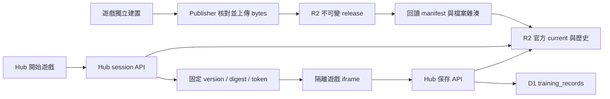

# R2 官方遊戲版本與 Hub 部署解耦

檢視日期：2026-10-08。範圍為已遷移的畫畫塔防；其餘 39 個遊戲仍沿用 Hub bundle 與共用 shell。

原本有四個耦合點：Hub registry 固定 version、成果 session 只能接受當前 version、PWA 相容入口固定版本，以及遊戲內容 push 會啟動 Pages 部署。另有兩個安全缺口：成果 token 未重查撤回狀態，第三方上傳與官方版本共用 releases prefix，卻未保留官方 slug。

採用每遊戲一份 R2 官方 current／雜湊歷史，保留不可變 release，沒有新增 D1 migration、binding 或 secret。平台 registry 只保留遷移資格、名稱與可信 origin。遊戲的 package.json 是內容版本唯一來源。



開始前取得 session；保存與重試使用同一份 session。切換 current 不影響仍核准的舊版；保存時重查該版本仍在可信歷史中、approved 且 digest 相符。舊 Hub 指定歷史版本與舊簽章仍相容，但撤回版本不得保存。儲存故障回覆 503，無效成果或身份回覆 400。

穩定 `/games/{gameId}/` 入口以 `no-store` 302 指向 current 的版本化 PWA。Hub、runner 均只讀官方目錄；第三方投稿、歷史投稿的審核發布與撤回不得操作已保留的官方 slug。官方歷史初始化僅使用 Git 已追蹤的發布收據，逐版核對實際 bytes，不以共用 prefix 的 approved 檔案作為官方來源。

Publisher 先核對檔案、再發布 manifest、最後切換 current。資產上傳／雜湊核對失敗不切換；同版內容不得覆寫。回退命令：

```sh
node scripts/publish-official-game.mjs drawing-defense --activate-version 2.0.1
```

CI 保留兩份 workflow 的七個驗證 gate。main 的 deployment_scope 判斷純 R2 遊戲內容與版本 metadata 可以跳過 Pages；未遷移遊戲、平台、依賴、workflow 或無法確認的差異仍部署。Cloudflare build 排除 R2 遊戲 workspace。

測試重現：session 不接受省略 version、錯誤 digest／撤回仍通過驗證、穩定入口回 404、publisher 無 current 切換／回退、Pages 仍建置 R2 bundle，以及歷史第三方投稿可進入官方 namespace。尚未部署的正式 Hub 以 Brave 重現「設定已出現，session 建立次數仍是 0」的失敗；修正後本機相同測試通過。真實 SQLite 驗證 current 切換、身份隔離、並行冪等保存；Brave 驗證途中切換 current、保存失敗重試、session API 失敗再載入、聚光燈、全螢幕、手機觸控與撤回。正式站測試仍攔截所有 Hub API 至本機，不寫正式成果。

限制：官方 CLI 每遊戲只能有一位發布者，發布與回退不可並行；未加入分散式 Lease／CAS。已安裝的版本化 PWA 維持原版本，穩定入口只影響下一次從入口開啟；舊格式 1.0.0 保留在 R2，但不能作為新格式 current。新增遊戲資格與平台格式更新仍需部署。

已完成 [CI/CD 平台部署](https://github.com/ian030590/RehabTrainerHub/actions/runs/37741967141)與正式入口、無 version 的 session API、四版資產及 Brave 流程驗證。正式 Hub 開始前固定版本的測試已由 0 次 session 失敗改為 1 次成功；途中切換 current、保存重試仍只產生一筆本機紀錄。正式 Hub 啟用了 Turnstile，因此僅在 API 導向本機的測試瀏覽器模擬其完成回呼，未測試真人驗證碼，也沒有放寬正式設定。完整結果見[發布收據](releases/drawing-defense-catalog-2026-10-08.json)。
