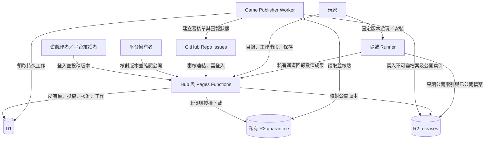
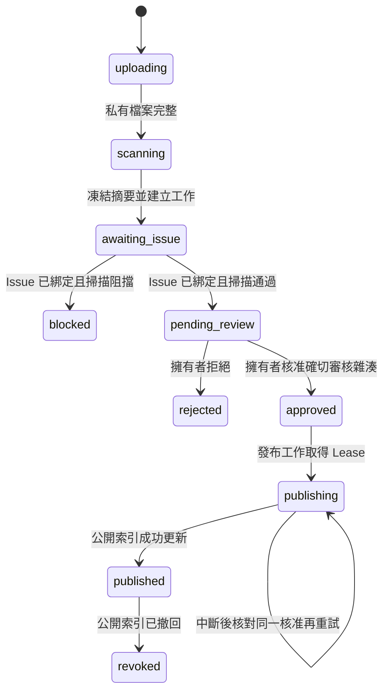

# 統一 R2 遊戲平台與 GitHub Issue 版本審核架構

日期：2026-10-08。狀態：目標架構；Hub 第一階段已有實作，尚未部署，39 個舊遊戲未遷移。實際完成範圍與啟用步驟見 [Hub 第一階段落地紀錄](hub-game-review-rollout.md)。

目標是讓 Hub 只認識「遊戲」與「經核准的發布版本」。所有遊戲的投稿、儲存、審核、啟動與成果保存使用同一套流程；作者是不是平台維護者，不影響執行權限，也不能略過版本審核。

本文記錄新的目標架構。[現行 R2 遷移計畫](r2-game-migration-plan.md)、[現行投稿契約](developer-game-packages.md)與 AGENTS.md 的現況描述，在實作遷移完成前仍適用；不能把本文當成已完成全站遷移的宣告。

## 1. 架構決策

| 項目 | 決策 |
| --- | --- |
| Hub 遊戲目錄 | 一個目錄、一套卡片、一個啟動流程，依活動分類與搜尋呈現 |
| 作者來源 | 保留公開作者署名與內部所有權資料，不建立官方／第三方執行分支 |
| 程式與素材 | 所有可部署遊戲檔案存 R2；Hub 不打包遊戲 runtime |
| 投稿 | 登入 Hub 上傳版本套件，系統替該版本建立本 repo 的 GitHub Issue |
| 審核單 | 每個版本一張 Issue，綁定不可變的投稿 ID 與審核雜湊 |
| 私有期 | 原始碼、套件、縮圖、測試附件與掃描詳細報告都留在私有 R2 |
| 核准者 | 初期僅允許平台擁有者，也就是你，核准、切換版本與撤回 |
| 核准入口 | 從 Issue 的審核連結進入 Hub，登入後核對版本與雜湊，再確認公開 |
| 公開條件 | 確切版本的人工核准已保存，發布檔案全部核驗成功，公開索引已更新 |
| 改版 | 程式、素材、文案、設定、結果 schema、能力或依賴改動，都送新版本重新審核 |
| 更新中 | 已公開的舊版繼續提供，新版等待審核；核准後才切換預設版本 |
| 發布與平台部署 | 發布遊戲不部署 Hub；平台或協定變更才部署平台 |

公開範圍的暫定方案：核准後公開可遊玩的 HTML／JS／CSS／素材。完整開發原始碼封存包預設仍私有；若要一併公開，必須把 `sourcePolicy: public` 與原始碼雜湊納入同一次核准。瀏覽器下載的遊戲 JS／HTML 本身無法保密。

投稿者不需要把程式 commit 到公開 repo，也不需要先建立公開原始碼 repo。尚未核准的檔案不能透過 Issue 附件、公開 PR、Actions artifact、Pages preview 或公開 source map 提前流出。已存在於公開 repo 或曾下載到使用者裝置的舊程式碼，無法靠搬到 R2 恢復保密。

## 2. 現況與需要整合的地方

目前已有可沿用的基礎：

- `rehab-game-quarantine` 保存私有投稿；`rehab-game-releases` 保存發布檔案。
- 投稿掃描器核對 ZIP、路徑、檔案大小與危險 API。
- 審核 API 有三項人工查核、發布 Lease、逐檔 SHA-256 與稽核事件。
- `usergamerunner` 與 Hub 分屬不同 site，不帶 D1、登入或私有投稿 binding。
- 畫畫塔防已採用遊戲自有 UI、私有 MessageChannel、R2 版本與固定工作階段。

仍然分裂的部分：

| 現行位置 | 現況 | 目標 |
| --- | --- | --- |
| `TrainingLobby.tsx` | 靜態內建清單與 API 投稿清單，兩套 overlay | 一份動態清單與 `GameOverlay` |
| `games/catalog.ts` | 40 個遊戲及分類；39 個仍在 Hub 依賴樹 | 遷移期間保留相容資料；最終只保留平台分類定義 |
| `developer_games` | 僅代表投稿遊戲 | 中性的 `games`，所有遊戲都有不可變 ID 與所有權 |
| 官方發布 CLI | 可直接上傳 approved manifest 並切換 current | 只能投稿或啟動已核准的版本，不能自行產生核准 |
| 官方 R2／投稿發布 | 不同來源與 current 管理 | 同一個公開索引與發布器 |
| 成果 | `training_records` 與 `game_runs`，兩套 session | 新版共用工作階段與成果入口，舊資料保留 |
| 審核單 | Hub 後台清單 | GitHub Issue，Hub 保留私有查核與確認公開介面 |

特別需要修正：現行第三方 `game-runs.js` 保存時要求 release 仍是 active。目標架構應允許「開始時固定、保存時仍公開且未撤回」的舊版工作階段，避免新版上架使正在玩的舊版成果失效。

## 3. 系統分工



### Hub

負責登入、所有權、投稿、單一目錄、私有下載、擁有者核准、玩家身份與成果保存。只載入平台 UI；設定、教學、game loop、計分、語言與完整結果畫面屬於遊戲。

公開 API 不回傳待審版本、私有 R2 key、提交者帳號 ID 或掃描原始內容。作者只能管理自己遊戲的投稿；知道別人的 release ID 不構成存取權。

### Game Publisher Worker

新增一個小型 Worker，例如 `workers/game-publisher/`。透過 Cron 領取 D1 的持久工作，執行 GitHub Issue 同步、已核准版本的發布、版本切換、撤回與故障補償；不執行投稿者的程式或 build script。

這個 Worker 解決跨 GitHub、R2、D1 的重試需求。HTTP 請求或 `waitUntil` 可以加速處理，但不能代替持久工作。初期不引入 Kafka、獨立 queue service 或多個發布微服務。Cloudflare 提供 Worker 的 scheduled handler 與 Cron triggers，可用於此工作迴圈。[官方文件](https://developers.cloudflare.com/workers/configuration/cron-triggers/)

### GitHub Issue

保存每版本的公開審核單、討論與處理結果。Issue 不保存程式附件、下載 token 或私有掃描內容。

Issue 的標籤、checkbox、文字、留言及關閉狀態不產生發布權。人工核准紀錄以 Hub 授權 API 寫入 D1；系統把結果回寫 Issue。如此不需要把一般 GitHub 編輯權轉換成 R2 發布權，也不需要初期加入發布 webhook。

### Runner

沿用 `trainerhub-user-games.pages.dev`，只提供 GET／HEAD、版本化 launcher、PWA、平台協定與核准檔案；不取得 Hub session、D1、原始碼封存或 quarantine binding。

遊戲 iframe 始終使用 `sandbox="allow-scripts"`。允許來源以平台設定為準，不能接受投稿者提供的任意 launch URL。

## 4. R2 儲存與公開邊界

繼續使用兩個用途不同的 R2 bucket。所有遊戲統一存 R2，不要求把私有投稿與可公開檔案放在同一個 bucket。

兩個 bucket 都停用 `r2.dev` 與直接公開的 bucket domain。玩家透過 Runner 取得檔案，每次請求都先核對公開索引；bucket 裡存在檔案不代表能被公開讀取。R2 預設不公開，直接公開 bucket 需要另外啟用。[官方文件](https://developers.cloudflare.com/r2/buckets/public-buckets/)

```text
rehab-game-quarantine                      # 全部私有
  submissions/{submissionId}/
    source.zip                            # 完整開發原始碼；純 HTML 可與 runtime 共用檔案
    runtime.zip                           # 作者提供的可部署套件
    submission.json                       # 凍結的版本、文案、能力、授權與依賴資訊
    files/{relativePath}                  # 驗證後的執行檔案
    scan.json                             # 私有詳細查核報告

rehab-game-releases                        # bucket 本身仍不直接公開
  releases/{slug}/{version}/
    manifest.json                         # 不可變的公開內容清單與版本資料
    files/{relativePath}                  # 不可變的遊玩檔案
    source.zip                            # 僅 sourcePolicy=public 且已核准時複製
  games/{slug}/index.json                  # 該遊戲唯一可變的公開權限／預設版本索引
```

`manifest.json` 宣告實際公開的全部檔案、逐檔大小與 SHA-256、版本化協定、結果 schema、能力與公開文案。授權聲明與第三方 notices 也納入審核。公開檔案採 allowlist；`.env`、Git metadata、私人附件及未核准 source map 不得混入。

首次建立檔案使用條件寫入；若相同 key 已存在，核對實際 bytes，相同才能重試，不同內容必須拒絕。R2 的條件寫入可用 `onlyIf` 實現。[官方文件](https://developers.cloudflare.com/r2/api/workers/workers-api-reference/#r2putoptions)

私有下載經 Hub 認證與授權，使用 `Content-Disposition: attachment`、`application/octet-stream`、`Cache-Control: private, no-store`、`nosniff` 與禁止執行的 CSP。Issue 的審核 URL 只有投稿 ID，不帶臨時下載憑證。初期沿用下載後在隔離環境試玩的流程；不在帶 Hub 管理員 session 的頁面執行投稿程式。

保留政策：發布過的版本不自動清理；待審／已核准的私有封存不能套用整桶 90 天刪除。孤立上傳、取消或拒絕的套件可依明確保留政策清理，清理前核對 D1 引用，保留版本雜湊與審核證據。

## 5. 投稿、Issue 與版本審核

### 投稿順序

1. 作者登入 Hub，選擇自己的遊戲或建立新遊戲，提交版本、變更說明、公開文案、原始碼與執行套件。
2. 平台保留 `submissionId` 與 `(gameId, version)`；不允許搶用別人的 slug，也不允許另一份內容覆寫相同版本。
3. 檔案只上傳私有 R2，核對大小、路徑、ZIP 風險、實際雜湊與原始碼可讀性。中斷的上傳不能進入審核狀態。
4. 掃描結果及凍結資料寫入 D1，同一個資料庫交易建立 `create_issue` 工作。被阻擋的有效投稿仍有審核單，但不能核准。
5. Worker 使用 GitHub App 為該版本建立 Issue，綁定 `repositoryId`、`issueNodeId` 與 `issueNumber`；確認成功後才轉成 `pending_review`。
6. 若 Issue 建立失敗，保持 `awaiting_issue`，資料與檔案均私有；重試相同工作，不要求作者再上傳。

GitHub App 限定安裝在 `ian030590/RehabTrainerHub`，僅授予 Issues read/write 及必要 metadata 存取。建立 Issue 的 REST API 支援 installation token，要求 Issues write 權限；token 可限制 repo 範圍並按到期時間更新。[Issue API](https://docs.github.com/en/rest/issues/issues#create-an-issue)、[GitHub App 認證](https://docs.github.com/en/apps/creating-github-apps/authenticating-with-a-github-app/authenticating-as-a-github-app-installation)

Issue 建立無法和 D1 原子提交，也不能假設外部 API 有 exactly-once 保證。每張票含由系統生成的 `submissionId` 標記；遠端回覆丟失時，先對照 App 建立的既有票與標記，再決定重試。若發現重複票，保留一張正式綁定票，將其他票標示為重複；任何重複票都沒有獨立核准權。

### Issue 內容

```text
標題：[遊戲版本審核] drawing-defense v2.1.0

投稿編號：系統生成的 submissionId
遊戲／版本：drawing-defense / 2.1.0
作者：投稿者同意公開的署名
變更說明：本版的活動與操作變更
要求能力：keyboard、pointer、audio、fullscreen
審核雜湊：完整 reviewDigest
狀態：待審核
私有審核：https://trainerhub.cc/admin/game-releases/{submissionId}
上一版本審核單：issue URL（如有）

原始碼、執行套件與查核報告需經授權登入才可取得。
```

Issue 公開資料由平台白名單投影產生。掃描若抓到秘密、私人字串或檔案內容，只公開一般錯誤代碼及數量，詳細內容保留在私有審核頁。

作者改 Issue 文案不會改已凍結的版本資料。需要變更任何會發布的資料，提交新版本、新雜湊與新 Issue。平台不執行 Issue 內的 shell 指令、外部 URL 或附件。

### 人工確認

擁有者從 Issue 連結登入 Hub，下載確切版本，在不帶敏感憑證的隔離環境查核原始碼與實際 runtime，完成開始、操作、退出、結果、語言與所需裝置測試，再查核公開文案與檔案授權。

核准 API 要求 `submissionId`、`expectedReviewDigest`、三項既有人工查核與核准備註。伺服器重新驗證所有權限、Issue 綁定、掃描無阻擋、凍結檔案及預期雜湊；確認後保存核准者、時間與完整審核雜湊，才建立發布工作。

`admin` 身分本身不足以代表你的發布權。初期以伺服器設定的 `GAME_RELEASE_OWNER_USER_ID` 比對你的既有 Hub 帳號，其他管理員只能依授權讀取審核資料。前端顯示核准按鈕不能取代後端檢查。

## 6. 資料模型與雜湊

### D1

沿用並演進現有表；以下是目標欄位與責任，不是本次執行的 migration。

| 表 | 保存內容與約束 |
| --- | --- |
| `games` | 中性遊戲 ID、唯一 slug、owner、公開署名、狀態；預設版本欄位為 R2 公開索引的投影 |
| `game_releases` | 版本投稿快照、檔案摘要、狀態、Issue 綁定、協定與能力；唯一 `(game_id, version)` |
| `game_release_files` | 投稿檔案清單、私有 key、種類、大小、實際 SHA-256 |
| `game_release_reviews` | release、核准者、三項查核、`reviewDigest`、公開原始碼政策、備註與時間；追加保存 |
| `game_release_jobs` | 工作種類、release、步驟、重試時間、Lease、最後錯誤、去重 key 與命令序號 |
| `game_run_sessions` | 身份、Subject ID、release、版本雜湊、token 雜湊、到期時間、成果 ID |
| `training_records` | 新版共用成果表；加入 release/session/digest/schema/source，每 session 最多一筆 |
| `admin_audit_events` | 核准、拒絕、發布、切版、撤回、故障恢復與敏感下載稽核 |

`developer_games` 的改名必須同步外鍵與呼叫者，保留原有 game/release ID，不靠 rename 字串取代完整 migration。已存在的 `game_runs` 留作歷史資料，進度、後台、匯出與分析讀取需涵蓋兩種歷史資料且避免重複計數；新版統一寫 `training_records`。舊 API 在相容期只處理原本的舊工作階段，不能另開免審發布入口。

帳號、guest Subject ID 與私人紀錄留在 Hub，不能進入公開 manifest、Issue 或遊戲通訊。原始碼與大型二進位檔案留 R2，D1 保存可查詢的版本與授權 metadata。

### 審核的是確切內容

| 雜湊 | 定義 |
| --- | --- |
| `artifactSha256` | 原始上傳執行套件 bytes；ZIP 包裝不同也會不同 |
| `sourceSha256` | 開發原始碼封存包 bytes；純 HTML 可與 artifact 相同 |
| `contentSha256` | 排序後的公開檔案路徑、大小與逐檔 SHA-256 的規範化清單 |
| `reviewDigest` | 規範化的版本、source/artifact/content 摘要、公開文案、原始碼公開政策、協定、結果 schema、能力、固定依賴與掃描政策版本 |
| `manifestSha256` | 發布 manifest 的實際 bytes；寫入公開索引，由讀取者核對 |

雜湊規格要固定 UTF-8 編碼、排序、JSON 規範化方式與路徑規則，並有跨平台 fixture。現行不同流程的 `contentSha256` 不能直接假設具有相同意義；轉換時保留原摘要並重新驗證新格式。

審核不能只看原始碼封存包。作者提供的 build 產物可能與原始碼不同，因此也要查核實際會公開的 bytes；需要重建比對時在無平台秘密的隔離環境執行。平台發布器不執行 `npm install` 或任意投稿 script。

## 7. 狀態與原子公開索引



`approved` 表示允許發布；此時檔案仍可完全私有。`published` 才表示玩家能取得版本。拒絕、blocked 與撤回版本都不能自行重送相同 version 的不同內容；修正必須使用新版本。相同 bytes 的上傳或工作重試可以冪等完成。

### 每遊戲一份公開索引

把預設版本與各版公開／撤回狀態放在同一個 `games/{slug}/index.json`，避免 current 與撤回清單分開更新造成不一致。示意結構：

```text
schemaVersion
gameId / slug
generation
currentReleaseId
releases[]
  releaseId / version
  status: published | revoked
  manifestSha256 / reviewDigest
  publishedAt / revokedAt
```

索引只包含曾經公開的版本與必要撤回標記，不列出待審版本。每次改動使用上一份 ETag 的條件寫入並遞增 generation；首次建立使用「不存在」條件。限制並驗證索引大小及版本數，超過容量時改用經評估的分片方案，不能無界讀入。

D1 是投稿、所有權、人工核准與持久工作來源；R2 公開索引是 Runner 是否對外提供某版本的來源。D1 的公開狀態／active 欄位由公開索引投影更新。GitHub 是審核單與討論紀錄，不能當即時玩家權限來源。

### 發布順序

1. 核對已保存的擁有者核准、Issue 綁定與 `reviewDigest`。
2. 取得該遊戲的寫入 Lease 與命令序號；同遊戲的發布、切版與撤回依序處理。
3. 逐檔讀私有 bytes、核驗大小與 SHA-256，再寫到不可變 release 路徑。
4. 回讀並核驗所有公開檔案，寫入不可變 manifest，再回讀核驗 manifest 摘要。
5. 在最後寫入前再次核對核准未取消、工作仍持有有效 Lease、命令未失效。
6. 以 ETag CAS 更新該遊戲公開索引，加入 published 版本並切換 current。這次成功寫入是對外公開點。
7. 更新 D1 投影與稽核狀態，再用持久工作回寫 Issue 的發布連結與結果。

步驟 6 前即使 release 檔案已複製，Runner 也因索引未列入而拒絕所有 URL。不能讓「存在 approved manifest」單獨成為公開條件。若 CAS 失敗，重新查核命令與最新狀態；不能盲目讀取最新 ETag 後覆寫，尤其不能讓過期工作取消較新的撤回。

D1、R2 與 GitHub 沒有一個共同交易。採用持久工作、冪等檔案寫入、條件更新與補償：公開索引寫入後 D1 更新失敗，恢復工作對照索引完成投影；Issue 更新失敗只重試通知。介面在公開點完成前顯示「發布中」，不能先顯示「所有人可玩」。

R2 binding 的物件讀寫有強一致性；經 CDN 的回應可保留舊快取，所以公開索引及撤回檢查直接讀 bucket，不經 edge cache。[官方文件](https://developers.cloudflare.com/r2/reference/consistency/)

## 8. 統一遊戲執行與成果

1. Hub 從 `/api/games` 取得同一套公開遊戲清單；分類、搜尋、作者署名與安裝入口均用中性型別。
2. 點開始時，Hub 呼叫 `/api/game-run-sessions`，提交 game ID 與必要的人機驗證。伺服器解析最新公開索引與 manifest，固定 release、version、digest、協定及能力。
3. 回傳固定的 launcher URL、session nonce、成果 ID、到期時間與一次性保存 token。token 只留 Hub parent，不進 URL、遊戲 iframe、manifest 或 MessagePort。
4. `GameOverlay` 以相同安全規則開啟確切版本；初始化核對父視窗／來源及 iframe window，建立私有通道。後續驗證 nonce、release、單調 sequence、訊息大小與 schema。
5. 新版遊戲自行呈現設定、教學、練習與成果。保留 iframe 顯示完整結果及保存重試；Hub 提供 container、保存回覆與退出。
6. Hub 經 `/api/records` 保存；重新核對身份、token、固定 release/digest、該版本仍公開且未撤回、成果欄位與大小。
7. 資料庫唯一約束保證一個 session 只新增一筆成果；同一 session 與同一成果的重試回傳已保存紀錄，不同成果或不同身份不能覆寫。撤回請求先在 D1 記錄停止新工作階段／保存的意圖，避免等待 R2 撤回工作時繼續新增成果；已寫入的紀錄保留為歷史，重試最多回傳原有紀錄。

發布新版本不改舊 session。保存時不能要求它仍是 current；只要求其原本核准的版本仍有公開權。成果都是瀏覽器回報數值，不能因版本核准或 token 就宣稱伺服器驗證了計分。

新契約使用版本化的中性協定，例如 `trainerhub.game/v2`；manifest 明確固定其 runtime 與結果 schema。以現有自包含遊戲的數值 schema 為演進起點，欄位只接受有限數值、Boolean 與 null，拒絕敏感鍵、身份與任意文字。設定值仍需遊戲自行驗證，保存端依該版核准的 schema 檢查。

既有 jsPsych／JSON 套件可在遷移期間以 `contractVersion` adapter 載入；adapter 以協定格式決定行為，不以作者決定。既有已核准版本不能暗中切換 adapter 或 runtime；格式遷移必須發布新版本。最終所有新版遊戲都自帶設定、教學與完整成績 UI，不擴張平台共用遊戲 shell。

投稿掃描器也依契約版本驗證。目前強制 `settings.json`／`score.json`、禁止 bundled jsPsych 與限制編譯檔行長的規則，不能直接拿來驗證自包含 v2。新版必須驗證自有入口、結果傳輸 schema、來源及執行 bytes、依賴與能力；原始碼可讀性與編譯產物分別查核。重新訂定掃描規則前先加入行為與安全回歸測試，維持危險 API、路徑、ZIP、外連與 sandbox 防護，不為平台作者設豁免。

### PWA、撤回與故障

- 穩定入口 `/games/{slug}/` 以 `no-store` 302 選最新公開版本；`/games/{slug}/{version}/` 固定該版。
- Runner 對 launcher、manifest、資產與 HEAD／304 回應，都先檢查公開索引與 manifest 雜湊；未知／未公開版本 404，撤回版本 410，R2 故障 503。
- 檔案只接受 manifest allowlist 並核對實際內容摘要。不可變資產可快取，但不能讓 CDN Cache Everything 繞過 Runner 的撤回 gate。
- Launcher／Service Worker 增加平台產生的版本狀態檢查路由；在線啟動與重新連線先核驗，偵測 404／410 才清理該版快取與關閉。503 表示暫時故障，不當作永久撤回。
- 預設保留既有離線 PWA 能力；離線裝置不能立即知道新撤回。已下載的檔案也無法收回，撤回保障是新在線存取與重新連線後的停用。
- 回退只切換到索引中仍公開、雜湊正確的已核准舊版，不重新改造檔案、不恢復 revoked 版本；修改舊版內容仍須送新版本。

## 9. 相機、麥克風、眼動與大型模型

這是全量遷移的必須完成項目。現有 Runner 禁止相機、麥克風、worker 與 fetch；opaque sandbox 的遊戲不能直接使用相機。不能只把 39 個 `dist` 複製到 R2 就宣稱完成。瀏覽器對 sandboxed iframe 的 `getUserMedia` 有 origin 限制。[瀏覽器文件](https://developer.mozilla.org/en-US/docs/Web/API/MediaDevices/getUserMedia#security)

採用平台維護的能力橋樑，能力由核准 manifest 決定，與作者來源無關：

- 基本鍵盤、觸控、音效、gamepad 與全螢幕沿用 strict sandbox。
- 相機／麥克風由可信平台 host 在明確使用者操作與同意後取得，管理開始、暫停、停止、裝置失敗與背景切換；遊戲不取得 Hub 憑證。
- 遊戲專屬推論與計分繼續屬於遊戲。橋樑只傳所需的短暫媒體資料或明確定義的輸入事件，不在 Hub 複製遊戲的規則／defaults／模型流程。
- MediaPipe／TensorFlow／Vosk／WebGazer 的模型、WASM、worker 與時序需求須逐遊戲驗證。若需 WASM／worker，先設計受控、固定版本的能力 profile 與資產讀取規則，不直接開放外連或 `unsafe-eval`。
- 眼動逐筆資料仍是私人資料，不能寫入遊戲發布 bucket 或公開成果。由可信保存橋樑傳往既有 `oculomotor-data`，保留下載格式、失敗重試與身份隔離；它與數值成果 channel 分開驗證。
- 獨立 PWA 要同樣保留媒體功能時，需由可信的頂層 Runner host 承接能力；Hub 到 launcher 的 iframe 仍不能取得同源權限。這個 host 的版本、同意畫面與資源釋放也是平台 gate。

能力橋樑是需要原型與真實 Brave 裝置驗收的設計工作，本文不宣稱它已成立。缺少等價流程的遊戲繼續使用舊入口，直到能力完成；不能刪除功能或把不支援標成成功遷移。

目前 12 MiB 壓縮／24 MiB 解壓的投稿上限與逐檔驗證方式，可能不適用大型模型。提高容量前要量測、採分段／串流處理與明確模型清單；發布器不能把整個模型套件讀入 Worker 記憶體。所有作者遵守相同能力及容量規則，沒有平台作者的掃描免除。

## 10. 權限與憑證

| 執行環境 | 需要的 binding／secret | 限制 |
| --- | --- | --- |
| Hub | D1、既有 auth、quarantine、release 讀取、owner ID | 投稿不能寫公開索引；核准 API 只寫經授權的決定與工作 |
| Publisher Worker | D1、quarantine 讀取、release 寫入、GitHub App 私鑰／App ID／installation ID／固定 repo ID | 只處理 D1 工作，沒有公開任意發布 endpoint；不能執行遊戲程式 |
| Runner | release bucket | 只 GET／HEAD、get／head；不帶 D1、auth、quarantine、GitHub secret |
| 遊戲 | 經核准的 package 與私有能力 channel | 沒有 R2 key、Hub token、帳號／Subject ID 與任意 fetch 能力 |

R2 Workers binding 不提供這裡所述的獨立讀取專用權限宣告；Hub／Runner 的只讀用途要靠程式、部署規範與 gate 維持，不能當成供應商已強制限制。外部 CLI／CI 的 S3 或 API token 另限制權限與 bucket 範圍。

既有直接發布 CLI 必須收斂為投稿工具。一般 CI 不持有可公開 release 的憑證，不能把 PR merge、main push 或 Issue label 視為核准。Cloudflare 帳號持有者的基礎設施管理權是最終信任邊界，仍需妥善控制。

初期核准保留同源／CSRF、防重送、伺服器身份驗證、人機驗證與流量限制，不因導入 Issue 放寬。投稿授權與公開原始碼政策由版本資料記錄；移到 R2 不改變既有檔案授權，不能把儲存位置當成重新授權。

## 11. API 與倉庫改動範圍

| 入口 | 目標行為 |
| --- | --- |
| `GET /api/games` | 全部公開遊戲的單一目錄；D1 投影可短暫快取，啟動仍重查 R2 |
| `POST /api/game-submissions` | 登入投稿，支援冪等 key，寫私有 R2 與 Issue 工作；回傳 202 和 submission ID |
| `GET /api/game-submissions/:id` | 作者本人與授權審核者查詢版本／Issue／處理狀態 |
| `GET /api/admin/game-releases/:id/artifact` | 授權附件下載，分別取得 source／runtime，不直接執行 |
| `POST /api/admin/game-releases/:id/approve` | owner-only，確認預期審核雜湊與人工查核，建立發布工作 |
| `POST /api/admin/game-releases/:id/reject` | owner-only，保存理由並同步 Issue |
| `POST /api/admin/game-releases/:id/revoke` | owner-only，建立優先撤回工作，完成公開索引更新後才回報已撤回 |
| `POST /api/admin/games/:id/activate` | owner-only，切換仍公開的已核准版本 |
| `POST /api/game-run-sessions` | 全部遊戲開始前解析並固定公開版本 |
| `POST /api/records` | 新版統一保存；身份與 token 不傳給遊戲 |
| Runner `/games/:slug/:version/status.json` | 平台生成、不可快取的公開狀態，供 PWA 撤回檢查 |

初期可以沿用 `/api/developer/games` 與現行審核 URL 作相容 adapter，避免為改 URL 破壞既有客戶端。新協定的權限與雜湊要求仍在伺服器檢查。

實作需要涵蓋：

- Hub：`TrainingLobby.tsx`、`publishedGames.ts`、三種 overlay、developer 投稿頁、admin 審核頁、文案與 i18n。
- Functions：投稿、審核、公開目錄、官方／第三方 session、records、progress、後台紀錄、分析與匯出。
- D1：遊戲名稱中性化、版本快照、Issue、審核證據、持久工作、session 與成果關聯 migration。
- Runner：單一公開索引、manifest v2、實際 bytes 校驗、協定 adapter、狀態路由、SW 與能力 host。
- 工具：官方 CLI 改投稿、workspace sync/build 排除逐步遷移遊戲、CI 部署範圍與測試 gate。
- 文件：AGENTS.md、R2 遷移、投稿契約、部署指引與發布收據。新增 Worker 部署及測試時同步兩份 workflow 的命令與 repo 指引；保留純文件不啟動 CI。
- 40 個遊戲：自有 UI／i18n／loop／renderer／結果與不同能力需求；不把共享 shell 複製成另一份平台 runtime。

## 12. 分階段落地與驗收

| 階段 | 工作 | 完成條件 |
| --- | --- | --- |
| A：封住發布繞道 | 建立擁有者核准與版本快照，直接發布 CLI 改投稿；先測禁止未核准公開 | 平台自己的新版本也沒有免審通道 |
| B：Issue 投稿 | 私有 source/runtime、持久工作、GitHub App、每版 Issue、私人審核下載 | API／GitHub 中斷或重試不洩露程式、不產生第二次發布權 |
| C：統一 R2 發布 | 公開索引、不可變 manifest、CAS、逐檔驗證、撤回／回退／修復 | 發布故障時玩家只取得完整舊版或完整新版 |
| D：統一 Hub 流程 | 單一目錄／overlay／session／成果；畫畫塔防與一個投稿遊戲做雙來源試點 | 來源不影響流程，切新版不影響舊 session，身份與保存重試通過 |
| E：遷移舊遊戲 | 先一般互動，再重引擎／WASM，最後媒體／眼動；逐個保留行為 | 每遊戲自包含、R2 審核發布、功能／裝置／PWA 驗收完成 |
| F：清理相容層 | 遷移全部 40 個遊戲後移除靜態 runtime、舊 shell 分支與免審工具 | Hub output 無遊戲 bundle；舊連結與歷史成果仍可用 |

既有公開版本可以在你逐版確認既有 bytes、授權與功能後，建立明確的遷移審核單與可信摘要，不自動宣稱已通過新制度。保留 drawing-defense 的舊版本網址、manifest 與撤回行為，直到舊 PWA 相容需求處理完成。

所有實作先依 AGENTS.md 做行為測試，確認缺少需求而失敗，再改產品程式。至少鎖定以下驗收：

| 情境 | 必須結果 |
| --- | --- |
| 未核准的新投稿，猜到檔案／版本／縮圖 URL | 匿名 GET／HEAD 不回傳任何私有檔案 |
| 一般 admin、作者或 Issue 編輯者嘗試核准 | 403，沒有公開索引改動 |
| Issue checkbox、label、關閉或重開 | 不產生核准或發布 |
| 作者換套件、修改能力／文案／source policy，沿用舊核准 | 雜湊或版本檢查拒絕，需新版本審核 |
| source.zip 與 runtime 對不上 | 查核不能自動視為一致，核准涵蓋實際 runtime |
| GitHub create 成功但回覆丟失 | 找回正式 Issue 或標示重複票，沒有重複核准權 |
| 發布第 N 個檔案失敗、manifest 不完整 | 公開索引不切換，舊版仍可玩 |
| 原始／發布檔案 bytes 改動但 metadata 假裝相同 | 實際 SHA-256 不符，拒絕公開／供檔 |
| Publisher Lease 過期，另一工作撤回或切版 | 過期命令不能覆蓋新索引；CAS 失敗不盲重試 |
| R2 公開成功但 D1／Issue 更新失敗 | 重試完成投影與通知，不改檔案、不重複公開 |
| 新版待審、被拒或掃描阻擋 | 舊版仍在目錄；新版不在公開索引 |
| 玩家開始後 current 切換 | 原版未撤回時可以完成並保存 |
| 完成成果並行保存／網路重試 | 同身份同 session 只有一筆，換身份或換成果不能覆寫 |
| 版本撤回、CDN／SW 曾快取 | 新在線請求拒絕；SW 重連清除；503 不誤清離線資料 |
| 訪客與登入使用者 | Subject ID 分離，guest 不出現在登入進度 |
| 舊 `game_runs` 與 `training_records` | 進度、後台及匯出完整且不重複 |
| 相機／麥克風／眼動／模型遊戲 | 拒絕權限、背景切換、退出釋放與原流程均有真實裝置驗收 |

沿用 `test:hub-functions`、`test:gamerunner`、`test:game-platform`、`test:game-architecture`、`test:entrypoints`、`test:pwa` 與針對性 build；資料 migration 用真實本機 SQLite 驗證外鍵、唯一約束與交易。Publisher 新測試納入兩份 workflow 的同一 gate，不因改版再序列重跑已完成的 CI gate。Brave smoke 覆蓋投稿私有存取、Hub／獨立 PWA、手機、全螢幕與撤回；眼動沿用專用 browser smoke。所有測試資料只寫本機資料庫。

本次只建立架構文件並查核現行程式與官方平台能力，未修改產品、執行 migration、建立 GitHub Issue、變更 R2 或執行產品測試。
